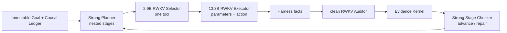

# RWKV-LH

RWKV-LH 是以 RWKV 为执行核心的持久 Agent 运行时。当前产品只启用 `RWKV Stateful Goal Loop v3`，目标是先可靠推进中等难度真实任务，并在失败时留下可恢复、可审核的完整事实。

> 当前仍是实验候选。单元测试只证明结构闭合；真实能力必须由冻结数据和真实 RWKV E2E 给出。

## 当前架构



- Strong Planner 返回嵌套 `add_stages/replace_stages -> stage -> steps[]`，可增加、真正替换或废弃未完成步骤。
- 同阶段步骤是同级步骤，不能互相依赖；读写根冲突会在计划提交前拒绝。
- 2.9B Selector 只看一个当前步骤，唯一决定工具；13.3B Executor 不二次选工具，每个已选 action 从干净角色 State 启动并只填写参数。
- 每个 Action 后由独立 clean-State RWKV Auditor 检查；Evidence Kernel 校验证据来源、作用域和步骤 revision。
- 一个阶段全部完成后，强模型以独立只读调用检查阶段一致性。它只返回 `advance/repair`，不能执行或修改事实。
- 默认 Auditor 复用已驻留的 13.3B 模型服务，但 session、State 和 WKV 与 Executor 隔离且永不合并。
- Harness 和 append-only Causal Ledger 是唯一事实权威；模型文本、WKV 和 cache 都不能直接授权完成。

当前阶段仍顺序执行，但不同 action 不再继承彼此的 Executor WKV；最近 Harness 事实由有界确定性投影提供。并发同阶段安全步骤与确定性事实合并仍是下一独立实现边界；旧 Atom Pool 不属于当前产品链路。

完整协议、角色和并发边界见 [RWKV Stateful Goal Loop v3](docs/RWKV_STATEFUL_GOAL_LOOP_V2.zh-CN.md)。

## 模型配置

模型不写死在代码中，通过 `.env.local` 按角色替换：

- `RWKV_LH_PLANNER_*`：Strong Planner 与 Stage Checker；
- `RWKV_LH_SELECTOR_*`：2.9B RWKV 与匹配模型/协议的 Selector Head；
- `RWKV_LH_EXECUTOR_*`：13.3B RWKV；
- `RWKV_LH_AUDITOR_STEP_*`、`RWKV_LH_FINALIZER_*`、`RWKV_LH_AUDITOR_FINAL_*`：三个独立角色配置；未配置部署字段时复用 Executor 部署，但不复用 State。

Selector Head 的模型 SHA、输入协议、Head SHA 和可选 State profile 必须一致。G1I、G1J 或后续权重不能跨身份伪装复用 Head。

## 安装和运行

项目逻辑只在 WSL `UbuntuRecovered` 中运行：

```bash
uv sync --frozen --dev
cp .env.example .env.local
uv run rwkv-lh-runtime-smoke
uv run rwkv-lh start \
  --request "创建并验证 result.json" \
  --workspace /tmp/rwkv-lh-workspace
```

恢复和查询：

```bash
uv run rwkv-lh status RUN_ID
uv run rwkv-lh resume RUN_ID
```

本地界面：

```bash
uv run rwkv-lh-web
```

## 主要模块

- `rwkv_lh/goal_loop_protocol.py`：嵌套阶段 PlanPatch、阶段屏障、Audit 与 Stage Review 协议。
- `rwkv_lh/stateful_goal_loop.py`：当前唯一产品 Controller。
- `rwkv_lh/model.py`：Selector handoff、单 Executor lane 与独立 Auditor。
- `rwkv_lh/model_session.py`、`rwkv_lh/runtime/native_state.py`：state+delta、checkpoint 与 cache 恢复。
- `rwkv_lh/exact_tool_selector/`：frontier-only Selector 输入和网络服务协议。
- `rwkv_lh/harness.py`：唯一 ActionDefinition 与执行事实源。
- `rwkv_lh/schema.py`、`rwkv_lh/store.py`：append-only event、投影和 SQLite 事务。
- `rwkv_lh/product_runtime.py`：从持久 Goal 和 `.env` 装配唯一产品链路。

## 验证

```bash
uv run pytest -q
uv run rwkv-lh-runtime-smoke
uv run rwkv-lh-e2e --suite all --validate-only
```

正式实验必须在 `data/experiments/` 预注册固定数据、模型/Head/State 身份、参数、阈值和相似度算法，并保存 raw output、CausalEvent、checkpoint、逐题首次偏离和聚合指标。发现一个错误后必须扩展检查完整数据集、同类场景和相关代码路径。

## 当前 G1J 判断

- 五个 G1J v1 角色数据集已经生成，但尚未训练或选择任何 State。2026-09-03 zero-State Ladder 为 `0/20`，P07 人工停止，不构成能力通过。
- Goal 模式按 Selector / Intent、Executor-Args、Step Auditor、Finalizer、Final Auditor 五个环节分别建设 State；禁止全局混合 State。
- 旧 Selector Head 的 feature 是独立 bootstrap 样本，却被错误标记为持久轨迹；运行时现已拒绝该 Head。新 Head 必须基于 `persistent-causal-sequences.v1` 同分布轨迹。
- 当前 runtime 使用显式 zero identity；完成真实轨迹数据、五个 evaluator 和修复后固定 Ladder 基线前，不得选择 StateTune 产物。

唯一实施事实源见 [G1J 分环节 State Tuning 冻结实施协议](docs/G1J_STATE_TUNING_AUDIT_HANDOFF_20260902.zh-CN.md)。
