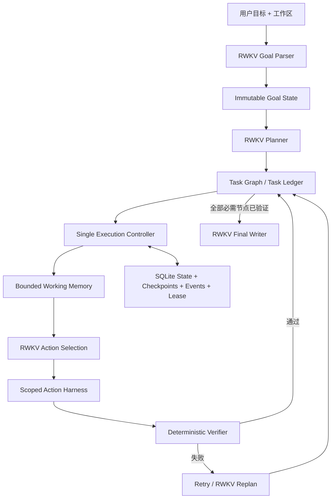

# RWKV-LH

RWKV-LH 是一个面向 RWKV 的持久化 Long-Horizon Agent 运行时。它把长期目标、任务图、执行尝试、证据、验证结果、恢复点与每次模型请求的采样决策保存为结构化状态，使 Agent 能在多步骤任务中保持目标、验证真实结果，并在中断后继续执行。

这个仓库只包含长程 Agent。它不包含网页检索 Agent、答案质量 Judge、检索评测流水线、前端或历史 HTML 报告。检索能力如有需要，应作为显式工具扩展接入，而不是成为 Controller 的隐式依赖。

RWKV-LH 专门为 RWKV 模型的长程执行而建立。LongHorizon-Harness、LangGraph、Temporal 与 Harbor 只用于研究设计思想和可靠执行语义，不是本项目的运行时、后端或兼容目标；所有语义规划与决策仍由 RWKV 完成。

## 架构



核心边界：

- `rwkv_lh/schema.py`：不可变 Goal、Task、Attempt、Memory、Artifact 与状态枚举。
- `rwkv_lh/store.py`：SQLite 事务、revision CAS、checkpoint、事件流和 Controller lease。
- `rwkv_lh/controller.py`：决定下一任务、重试、replan、恢复与结束；不改写 RWKV 最终输出。
- `rwkv_lh/harness.py`：工作区范围内的文件、命令和证据操作；扩展动作必须显式声明副作用与幂等性。
- `rwkv_lh/validation.py`：依据文件、哈希、命令退出码、JSON、证据绑定等可观察结果验收。
- `rwkv_lh/memory.py`：从持久状态投影当前任务需要的有界上下文。
- `rwkv_lh/model.py`：RWKV 的 Goal Parse、Planning、Action、Cross-validation、Replan 和 Final Answer 协议。
- `rwkv_lh/runtime/`：结构化 OpenAI-compatible RWKV 客户端。

## OpenAI-compatible RWKV runtime

runtime 不是散落的 HTTP 调用，而是四层稳定接口：

- `settings.py`：类型化部署配置和 `.env.local` 加载。
- `sampling.py`：通过 `ContextVar` 隔离每个请求的 temperature、seed、task id 与 lane。
- `protocol.py`：请求、响应、usage、health 以及 Transport/HTTP/Protocol 错误类型。
- `openai_compat.py`：线程隔离连接池、UTF-8 JSON 解析、超时、有限重试、`/completions`、`/chat/completions` 与 `/models`。

请求级 temperature 的目标不是简单增加随机性，而是按推理阶段选择行为：事实提取、工具动作、验证和最终回答使用低温；任务拆解与 replan 可以使用稍高温度。每次请求都会在 SQLite 事件中记录 request type、temperature、seed、输入、输出和结果。

当前策略定义在 `rwkv_lh/temp_policy.py`。模型调用链为：

```text
Controller / Model role
→ TemperaturePolicy.decide(request_type)
→ sampling_parameters(temp, seed)
→ OpenAICompatibleRWKVClient
→ POST /v1/completions
```

## 安装

只使用 `uv`：

```bash
git clone https://github.com/rwkv-rs/RWKV-LH.git
cd RWKV-LH
uv sync --frozen --dev
cp .env.example .env.local
```

在 `.env.local` 中配置 endpoint、API key 和模型名。凭证文件被 Git 忽略。

## 运行

检查模型端：

```bash
uv run rwkv-lh-runtime-smoke
uv run rwkv-lh-runtime-smoke --completion --temperature 0.03 --seed 1
```

启动新任务：

```bash
mkdir -p /tmp/rwkv-lh-workspace
uv run rwkv-lh start \
  --request "在工作区创建两个配置文件，并用测试验证它们一致" \
  --workspace /tmp/rwkv-lh-workspace
```

查询或恢复：

```bash
uv run rwkv-lh status RUN_ID
uv run rwkv-lh resume RUN_ID
```

默认 SQLite 与 artifact 位于 `data/runs`；也可以通过 `--state-directory` 指定。

## 测试边界

```bash
uv run pytest
uv run rwkv-lh-control
```

`LH-Control-30` 是 RWKV-LH 的确定性运行时回归测试，覆盖 Controller、状态、验证、恢复、幂等、依赖、scope 和 request-level sampling。它不调用其他 Agent，也不替代 RWKV 模型能力测试；真实模型能力由单独的 RWKV E2E 套件验证：只向 RWKV 提供用户目标、初始工作区和工具，不预置 Task Graph、动作或 replan 路径。

真实 E2E 套件可先校验题库边界：

```bash
uv run rwkv-lh-e2e --suite core30 --validate-only
uv run rwkv-lh-e2e --suite lh12 --validate-only
uv run rwkv-lh-e2e --suite all --validate-only
```

`core30` 是原有基础/中等/困难套件；`lh12` 是新增的长程压力套件，覆盖 repeated replan、goal retention、动态发现、crash recovery、fan-out/fan-in、prompt injection、异构迁移、compensation、外部状态、tool-call budget、working memory 和 capstone。

隐藏 acceptance 由独立 bubblewrap worker 验证：仓库、`/tests`、verifier 日志和 scorecard 不会挂载；工作区是拒绝 symlink 的只读快照；PID 与网络 namespace 独立；Agent 进程必须先退出。Linux 真实 E2E 因而要求系统安装 `bwrap`，缺失时 fail closed。

RWKV 的职责定义、现有 10 阶段提示词、12 道新题、隔离威胁模型，以及 LongHorizon-Harness、LangGraph、Temporal、Harbor 的借鉴边界见 [`docs/RWKV_LONG_HORIZON_PHASE1.zh-CN.md`](docs/RWKV_LONG_HORIZON_PHASE1.zh-CN.md)。

2026-08-09 的初版真实验证为 0/8 严格通过、4/8 隐藏产物验收通过；当前版本不能据此标记为生产可用。完整判读见 `docs/RWKV_E2E_INITIAL_VALIDATION_20260809.md`。

## 恢复保证

每次副作用前先持久化 Attempt；每次执行后保存结果、artifact hash、验证结果和 checkpoint。恢复时根据动作的 `read_only`、`side_effect` 与 `idempotent` 元数据决定安全重试或阻塞，避免静默重复非幂等操作。Goal digest 用于检测长期执行中的目标漂移。
