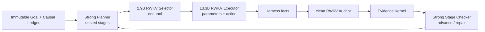

# RWKV-LH

RWKV-LH 是以 RWKV 为执行核心的持久 Agent 运行时。当前产品只启用 `RWKV Stateful Goal Loop v2`，目标是先可靠推进中等难度真实任务，并在失败时留下可恢复、可审核的完整事实。

> 当前仍是实验候选。单元测试只证明结构闭合；真实能力必须由冻结数据和真实 RWKV E2E 给出。

## 当前架构



- Strong Planner 返回嵌套 `add_stages/replace_stages -> stage -> steps[]`，可增加、真正替换或废弃未完成步骤。
- 同阶段步骤是同级步骤，不能互相依赖；读写根冲突会在计划提交前拒绝。
- 2.9B Selector 只看一个当前步骤，唯一决定工具；13.3B Executor 不二次选工具，只填写参数和推进执行。
- 每个 Action 后由独立 clean-State RWKV Auditor 检查；Evidence Kernel 校验证据来源、作用域和步骤 revision。
- 一个阶段全部完成后，强模型以独立只读调用检查阶段一致性。它只返回 `advance/repair`，不能执行或修改事实。
- 默认 Auditor 复用已驻留的 13.3B 模型服务，但 session、State 和 WKV 与 Executor 隔离且永不合并。
- Harness 和 append-only Causal Ledger 是唯一事实权威；模型文本、WKV 和 cache 都不能直接授权完成。

当前阶段执行仍是单一持久 Executor State 下的顺序执行。隔离 Executor State、并发同阶段安全步骤、只合并 Harness 事实，是下一独立实现边界；旧 Atom Pool 不属于当前产品链路。

完整协议、角色和并发边界见 [RWKV Stateful Goal Loop v2](docs/RWKV_STATEFUL_GOAL_LOOP_V2.zh-CN.md)。

## 模型配置

模型不写死在代码中，通过 `.env.local` 按角色替换：

- `RWKV_LH_PLANNER_*`：Strong Planner 与 Stage Checker；
- `RWKV_LH_SELECTOR_*`：2.9B RWKV 与匹配模型/协议的 Selector Head；
- `RWKV_LH_EXECUTOR_*`：13.3B RWKV；
- `RWKV_LH_AUDITOR_*`：可选独立 Auditor 模型；未配置时复用 Executor 部署。

Selector Head 的模型 SHA、输入协议、Head SHA 和可选 State profile 必须一致。G1I、G1J 或后续权重不能跨身份伪装复用 Head。

## 安装和运行

项目逻辑只在 WSL `UbuntuRecovered` 中运行：

```bash
uv sync --frozen --dev
cp .env.example .env.local
uv run rwkv-lh-runtime-smoke
uv run rwkv-lh start \
  --request "创建并验证 result.json" \
  --workspace /tmp/rwkv-lh-workspace
```

恢复和查询：

```bash
uv run rwkv-lh status RUN_ID
uv run rwkv-lh resume RUN_ID
```

本地界面：

```bash
uv run rwkv-lh-web
```

## 主要模块

- `rwkv_lh/goal_loop_protocol.py`：嵌套阶段 PlanPatch、阶段屏障、Audit 与 Stage Review 协议。
- `rwkv_lh/stateful_goal_loop.py`：当前唯一产品 Controller。
- `rwkv_lh/model.py`：Selector handoff、单 Executor lane 与独立 Auditor。
- `rwkv_lh/model_session.py`、`rwkv_lh/runtime/native_state.py`：state+delta、checkpoint 与 cache 恢复。
- `rwkv_lh/exact_tool_selector/`：frontier-only v8 Selector 输入和网络服务协议。
- `rwkv_lh/harness.py`：唯一 ActionDefinition 与执行事实源。
- `rwkv_lh/schema.py`、`rwkv_lh/store.py`：append-only event、投影和 SQLite 事务。
- `rwkv_lh/product_runtime.py`：从持久 Goal 和 `.env` 装配唯一产品链路。

## 验证

```bash
uv run pytest -q
uv run rwkv-lh-control
uv run rwkv-lh-e2e --suite all --validate-only
```

正式实验必须在 `data/experiments/` 预注册固定数据、模型/Head/State 身份、参数、阈值和相似度算法，并保存 raw output、CausalEvent、checkpoint、逐题首次偏离和聚合指标。发现一个错误后必须扩展检查完整数据集、同类场景和相关代码路径。

## 当前 G1J 判断

- 旧 G1J 2.9B + v7/S60 Head 固定开发集 accuracy 为 `0.9509918`，最早失败是 raw argmax 工具分类错误，不是 JSON 或 PlanPatch 格式。
- 同一 S60/V7 dev 的 2571 条配对中，G1J 相对 G1I 修复 10 条、回归 29 条、共同错误 29 条，整体 accuracy `0.984831 -> 0.977441`；这是各自匹配 Head 的旧 V7 系统对比，不是裸模型对比。
- Selector v8 已把语义尾改为单一 frontier；v8 需要重新抽取 G1J 特征并训练匹配 Head，不能复用 v7 Head 伪装验证。
- G1J 13.3B 和 7.2B 的当前 zero-State Auditor 对照为 `2/2` 对 `0/2`，因此默认 Auditor 复用 13.3B 权重。

逐样本修复/回归清单见 [G1I/G1J 配对审计](data/experiments/G1J_VS_G1I_ROLE_COMPARISON_20260901/RESULT.md)。
- 在工程链路、输入协议和 Selector Head 验证完成前不做 State Tuning。

当前证据见 [架构文档](docs/RWKV_STATEFUL_GOAL_LOOP_V2.zh-CN.md) 和 [本轮实验记录](data/experiments/RWKV_GOAL_LOOP_V2_CLEANUP_20260901/PREREGISTRATION.md)。
