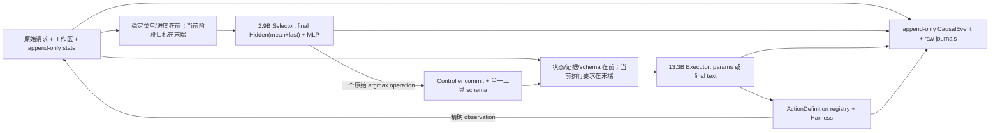

# RWKV-LH

RWKV-LH 是面向基础续写 RWKV 的持久化 Agent 运行时。当前产品链路把职责拆为独立的
2.9B 工具 Selector 与 13.3B Executor：前者只看 25 个名称/描述并提交精确 operation，后者只看
该 operation 的单一完整 schema，生成参数、推进执行和 final。可选 Strong Supervisor 只建立
Contract Graph 和审核公开结果，不执行工具、不填参数，也不改写 RWKV Final。
ECRA-derived 检索内核、运行级联网策略和主动式持久队列已经接入同一 Controller。

> 2026-08-31 的权威状态与交接见 [当前状态](docs/CURRENT_STATUS.zh-CN.md) 和
> [当前交接](docs/CURRENT_HANDOFF.zh-CN.md)。本文后续的“单 RWKV Action session”是仍保留的
> R126 历史/兼容消融基线，不代表当前启用联网产品链路。

> 当前版本仍是实验候选。正式能力只能由冻结源码下的真实 RWKV E2E 给出；单元测试通过
> 只证明结构可运行。

## 当前架构

当前产品链路使用独立 Selector→Executor；R126 单模型路径仍保留为显式兼容/消融基线，
不代表产品默认职责边界。`--supervisor contract_graph` 可启用强模型义务图，但具体 operation、
参数、执行推进和 final 仍由两个 RWKV lane 与 Harness 完成。



关键不变量：

- 不解析自然语言为在线 Goal schema、criterion 或 Task DAG。用户请求只作为不可变原文。
- Selector 与 Executor 是不同模型、不同 lane、不同 checkpoint 和不同 initial-state profile；
  state 不跨 lane 导入，也不在每个阶段无证据地反复切换。
- Selector 固定只看 25 个名称/一句描述与有界进度，不看参数 schema、完整工具结果或 Executor
  文本；它保存全部 25 维 logits 和原始 argmax，不使用类别 mask、阈值修补或 13.3B 复选。
- Executor 只看已提交 operation 的一个完整 schema，不再看到全菜单或 `select_tool` 指令；
  一次回合只接受一个明确的直接调用。
- 所有当前 RWKV 输入统一采用 request-last：稳定契约、状态、历史和已观察证据在前，当前阶段
  目标、当前执行要求或当前拒绝原因在最后，之后立即进入续写/Hidden 提取点。
- Controller 不补 operation 或参数，不读取隐藏验收。只有 Parser 与 ActionDefinition 做机械
  派生和校验；拒绝后保留原始输出并把精确错误作为下一次当前问题。
- 简单格式层只归一化常见调用外壳与 Markdown JSON fence；operation 参数仍由对应
  ActionDefinition 校验。被拒调用不执行。
- 如果 RWKV 已明确选择一个已注册 operation 但参数不合法，最近的拒绝 Observation 会重显
  这个 operation 的精确 schema；不会猜测、删除或改写参数。
- 所有业务阶段写入统一不可变事件：
  `schema_version/event_id/run_id/sequence/parent_id/cause_id/subject_id/event_type/`
  `payload_schema/payload/digest/created_at`。
- Action 由 `action_started` 与 `action_finished` 两个事件表示。Action、artifact revision、
  failure budget、Final 与 UI 状态是事件链的确定性投影，不是第二套可变真相。
- SQLite snapshot 和 ModelSession transcript 是带 digest 的恢复/transport cache。加载时重新
  fold 事件并校验 projection digest；旧 v16 及更早状态不静默迁移。
- 默认后端是可审计 `prompt_replay`。`native_rwkv` 已有完整适配器和检查点格式，但只有服务端明确
  声明并实现 create/resume/fork/commit/rollback/export/import 时才启用。
- Final 文本始终来自同一 RWKV session 的 `final_answer(text)`。默认模式直接交付；Hybrid
  模式只有 Supervisor PASS 后才标记完成，但 Runtime 和 Supervisor 都不改写文本。

主要模块：

- `rwkv_lh/model_io.py`：唯一 direct-call wire grammar 与透明外壳归一化。
- `rwkv_lh/model_session.py`：checkpoint、commit/rollback 和确定性 rollover。
- `rwkv_lh/model.py`：单 Action lane、具体工具定义与精确 schema rejection feedback。
- `rwkv_lh/harness.py`：唯一 ActionDefinition 注册表、sandbox 与执行。
- `rwkv_lh/controller.py`：直接 Action→Observation→Final 循环和 crash recovery。
- `rwkv_lh/supervisor.py`：provider-neutral 规划/检查契约、严格校验和返修上限策略。
- `rwkv_lh/schema.py` / `store.py`：v17 CausalEvent 权威链、投影与 SQLite 事务。
- `rwkv_lh/web_ui.py`：同一 Controller 的本地测试界面，不增加第二条执行路径。
- `rwkv_lh/retrieval/`：联网 Gate、provider/fetch/clean/chunk/snapshot、精确证据与事件投影。
- `rwkv_lh/proactive.py`：持久任务、周期触发、租约/心跳、退避、审批、dead-letter 与通知；
  产品队列按解析后的 workspace 持久化并发键，同一工作区的 handler 由 SQLite claim 和本地进程锁双重串行化，
  未终结周期会 coalesce 后续 occurrence，避免跨 run 并发副作用与周期积压。
- `rwkv_lh/product_runtime.py`：从不可变 Goal 重建 CLI/Web/主动 worker 的唯一产品 Controller。
- `rwkv_lh/exact_tool_selector/`：本地 GPU0 的 2.9B S60 Hidden(mean+last)+h64 MLP
  Selector；只从 25 个名称/描述提交一个原始 argmax operation，并保存 logits、模型/head/state
  身份和持久状态。
- `rwkv_lh/state_router/`：仅保留未毕业的 0.4B 历史实验源码和审计读取兼容；当前运行栈、
  前端、路由和能力评价均不启动或调用它。

## 当前证据

- 2.9B S60 在冻结静态数据面超过 96%；这只证明分类数据面，不外推真实多步成功率。
- 本地 Retrieval Quality R2 为 9/9 hard gates，top-1 relevance、source recall、expected-host
  precision 均为 1.0；当前联网 canary 的 7/7 次 `web_search` 成功并把证据交给 Reviewer。
- 独立复审发现的 4 个 P1、3 个 P2 已按失败注入修复；相关矩阵 7/7，修复后的完整单元测试
  当前完整回归为 706 passed、1 个 Python 3.13 fork 弃用 warning。
- 2026-08-31 三题真实诊断 canary 使用当前最佳
  `gpt-5.4-mini + S60 zero + G3/G6`，结果 completed/external/strict 均为 **0/3**。
  242 份 RWKV generation 的 raw byte/SHA 完整性失败为 0，227 次 Selector handoff 的原始
  eligible argmax 偏离为 0；失败来自真实 operation/参数/多写根推进残差，不是结果改写。
  详见 [固定结果](data/experiments/FAST_AGENT_CAPABILITY_CANARY_V1_20260831/RESULT.md)。
- 因此联网检索内核可以作为第一版组件，但整体 Agent 仍是实验预览，不能称为第一正式版本。
- 当前最佳前端部署已用真实 POST 跑通 2.9B `calculator/final_answer` argmax → 13.3B G3 raw
  generation → Harness → 原样 final；这只证明部署链路闭合，不覆盖三题 0/3。详见
  [部署烟测](data/experiments/FAST_AGENT_CAPABILITY_CANARY_V1_20260831/DEPLOYMENT_SMOKE.md)。

当前 Executor 固定为 13.3B G3/G6 multi-profile R7 服务；旧完整 E2E-90 Round46
Strict `31/90` 只作为历史兼容基线，不代表当前 Selector→Executor 架构。

## 安装与运行

项目逻辑只在 WSL `UbuntuRecovered` 中运行：

```bash
uv sync --frozen --dev
cp .env.example .env.local
uv run rwkv-lh-runtime-smoke
uv run rwkv-lh start --request "创建并验证 result.json" --workspace /tmp/rwkv-lh-workspace
uv run rwkv-lh start --supervisor contract_graph --network-policy auto_public \
  --request "查证当前版本并生成报告" --workspace /tmp/rwkv-lh-workspace
```

Python 工具命令复用项目 uv 环境。`.venv` 以只读方式映射到命令 sandbox，实验 workspace
是任务唯一可写范围。模型可以执行 `python -m pytest` 或已安装的 `pytest`，不应在任务中
修改 `.venv` 或在线安装依赖。

本地仓库文本搜索使用原生只读 `search_text`，不依赖沙箱外的 `rg`/`grep`。它默认采用 grep
风格 regex，并提供显式 literal、大小写、递归、文件大小上限、结构化路径/行列、结果与 token 双重分页；工具只返回精确
匹配事实，TODO/FIXME 等事项的紧急度仍由 RWKV 根据请求与上下文判断。

推理服务保持分进程：本地物理 GPU0 运行 2.9B S60 Selector，远端物理 GPU0 运行 13.3B
G3/G6 multi-profile vllm-rwkv，Web/worker 使用同一 Harness。0.4B Shadow 已退出当前部署。
在远端 `18075` 与本地 tunnel `29613` 已可达时：

```bash
uv run rwkv-lh-stack up --web --worker
uv run rwkv-lh-stack status
uv run rwkv-lh-stack down
```

详细的进程所有权、健康证明、配置和当前限制见
[Runtime Stack](docs/RUNTIME_STACK.zh-CN.md)。

恢复与查询：

```bash
uv run rwkv-lh status RUN_ID
uv run rwkv-lh resume RUN_ID
```

主动任务：

```bash
uv run rwkv-lh enqueue --request "周期检查本地项目" --workspace /tmp/project \
  --interval-seconds 3600 --supervisor contract_graph
uv run rwkv-lh serve
uv run rwkv-lh jobs
uv run rwkv-lh notifications --after 0
```

本地界面：

```bash
uv run rwkv-lh-web
```

打开 `http://127.0.0.1:8766`。当前正式前端为 `RWKV Goal Studio`，只展示和驱动同一 Controller。

命令行/API 未显式选择时仍默认不调用强模型、不开网；本地界面为便于测试完整链路，默认选择
`contract_graph + auto_public`，可在提交前改为 offline/单模型。通过 ignored `.env` 中的
`SUPERVISOR_BASE_URL`、`SUPERVISOR_API_KEY`、`SUPERVISOR_MODEL` 配置 OpenAI-compatible
强模型。接口、失败语义和审计字段见
[Hybrid Supervisor v1](docs/HYBRID_SUPERVISOR_V1.zh-CN.md)。

在线微任务模式把 GPT-5.4 作为低频控制面，把工具执行留给 RWKV：每个 directive 下 RWKV
可连续执行一个固定 action wave，完成报告、波次上限或重复零进展时再由 GPT 在线验收并安排
下一件小工作。独立 E2E case 可用 `--concurrency` 并发运行：

```bash
uv run rwkv-lh-e2e --supervisor openai \
  --supervisor-strategy online_microtask --suite all \
  --tool-disclosure-mode full --max-transitions 200 \
  --concurrency 6 --output data/experiments/RoundN
```

## 验证

```bash
uv run pytest -q
uv run rwkv-lh-control
uv run rwkv-lh-e2e --suite all --validate-only
```

正式 E2E：

```bash
uv run rwkv-lh-e2e --suite all --max-transitions 200 --concurrency 1 \
  --output data/experiments/RoundN
```

Hybrid E2E：

```bash
uv run rwkv-lh-e2e --supervisor openai --suite all \
  --max-transitions 200 --concurrency 1 \
  --output data/experiments/RoundN_hybrid
```

隐藏验收和 Codex 参考答案不进入模型输入。实验必须预注册固定数据、参数、阈值与相似度
算法，并保存源码 manifest、prompt/raw output、CausalEvent、checkpoint、逐题首次偏离和
聚合指标。

详见 [当前架构](docs/LONG_HORIZON_AGENT_DESIGN.zh-CN.md)、
[G1i 协议](docs/G1I_TOOL_PROTOCOL.zh-CN.md) 与
[Round118 预注册](data/experiments/Round118_V17_CAUSAL_EVENT_AUTHORITY_AND_SCHEMA_FEEDBACK_PROTOCOL.md)。
