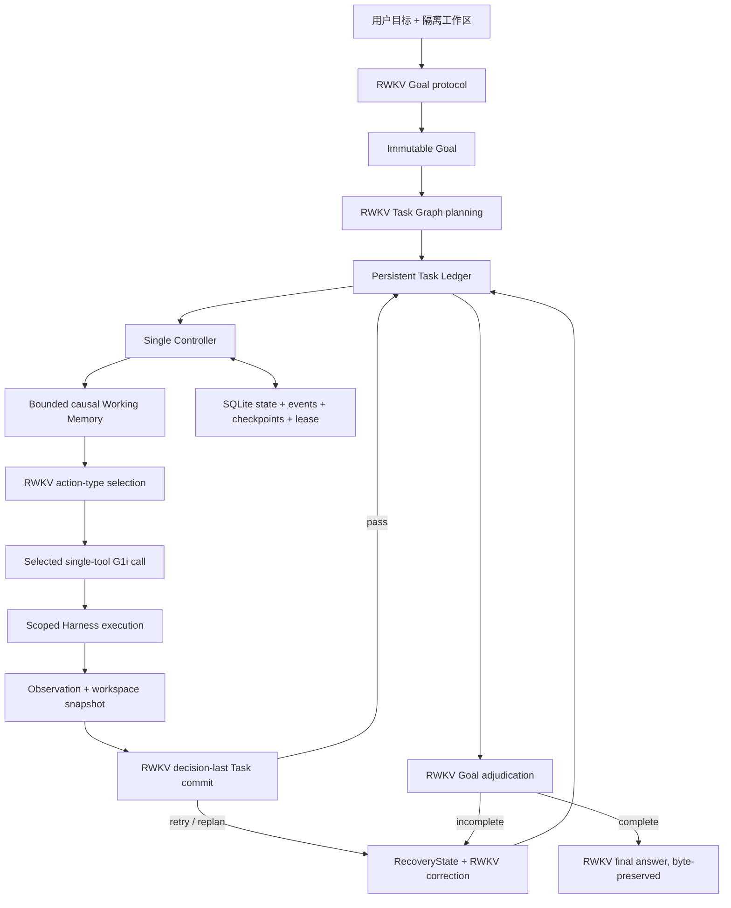

# RWKV-LH

RWKV-LH 是一个只面向 RWKV 的持久化 Long-Horizon Agent 运行时。它把目标、任务图、执行尝试、工具结果、验证证据、恢复状态和模型请求保存为结构化状态，让 RWKV 在多步骤任务中持续读取真实工作区、执行动作、判断结果并从失败处恢复。

本仓库不使用其他模型替 RWKV 规划、选择工具、判断任务是否完成或改写最终答案。确定性代码只负责协议、状态、执行隔离、可观察事实和恢复语义。

> 当前版本是可复现实验检查点，不是 beta 或生产版本。

## 当前最佳架构

当前分支保留的是 **Round46 主架构**。2026-08-14 上传前复核时，62 个登记文件与 Round46 正式运行 manifest 完全一致；随后只修复了一个由回归测试发现的通用命令接口问题：规范别名 `python` 现在无条件指向当前 RWKV-LH 运行时，不再随 PATH 改变。该修复没有重跑并冒充新的模型分数。Round47、Round48、Round49 的候选结构均已依据真实 RWKV canary 结果回退，不存在并行的旧 Controller 或第二套运行链路。

固定模型：`rwkv7-g1i-13.3b-20260805-ctx16384`。当前最新的可比完整结果是 Basic30，不应误写成 E2E-90：

| 指标 | Round41 Basic30 | Round46 Basic30 | 变化 |
| --- | ---: | ---: | ---: |
| Strict E2E | 17/30 | **23/30** | +6 |
| External acceptance | 24/30 | 23/30 | -1 |
| Agent completed | 20/30 | 25/30 | +5 |
| False positive | 3 | **2** | -1 |
| False negative | 7 | **0** | -7 |
| RWKV 请求数 | 467 | 517 | +50 |

`Strict = Agent completed AND External acceptance`。Round46 仍有两个假阳性（B12、B29），所以它只是当前质量最高的回档点，不代表简单题已完全解决。其价值是 Strict 明显提高、假阳性没有增加、假阴性归零。现阶段以 Strict、FP/FN 和因果链正确性为优化目标；请求数和耗时照常记录，但不作为质量改造的否决条件。

完整结果与逐题归因：

- [Round46 预注册协议](data/experiments/Round46_PROTOCOL.md)
- [Round46 Basic30 报告](data/experiments/Round46_basic30_decision_last_format/REPORT.md)
- [Round46 Basic30 因果分析](data/experiments/Round46_basic30_decision_last_format/CAUSAL_ANALYSIS.md)
- [Round46 上传前接口修复协议](data/experiments/Round46_UPLOAD_FIX_PROTOCOL.md)
- [Round47 失败候选分析](data/experiments/Round47_canary_stale_frontier/CAUSAL_ANALYSIS.md)
- [Round48 失败候选分析](data/experiments/Round48_canary_noop_lineage/CAUSAL_ANALYSIS.md)
- [Round49 失败候选分析](data/experiments/Round49_canary_immediate_frontiers/CAUSAL_ANALYSIS.md)

Round47 的同 frontier stale-action 失效没有修复 B12 的新串行错误路径；Round48 的 noop lineage 在固定 canary 中退化为 `6/10` Strict；Round49 的强制 immediate frontier 使 RWKV 把未来语义阶段全部展平，退化为 `0/10` Strict。这些结果说明结构层只能保存和传递 RWKV 的因果关系，不能用规则替 RWKV 选择正确任务、工具参数或答案。

Round46 尚未在当前结构上跑完整 E2E-90，因此不能从 `23/30` 外推 Medium/Hard 表现。历史 90 题结果、协议和完整因果记录保存在 `data/experiments/`。

## 架构



这里只有一个权威状态与执行链：

- `rwkv_lh/schema.py`：不可变 Goal、Task、Attempt、Artifact、Evidence、RecoveryState 和版本化运行状态。
- `rwkv_lh/store.py`：SQLite 事务、revision CAS、checkpoint、事件流和 Controller lease。
- `rwkv_lh/controller.py`：唯一调度循环，负责 ready frontier、重试、replan、恢复与结束；不改写 RWKV 的语义决策和最终输出。
- `rwkv_lh/memory.py`：从权威状态生成有界的因果上下文，不使用自由摘要替代事实。
- `rwkv_lh/model.py`：RWKV 的 Goal、Planning、Action、Task commit、Goal adjudication、Recovery 和 Final 协议。
- `rwkv_lh/tool_protocol.py`：G1i 线协议和闭集格式归一化。
- `rwkv_lh/harness.py`：工作区范围内的文件、命令、观察与副作用执行。
- `rwkv_lh/validation.py`：文件、hash、命令退出码、JSON 和工作区快照等可观察事实。
- `rwkv_lh/runtime/`：只面向 RWKV 的 OpenAI-compatible 客户端与请求级采样状态。

### 格式转换层边界

模型边界只接受少量已登记的常见 wire form，并归一为一个内部协议。它只转换结构，不判断内容：

- 可以展开已登记的 `task_graph.tasks/nodes` 或 function-call 外壳；
- 可以把 G1i 常见的字符串 `arguments` 解码为原对象；
- 对键集合恰好为 `{reason, decision}` 的 Task commit，可以只补固定常量 `schema_version="long-horizon.task-commit.v1"`；
- 必须保留 raw/normalized payload、摘要、转换名和 normalizer 版本；
- 不补任务、criterion、工具名、参数、expected、文件内容、decision 或最终答案；
- 未登记格式、冲突字段和额外语义字段 fail closed。

Round46 的 B27 首次输出已经给出正确 `decision=replan`，只是缺少固定 schema tag。格式层无损补标签后避免了重新采样把决定变成错误的 `pass`；`reason` 和 `decision` 均未改变。

## 安装与运行

项目命令只在 WSL `UbuntuRecovered` 中执行。使用 `uv`：

```bash
git clone https://github.com/rwkv-rs/RWKV-LH.git
cd RWKV-LH
uv sync --frozen --dev
cp .env.example .env.local
```

在 `.env.local` 配置 RWKV endpoint、模型名和凭证。该文件被 Git 忽略。

```bash
uv run rwkv-lh-runtime-smoke
mkdir -p /tmp/rwkv-lh-workspace
uv run rwkv-lh start \
  --request "在工作区创建两个配置文件，并用测试验证它们一致" \
  --workspace /tmp/rwkv-lh-workspace
```

查询或恢复：

```bash
uv run rwkv-lh status RUN_ID
uv run rwkv-lh resume RUN_ID
```

默认状态和 artifact 位于 `data/runs/`。

## 本地手工测试界面

```bash
uv run rwkv-lh-web
```

打开 `http://127.0.0.1:8765`。界面可创建隔离任务、提供初始文件，并查看 RWKV prompt/raw output、协议归一化、Task Graph、SQLite 事件、工作区文件和审计导出。

Web UI 只监听 loopback，不应直接暴露到公网。它不是另一套 Agent，不添加隐式 `web_search`，不使用其他模型判断答案，也不改写 RWKV 最终输出。详见 [本地界面说明](docs/LOCAL_WEB_UI.zh-CN.md)。

## 测试与质量门

```bash
uv run pytest -q
uv run rwkv-lh-control
uv run rwkv-lh-e2e --suite all --validate-only
```

当前离线回归共 `364` 项；`LH-Control-30` 检查 Controller、状态、验证、恢复、幂等、依赖、scope 和请求级采样；E2E catalog 固定为 `90` 题，Basic、Medium、Hard 各 30 题。离线测试不替代真实 RWKV E2E。

正式 E2E 只向 RWKV 提供用户目标、初始工作区和工具，不预置 Task Graph、动作、replan 路径或隐藏 acceptance：

```bash
uv run rwkv-lh-e2e --suite all \
  --max-transitions 200 \
  --concurrency 8 \
  --output data/experiments/RoundN
```

`--concurrency` 只并行不同 case；每题有独立工作区、SQLite、模型客户端和 verifier 目录。隐藏验收在独立 bubblewrap worker 中执行，模型和 Agent 看不到 acceptance、scorecard 或 verifier 日志。

大型代码项目“并行总结每个文件”的 31 文件冻结验收集位于 `data/datasets/rwkv_lh_large_code_31_v1/`。它是后续能力目标，未通过前不得写成已具备能力。

## 数据与实验记录

固定数据集位于 `data/datasets/`，并登记来源、版本、用途、摘要和生成方式。RWKV-E2E-90 与 Codex 冻结参考答案位于 `data/datasets/rwkv_e2e_90_v1/`。

每轮在结构修改前写入 `RoundN_PROTOCOL.md`；运行后保存冻结协议、聚合结果、源码 manifest、逐题报告和因果分析。数 GB 的 case 工作区、SQLite 与逐 revision 快照保留在本地 append-only 实验目录并由 `.gitignore` 排除；可审查、可复现的协议、结果、manifest 和分析进入 Git。

不得在结果产生后修改 expected、阈值或相似度算法。发现单题问题后，必须继续检查完整数据集、全部同类场景和相关上下游代码路径。规则不能读取隐藏验收来筛选答案，也不能增删改 RWKV 的决定或最终输出。

## 恢复保证

每次副作用前持久化 Attempt；执行后保存 observation、artifact hash、验证结果和 checkpoint。恢复时依据动作的 `read_only`、`side_effect` 与 `idempotent` 元数据决定安全重试或阻塞，避免静默重复非幂等操作。Goal digest 用于检测长期执行中的目标漂移。
