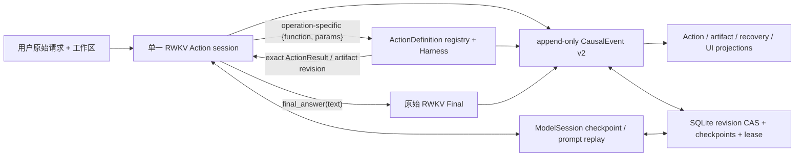

# RWKV-LH

RWKV-LH 是面向基础续写 RWKV 的持久化 Agent 运行时。当前实验架构只保留一个 RWKV
语义会话：模型直接选择注册工具，Harness 执行其明确参数，并把真实 Observation 返回同一
会话。Runtime 保存事实和恢复状态，但不替 RWKV 选择工具、生成任务、判断业务答案或改写
Final。

> 当前版本仍是实验候选。正式能力只能由冻结源码下的真实 RWKV E2E 给出；单元测试通过
> 只证明结构可运行。

## 当前唯一架构



关键不变量：

- 不解析自然语言为在线 Goal schema、criterion 或 Task DAG。用户请求只作为不可变原文。
- 模型边界直接显示 `read_file`、`write_file`、`write_json`、`run_command` 等具体工具及
  `final_answer`；没有 `lh_task_call(operation, operation_args)`、selector 或 reviewer。
- 一次回合只接受一个明确工具调用。Controller 不选择 operation，不补参数，不读取隐藏验收。
- 简单格式层只归一化常见调用外壳与 Markdown JSON fence；operation 参数仍由对应
  ActionDefinition 校验。被拒调用不执行。
- 如果 RWKV 已明确选择一个已注册 operation 但参数不合法，最近的拒绝 Observation 会重显
  这个 operation 的精确 schema；不会猜测、删除或改写参数。
- 所有业务阶段写入统一不可变事件：
  `schema_version/event_id/run_id/sequence/parent_id/cause_id/subject_id/event_type/`
  `payload_schema/payload/digest/created_at`。
- Action 由 `action_started` 与 `action_finished` 两个事件表示。Action、artifact revision、
  failure budget、Final 与 UI 状态是事件链的确定性投影，不是第二套可变真相。
- SQLite snapshot 和 ModelSession transcript 是带 digest 的恢复/transport cache。加载时重新
  fold 事件并校验 projection digest；旧 v16 及更早状态不静默迁移。
- 当前后端只有可审计 `prompt_replay`，没有把 prompt cache 宣称为 native RWKV recurrent state。
- Final 无论对错都来自同一 RWKV session 的 `final_answer(text)`，Runtime 不改写文本。

主要模块：

- `rwkv_lh/model_io.py`：唯一 direct-call wire grammar 与透明外壳归一化。
- `rwkv_lh/model_session.py`：checkpoint、commit/rollback 和确定性 rollover。
- `rwkv_lh/model.py`：单 Action lane、具体工具定义与精确 schema rejection feedback。
- `rwkv_lh/harness.py`：唯一 ActionDefinition 注册表、sandbox 与执行。
- `rwkv_lh/controller.py`：直接 Action→Observation→Final 循环和 crash recovery。
- `rwkv_lh/schema.py` / `store.py`：v17 CausalEvent 权威链、投影与 SQLite 事务。
- `rwkv_lh/web_ui.py`：同一 Controller 的本地测试界面，不增加第二条执行路径。

## 当前证据

已上传的完整 E2E-90 最佳基线仍是 Round46：Strict `31/90`、External `32/90`、
Agent completed `55/90`、FP `24`、FN `1`。

Round117 单 RWKV direct-action Basic30 为 Strict/External `20/30`、Agent completed
`28/30`、FP `8`、FN `0`。它较 Round116 的 `8/30` 明显恢复，但仍低于 Round46 Basic30
的 `24/30`，因此没有运行 confirmatory、collection 或 full90。逐题审计同时发现 Round117
的可变 Action ledger 与 Observation 分裂；v17 已把该状态改成 CausalEvent 权威投影，正在
按 Round118 预注册协议重新验证。

固定模型：`rwkv7-g1i-13.3b-20260805-ctx16384`。

## 安装与运行

项目逻辑只在 WSL `UbuntuRecovered` 中运行：

```bash
uv sync --frozen --dev
cp .env.example .env.local
uv run rwkv-lh-runtime-smoke
uv run rwkv-lh start --request "创建并验证 result.json" --workspace /tmp/rwkv-lh-workspace
```

Python 工具命令复用项目 uv 环境。`.venv` 以只读方式映射到命令 sandbox，实验 workspace
是任务唯一可写范围。模型可以执行 `python -m pytest` 或已安装的 `pytest`，不应在任务中
修改 `.venv` 或在线安装依赖。

恢复与查询：

```bash
uv run rwkv-lh status RUN_ID
uv run rwkv-lh resume RUN_ID
```

本地界面：

```bash
uv run rwkv-lh-web
```

打开 `http://127.0.0.1:8765`。界面只展示和驱动同一 Controller。

## 验证

```bash
uv run pytest -q
uv run rwkv-lh-control
uv run rwkv-lh-e2e --suite all --validate-only
```

正式 E2E：

```bash
uv run rwkv-lh-e2e --suite all --max-transitions 200 --concurrency 1 \
  --output data/experiments/RoundN
```

隐藏验收和 Codex 参考答案不进入模型输入。实验必须预注册固定数据、参数、阈值与相似度
算法，并保存源码 manifest、prompt/raw output、CausalEvent、checkpoint、逐题首次偏离和
聚合指标。

详见 [当前架构](docs/LONG_HORIZON_AGENT_DESIGN.zh-CN.md)、
[G1i 协议](docs/G1I_TOOL_PROTOCOL.zh-CN.md) 与
[Round118 预注册](data/experiments/Round118_V17_CAUSAL_EVENT_AUTHORITY_AND_SCHEMA_FEEDBACK_PROTOCOL.md)。
