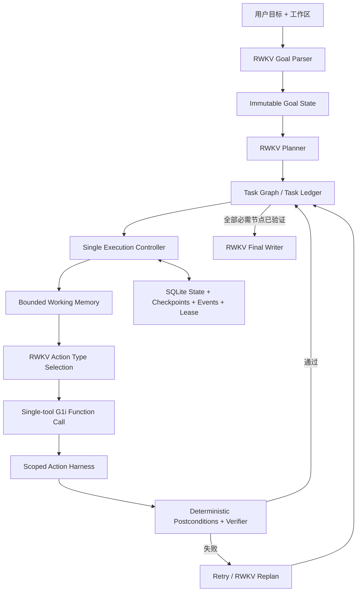

# RWKV-LH

RWKV-LH 是一个面向 RWKV 的持久化 Long-Horizon Agent 运行时。它把长期目标、任务图、执行尝试、证据、验证结果、恢复点与每次模型请求的采样决策保存为结构化状态，使 Agent 能在多步骤任务中保持目标、验证真实结果，并在中断后继续执行。

这个仓库只包含长程 Agent。它不包含网页检索 Agent、答案质量 Judge、检索评测流水线、前端或历史 HTML 报告。检索能力如有需要，应作为显式工具扩展接入，而不是成为 Controller 的隐式依赖。

RWKV-LH 专门为 RWKV 模型的长程执行而建立。LongHorizon-Harness、LangGraph、Temporal 与 Harbor 只用于研究设计思想和可靠执行语义，不是本项目的运行时、后端或兼容目标；所有语义规划与决策仍由 RWKV 完成。

**不可变产品原则：RWKV-LH 只为 RWKV 服务。** 不增加通用模型 provider、AgentAdapter、模型混跑或用其他模型掩盖 RWKV 失败；不为了跨模型兼容改写现有 RWKV 提示词格式；不把 LangGraph、Temporal、Harbor 或其他 Agent 框架引入运行时依赖。允许的演进必须直接改善 RWKV 的上下文组织、状态保持、动作执行、验证、恢复或 vllm-rwkv 推理行为。

## 当前状态

当前版本是 **可复现实验基线**，不是 beta 或生产可用版本。2026-08-11 在固定 G1i-13.3B、固定数据集和预注册 `utf8-byte-ngram-cosine.v1` 指标下得到：

- 离线产品回归：`97 passed`。
- G1i 生产动作固定五题：5/5 完成、5/5 工具名正确、4/5 exact，平均相似度 `0.988121`。
- RWKV-E2E-42 全量严格验收：5/42；其中 basic 5/10、medium 0/10、hard 0/10、long-horizon 0/12。

这些结果证明 G1i 工具协议已经进入真实 Controller → Harness → Verifier 路径，但长程完成边界仍不可靠。当前优先整改项是：

1. 将任务推进声明与经过验证的 Goal evidence 分离；
2. 由确定性结构层分配 task id、重写引用并校验 DAG；
3. 建立跨 replacement 的 recovery lineage，并把验证失败路由回真正的 producer；
4. 在推理服务提供能力后接入可持久化、可 fork/commit/rollback 的真实 RWKV recurrent state。

完整架构诊断与实施顺序见 [`ARCHITECTURE_FINDINGS.md`](data/experiments/rwkv_lh_architecture_ablation_v1/ARCHITECTURE_FINDINGS.md)，G1i 协议与全量结果见 [`G1I_TOOL_PROTOCOL.zh-CN.md`](docs/G1I_TOOL_PROTOCOL.zh-CN.md)。在上述系统性问题完成并通过固定指标、全数据集与恢复回归前，不应把单题成功或离线通过等同于整体问题已解决。

## 架构



核心边界：

- `rwkv_lh/schema.py`：不可变 Goal、Task、Attempt、Memory、Artifact 与状态枚举。
- `rwkv_lh/store.py`：SQLite 事务、revision CAS、checkpoint、事件流和 Controller lease。
- `rwkv_lh/controller.py`：决定下一任务、重试、replan、恢复与结束；不改写 RWKV 最终输出。
- `rwkv_lh/harness.py`：工作区范围内的文件、命令和证据操作；扩展动作必须显式声明副作用与幂等性。
- `rwkv_lh/validation.py`：依据文件、哈希、命令退出码、JSON、证据绑定等可观察结果验收。
- `rwkv_lh/memory.py`：从持久状态投影当前任务需要的有界上下文。
- `rwkv_lh/model.py`：RWKV 的 Goal Parse、Planning、Action、Cross-validation、Replan 和 Final Answer 协议。
- `rwkv_lh/tool_protocol.py`：线上 G1i `System: Tools`、fenced JSON function call、Function output 续轮格式与参数归一化。
- `rwkv_lh/runtime/`：结构化 OpenAI-compatible RWKV 客户端。

## OpenAI-compatible RWKV runtime

### WSL-only 运行边界

RWKV-LH 的项目进程、Python、测试与 E2E benchmark 只在 WSL 中运行。Windows 不承载项目服务或代理中转脚本；允许 WSL 直接使用 Windows 上的 FlClash，例如 `RWKV_PROXY_URL=http://172.31.80.1:7890`。代理只改变网络出口，不改变执行环境，正式报告必须记录 WSL 发行版、代理地址和并发度。

### RWKV 推理后端 profile

运行时只面向 RWKV，但支持两个已经由真实 RWKV 服务实现的线协议：

- `vllm-rwkv-rapid`：使用 `/completions`，发送 vllm-rwkv rapid-sampling 已实现的参数。
- `rwkv-lightning-native`：使用 `/chat/completions`，把 prompt 映射为 `contents`，停止串映射为 `stop_tokens`，重复惩罚映射为 `alpha_presence`、`alpha_frequency` 和 `alpha_decay`。该 profile 不发送服务端没有实现的 `min_tokens`、`stop_token_ids` 或 token-id 返回选项。

远端位于 Cloudflare Access 后时，可通过 `RWKV_CF_ACCESS_CLIENT_ID` 和 `RWKV_CF_ACCESS_CLIENT_SECRET` 注入访问头；凭证只写入被 Git 忽略的 `.env.local` 或当前 WSL 进程环境，禁止写入命令记录、报告和仓库。

```dotenv
RWKV_BASE_URL=https://your-rwkv-endpoint.example/v1
RWKV_MODEL=your-rwkv-model-id
RWKV_BACKEND_PROFILE=rwkv-lightning-native
RWKV_API_KEY=
RWKV_CF_ACCESS_CLIENT_ID=
RWKV_CF_ACCESS_CLIENT_SECRET=
RWKV_PROXY_URL=http://172.31.80.1:7890
```

runtime 不是散落的 HTTP 调用，而是四层稳定接口：

- `settings.py`：类型化部署配置和 `.env.local` 加载。
- `sampling.py`：通过 `ContextVar` 隔离每个请求的 rapid-sampling 参数、request id、task id 与 lane。
- `protocol.py`：请求、响应、usage、health 以及 Transport/HTTP/Protocol 错误类型。
- `openai_compat.py`：线程隔离连接池、UTF-8 JSON 解析、超时、有限重试、`/completions`、`/chat/completions` 与 `/models`。

请求级 temperature 的目标不是简单增加随机性，而是按推理阶段选择行为：事实提取、工具动作、验证和最终回答使用低温；任务拆解与 replan 可以使用稍高温度。每次请求都会在 SQLite 事件中记录 request id/type、完整采样配置、输入、输出和结果。

当前运行时按已部署的 vllm-rwkv rapid-sampling 实现收敛参数：支持 `temperature`、`top_p`、`top_k`、`presence_penalty`、`frequency_penalty`、`penalty_decay`、`min_tokens`、停止字符串和附加 `stop_token_ids`；不发送 `seed`、`min_p`、`repetition_penalty`、`ignore_eos` 或 thinking budget。`temperature=0` 会在本地拒绝。模型端当前最大上下文是 16,384 tokens，输入预算会按每次请求的 `max_tokens`、BOS 和安全余量动态计算。

### G1i 工具调用协议

vllm-rwkv 可以启用原生 tool parser，但固定数据复测显示当前 parser 不能作为默认正确性边界。RWKV-LH 在 `/completions` 上显式渲染线上 G1i 格式：

````text
System: Tools: [...]
Return only a JSON function call.

User: <任务提示>

Assistant: ```json
{"name":"read_file","arguments":{"path":"input.txt"}}

User: Function output: <工具返回>

Assistant: ```json
{"name":"submit","arguments":{...}}
````

当前推理端没有可持久化的 RWKV recurrent-state handle，因此生产代码使用相同字节格式的完整前缀重放；这只保证协议等价，不宣称获得 state 的延迟、分支或恢复收益。未来接入 state 时，`User: Function output` 是追加到同一 state 的新 User turn，不是连续写进上一个 Assistant 块。

动作链保留紧凑的 action-type 选择，再把唯一已选工具放入 `System: Tools` 生成参数。完整工具表一次生成在固定用例中出现选择退化，因此没有为了减少一次模型调用而牺牲正确率。G1i 输出中的 `arguments` 可以是对象，也可以是 OpenAI/vLLM 常见的 JSON 字符串；协议层统一归一化为对象后再交给 Harness 校验。内建动作的可观察后置条件由确定性代码生成，自定义动作才调用 RWKV 设计 verifier。

协议、state 边界、消融数据和复现命令见 [`docs/G1I_TOOL_PROTOCOL.zh-CN.md`](docs/G1I_TOOL_PROTOCOL.zh-CN.md)。

当前策略定义在 `rwkv_lh/temp_policy.py`。模型调用链为：

```text
Controller / Model role
→ TemperaturePolicy.decide(request_type)
→ sampling_parameters(rapid-sampling profile + request id)
→ OpenAICompatibleRWKVClient
→ POST /v1/completions
```

## 安装

只使用 `uv`：

```bash
git clone https://github.com/rwkv-rs/RWKV-LH.git
cd RWKV-LH
uv sync --frozen --dev
cp .env.example .env.local
```

在 `.env.local` 中配置 endpoint、API key 和模型名。凭证文件被 Git 忽略。

## 运行

检查模型端：

```bash
uv run rwkv-lh-runtime-smoke
uv run rwkv-lh-runtime-smoke --completion --temperature 0.03 --top-p 1.0
```

启动新任务：

```bash
mkdir -p /tmp/rwkv-lh-workspace
uv run rwkv-lh start \
  --request "在工作区创建两个配置文件，并用测试验证它们一致" \
  --workspace /tmp/rwkv-lh-workspace
```

查询或恢复：

```bash
uv run rwkv-lh status RUN_ID
uv run rwkv-lh resume RUN_ID
```

默认 SQLite 与 artifact 位于 `data/runs`；也可以通过 `--state-directory` 指定。

## 测试边界

```bash
uv run pytest -q
uv run rwkv-lh-control
```

当前离线测试共 97 项。`LH-Control-30` 是 RWKV-LH 的确定性运行时回归测试，覆盖 Controller、状态、验证、恢复、幂等、依赖、scope 和 request-level sampling。它不调用其他 Agent，也不替代 RWKV 模型能力测试；真实模型能力由单独的 RWKV E2E 套件验证：只向 RWKV 提供用户目标、初始工作区和工具，不预置 Task Graph、动作或 replan 路径。

真实 E2E 套件可先校验题库边界：

```bash
uv run rwkv-lh-e2e --suite core30 --validate-only
uv run rwkv-lh-e2e --suite lh12 --validate-only
uv run rwkv-lh-e2e --suite all --validate-only
```

正式题目可以使用隔离的 case 进程并发，例如：

```bash
uv run rwkv-lh-e2e --suite core30 \
  --case E2E-B01 --case E2E-B02 --case E2E-B03 --case E2E-B04 \
  --case E2E-B05 --case E2E-B06 --case E2E-B07 --case E2E-B08 \
  --concurrency 8 \
  --output outputs/basic8-c8
```

`--concurrency` 是 case worker 进程数，不是单题内部模型调用并发。runner 使用独立 spawn 进程而不是线程；每题仍拥有独立工作区、SQLite、模型客户端和 verifier 私有目录，父进程只汇总公开结果。每个子进程必须先关闭 Agent 进程树，再启动该题的 bubblewrap verifier。

`core30` 是原有基础/中等/困难套件；`lh12` 是新增的长程压力套件，覆盖 repeated replan、goal retention、动态发现、crash recovery、fan-out/fan-in、prompt injection、异构迁移、compensation、外部状态、tool-call budget、working memory 和 capstone。

隐藏 acceptance 由独立 bubblewrap worker 验证：仓库、`/tests`、verifier 日志和 scorecard 不会挂载；工作区是拒绝 symlink 的只读快照；PID 与网络 namespace 独立；Agent 进程必须先退出。Linux 真实 E2E 因而要求系统安装 `bwrap`，缺失时 fail closed。

RWKV 的职责定义、现有 10 阶段提示词、12 道新题、隔离威胁模型，以及 LongHorizon-Harness、LangGraph、Temporal、Harbor 的借鉴边界见 [`docs/RWKV_LONG_HORIZON_PHASE1.zh-CN.md`](docs/RWKV_LONG_HORIZON_PHASE1.zh-CN.md)。

2026-08-10 的正式使用就绪审计、真实 canary 结果、项目对比、缺陷优先级与晋级门槛见 [`docs/RWKV_FORMAL_READINESS_20260810.zh-CN.md`](docs/RWKV_FORMAL_READINESS_20260810.zh-CN.md)。

2026-08-09 的初版真实验证为 0/8 严格通过、4/8 隐藏产物验收通过，完整判读见 [`docs/RWKV_E2E_INITIAL_VALIDATION_20260809.md`](docs/RWKV_E2E_INITIAL_VALIDATION_20260809.md)。最新 G1i 基线虽已提高到 RWKV-E2E-42 的 5/42，但仍不能标记为生产可用。

## 数据与实验记录

固定数据集放在 `data/datasets/`，每个数据集都登记来源、版本、用途、摘要与生成方式；架构消融、协议探针、逐题 audit、统一指标比较和正式结果放在 `data/experiments/rwkv_lh_architecture_ablation_v1/`。运行时 SQLite state、临时探针和生成缓存不进入 Git。

复测不得在结果产生后修改 expected、阈值或相似度算法。发现单题问题后，需要继续检查完整数据集、全部同类场景及相关上下游代码路径。

## 恢复保证

每次副作用前先持久化 Attempt；每次执行后保存结果、artifact hash、验证结果和 checkpoint。恢复时根据动作的 `read_only`、`side_effect` 与 `idempotent` 元数据决定安全重试或阻塞，避免静默重复非幂等操作。Goal digest 用于检测长期执行中的目标漂移。
