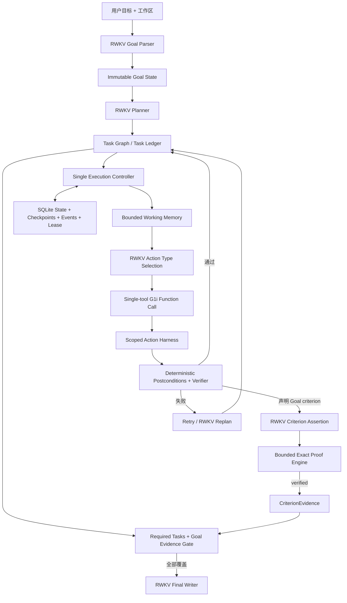

# RWKV-LH

RWKV-LH 是一个面向 RWKV 的持久化 Long-Horizon Agent 运行时。它把长期目标、任务图、执行尝试、证据、验证结果、恢复点与每次模型请求的采样决策保存为结构化状态，使 Agent 能在多步骤任务中保持目标、验证真实结果，并在中断后继续执行。

这个仓库只包含长程 Agent。它不包含网页检索 Agent、答案质量 Judge 或检索评测流水线；
`rwkv-lh-web` 只是本机手工测试和全链路审计界面，不是另一套 Agent，也不参与 RWKV 决策。
检索能力如有需要，应作为显式工具扩展接入，而不是成为 Controller 的隐式依赖。

RWKV-LH 专门为 RWKV 模型的长程执行而建立。LongHorizon-Harness、LangGraph、Temporal 与 Harbor 只用于研究设计思想和可靠执行语义，不是本项目的运行时、后端或兼容目标；所有语义规划与决策仍由 RWKV 完成。

**不可变产品原则：RWKV-LH 只为 RWKV 服务。** 不增加通用模型 provider、AgentAdapter、模型混跑或用其他模型掩盖 RWKV 失败；不为了跨模型兼容改写现有 RWKV 提示词格式；不把 LangGraph、Temporal、Harbor 或其他 Agent 框架引入运行时依赖。允许的演进必须直接改善 RWKV 的上下文组织、状态保持、动作执行、验证、恢复或 vllm-rwkv 推理行为。

## 当前状态

当前版本是 **可复现实验基线**，不是 beta 或生产可用版本。2026-08-12 使用固定
`rwkv7-g1i-13.3b-20260805-ctx16384`、固定 RWKV-E2E-90、并发 8、每题最多 200 transitions
与预注册 `utf8-byte-ngram-cosine.v1` 得到：

| 轮次 | 结构变量 | External | Strict | FP | FN |
| --- | --- | ---: | ---: | ---: | ---: |
| Round1 | 整改后的 E2E-90 基线 | 7/90 | 5/90 | 6 | 2 |
| Round2 | 透明协议外壳归一 | 8/90 | 7/90 | 12 | 1 |
| Round3 | 相同失败 observation 抑制 | 4/90 | 2/90 | 9 | 2 |
| Round4 | RWKV 自提独立 criterion proof | 7/90 | 0/90 | 0* | 7 |
| Round5 | 线性 typed criterion assertion | 12/90 | 0/90 | 0* | 12 |
| Round6 | progressive-disclosure read operator assertion | 6/90 | 0/90 | 0* | 6 |
| Round7 | RWKV Goal obligation ledger + supplemental planning | 12/90 | 0/90 | 0* | 12 |
| Round8 | copy-resistant assertion binding contract | 12/90 | 0/90 | 0* | 12 |
| Round9 | single-claim G1i assertion binding | 15/90 | 0/90 | 0* | 15 |
| Round10 | canonical G1i assertion binding framing | 15/90 | 0/90 | 0* | 15 |
| Round11 | persistent unresolved-obligation lifecycle | 18/90 | 0/90 | 0* | 18 |
| Round12 | RWKV witness-intent precommit + opaque catalog selection | 11/90 | 0/90 | 0* | 11 |

- Round11 难度分组 External：Basic 16/30、Medium 1/30、Hard 1/30。
- Round12 难度分组 External：Basic 10/30、Medium 1/30、Hard 0/30。
- Round12 冻结正式运行：90/90 结果、90/90 因果链、1,436 次真实 RWKV 请求；Strict/Completed
  均为 0，11 个 external-correct case 全部成为 false negative。正式传输 manifest 证明本地
  1,436 个请求与远端 1,436 个 spool job 一一对应，全部 `upstream_invocations=1`，没有重生成。
- 离线产品回归与 LH-Control 的本轮最终结果见 Round12 目录；手工前端另有独立非模型接口测试。
- Round1–Round11 均有 90/90 完整因果链；有 completed run 的轮次中，最终回答与 RWKV 原始响应
  全部字节一致。
- Round2 的 External/Strict 提升，但 FP 从 6 增至 12。按用户明确要求，本次允许临时取消
  “FP 不增加”上传门禁以保存 Round2；从 Round3 起恢复该门禁，不能用通过数掩盖错误完成。
- Round3 FP 降为 9，但 External/Strict 回退；42 个可缓存 observation 中没有任何相同失败观察
  再次出现，实际 suppression 为 0，因此不得把请求数或分数变化归因于该 gate，也不上传新回档。
- Round4 的 84 次 criterion evaluation 中 proof pass 为 0，Agent completed 也是 0。FP=0 是全阻断下的
  空洞结果，不是完成精度提升；Round4 不上传为最佳回档，当前最佳仍是 Round2。
- Round5 将递归 DSL 改为线性 typed assertion，External 升至 12、请求从 Round4 的 802 降至 705，
  顶层 validation contract 有效率也从 38/84 升至 40/58；但 RWKV 给出的 55 条 assertion 全部因联合枚举
  占位值、source 不相容字段或自创字段而未能无损归一，Agent completed 仍为 0。Round5 同样不上传为最佳
  回档，FP=0 仍带 `*` 表示全无 completion。
- Round6 按 Prime/G1i 的 progressive disclosure 把 read operator 选择与参数 binding 分成两阶段。Phase B
  只成功 5 个 event/7 条 assertion，7 条又因非 direct dependency 或两侧同源全部拒绝；External 回退到 6，
  completed 仍为 0。它证明“分阶段”本身不能替代 RWKV 的 evidence ownership 判断，Round6 不上传。
- Round7 把 initial plan 的结构合法性与 criterion coverage 拆开，以确定性集合差建立 obligation ledger，再由
  RWKV 追加 supplemental task。40 个非空 ledger 中 15 个扩图成功并新增 44 个 task，只带来 3 个 accepted
  cohort External pass；其中 15 个标题、19 个描述与 base task 完全重复。全轮请求增至 1148，completed 仍为
  0，因此只保留实验数据，不上传为最佳检查点。
- Round8 将 Phase B selected contract 改为抗复制的非 JSON 行协议。accepted binding response 从 Round7 的
  8/79 升至 13/88，形成 15 条 assertion，但全部因非 direct dependency、无效 JSON pointer 或非原文 Goal
  quote 被 exact proof 拒绝；External/Strict/Completed 与 Round7 相同，因此不上传。
- Round9 将每个 claim 拆为一个单工具 G1i 调用，但 66 次响应没有一次使用 canonical `{name,arguments}`，
  其中 63 次以工具名作为顶层 key。Phase B 触发后完全失败，External=15 不能归因于该变量；completed 仍为 0，
  不上传。
- Round10 明确 canonical G1i 外层后，50 次绑定调用被规范化，但 13 个有效单 claim 全部在
  direct dependency、artifact ownership 或 JSON Pointer 上失败。External=15、Strict/Completed=0，不上传。
- Round11 取消初始计划的同步 criterion coverage 硬门，改为执行后持久 unresolved
  obligation。该门的早停从 30 题降为 0，External 升至 18；但 232 次 assertion evaluation
  没有一次 proof pass，48 题进入 replan，追加 197 个 task，总请求升至 2175。错误被推迟并放大，
  Strict/Completed 仍为 0，不上传。
- Round12 把 witness intent 前置到具体 action 选择后、执行前，并让 RWKV 从完整 opaque catalog
  选择 source/handle。32 题进入 intent，只有 6 题成功预提交，3 题到达 binding，28 次 proof
  evaluation 全部拒绝；最大终态断点为 30 题 witness-intent contract，其次是 13 题 obligation
  replan contract。External 比 Round11 下降 7，Strict/Completed 仍为 0，因此不上传为最佳回档。

透明归一只展开完整的 `task_graph.tasks/nodes` 与单 function 外壳，保留归一前后 payload；
不补任务、criterion、参数、文件内容或答案。当前优先整改项是：

1. 下一单变量应将 witness intent 前置到 RWKV 计划/修订：由 RWKV 决定 criterion、producer/
   consumer、actual/expected source 类型和 comparison，Controller 不自动配对或选“最可能通过”的引用；
2. 对所有原始 action result、dependency artifact、goal literal 和 workspace snapshot 无筛选地生成 opaque
   handle；RWKV 用简单单工具协议选 handle，确定性层只验证存在性、所有权、hash 和类型；
3. proof 失败先向同一 RWKV 返回 `not_direct_dependency` / `pointer_missing` / `type_mismatch`
   做局部重绑；只有 RWKV 明确判断需要新产物时才扩图，不再把缺 evidence 自动放大为整批重复 task；
4. Goal criterion 1--16 容量与前置 witness lifecycle 分轮消融；推理后端真实声明 capability 后再接入可
   持久化、可 fork/commit/rollback 的 RWKV recurrent state。

固定协议见 [`Round0/PROTOCOL.md`](data/experiments/Round0/PROTOCOL.md)，逐轮结果与因果分析见
[`Round1`](data/experiments/Round1/CAUSAL_ANALYSIS.md) 和
[`Round2`](data/experiments/Round2/CAUSAL_ANALYSIS.md)、
[`Round3`](data/experiments/Round3/CAUSAL_ANALYSIS.md) 和
[`Round4`](data/experiments/Round4/CRITERION_PROOF_ANALYSIS.md)、
[`Round5`](data/experiments/Round5/LINEAR_ASSERTION_ANALYSIS.md)、
[`Round6`](data/experiments/Round6/OPERATOR_ASSERTION_ANALYSIS.md)、
[`Round7`](data/experiments/Round7/GOAL_OBLIGATION_ANALYSIS.md)、
[`Round8`](data/experiments/Round8/BINDING_CONTRACT_ANALYSIS.md)、
[`Round9`](data/experiments/Round9/G1I_BINDING_ANALYSIS.md)、
[`Round10`](data/experiments/Round10/CANONICAL_G1I_ANALYSIS.md)、
[`Round11`](data/experiments/Round11/PERSISTENT_OBLIGATION_ANALYSIS.md) 和
[`Round12`](data/experiments/Round12/BACKWARD_CAUSAL_ANALYSIS.md)；分阶段计划的数据审查见
[`Round3/PLAN_REVIEW.md`](data/experiments/Round3/PLAN_REVIEW.md)。在完成边界、全数据集和恢复回归都达标前，
不应把单题成功或离线通过等同于整体问题已解决。

## 架构



核心边界：

- `rwkv_lh/schema.py`：不可变 Goal、Task、Attempt、Memory、Artifact、CriterionClaim/Evidence 与版本化状态。
- `rwkv_lh/store.py`：SQLite 事务、revision CAS、checkpoint、事件流和 Controller lease。
- `rwkv_lh/controller.py`：决定下一任务、重试、replan、恢复与结束；不改写 RWKV 最终输出。
- `rwkv_lh/harness.py`：工作区范围内的文件、命令和证据操作；扩展动作必须显式声明副作用与幂等性。
- `rwkv_lh/validation.py`：依据文件、哈希、命令退出码、JSON、证据绑定等可观察结果验收。
- `rwkv_lh/proof.py`：只执行 RWKV 明确给出的有界 exact assertion，不从自然语言生成或选择证明。
- `rwkv_lh/memory.py`：从持久状态投影当前任务需要的有界上下文。
- `rwkv_lh/model.py`：RWKV 的 Goal Parse、Planning、Action、Cross-validation、Replan 和 Final Answer 协议。
- `rwkv_lh/tool_protocol.py`：线上 G1i `System: Tools`、fenced JSON function call、Function output 续轮格式与参数归一化。
- `rwkv_lh/runtime/`：结构化 OpenAI-compatible RWKV 客户端。

## OpenAI-compatible RWKV runtime

### WSL-only 运行边界

RWKV-LH 的项目进程、Python、测试与 E2E benchmark 只在 WSL 中运行。Windows 不承载项目服务或代理中转脚本；允许 WSL 直接使用 Windows 上的 FlClash，例如 `RWKV_PROXY_URL=http://172.31.80.1:7890`。代理只改变网络出口，不改变执行环境，正式报告必须记录 WSL 发行版、代理地址和并发度。

### RWKV 推理后端 profile

运行时只面向 RWKV，但支持两个已经由真实 RWKV 服务实现的线协议：

- `vllm-rwkv-rapid`：使用 `/completions`，发送 vllm-rwkv rapid-sampling 已实现的参数。
- `rwkv-lightning-native`：使用 `/chat/completions`，把 prompt 映射为 `contents`，停止串映射为 `stop_tokens`，重复惩罚映射为 `alpha_presence`、`alpha_frequency` 和 `alpha_decay`。该 profile 不发送服务端没有实现的 `min_tokens`、`stop_token_ids` 或 token-id 返回选项。

远端位于 Cloudflare Access 后时，可通过 `RWKV_CF_ACCESS_CLIENT_ID` 和 `RWKV_CF_ACCESS_CLIENT_SECRET` 注入访问头；凭证只写入被 Git 忽略的 `.env.local` 或当前 WSL 进程环境，禁止写入命令记录、报告和仓库。

```dotenv
RWKV_BASE_URL=https://your-rwkv-endpoint.example/v1
RWKV_MODEL=your-rwkv-model-id
RWKV_BACKEND_PROFILE=rwkv-lightning-native
RWKV_API_KEY=
RWKV_CF_ACCESS_CLIENT_ID=
RWKV_CF_ACCESS_CLIENT_SECRET=
RWKV_PROXY_URL=http://172.31.80.1:7890
```

runtime 不是散落的 HTTP 调用，而是四层稳定接口：

- `settings.py`：类型化部署配置和 `.env.local` 加载。
- `sampling.py`：通过 `ContextVar` 隔离每个请求的 rapid-sampling 参数、request id、task id 与 lane。
- `protocol.py`：请求、响应、usage、health 以及 Transport/HTTP/Protocol 错误类型。
- `openai_compat.py`：线程隔离连接池、UTF-8 JSON 解析、超时、有限重试、`/completions`、`/chat/completions` 与 `/models`。

请求级 temperature 的目标不是简单增加随机性，而是按推理阶段选择行为：事实提取、工具动作、验证和最终回答使用低温；任务拆解与 replan 可以使用稍高温度。每次请求都会在 SQLite 事件中记录 request id/type、完整采样配置、输入、输出和结果。

当前运行时按已部署的 vllm-rwkv rapid-sampling 实现收敛参数：支持 `temperature`、`top_p`、`top_k`、`presence_penalty`、`frequency_penalty`、`penalty_decay`、`min_tokens`、停止字符串和附加 `stop_token_ids`；不发送 `seed`、`min_p`、`repetition_penalty`、`ignore_eos` 或 thinking budget。`temperature=0` 会在本地拒绝。模型端当前最大上下文是 16,384 tokens，输入预算会按每次请求的 `max_tokens`、BOS 和安全余量动态计算。

### G1i 工具调用协议

vllm-rwkv 可以启用原生 tool parser，但固定数据复测显示当前 parser 不能作为默认正确性边界。RWKV-LH 在 `/completions` 上显式渲染线上 G1i 格式：

````text
System: Tools: [...]
Return only a JSON function call.

User: <任务提示>

Assistant: ```json
{"name":"read_file","arguments":{"path":"input.txt"}}

User: Function output: <工具返回>

Assistant: ```json
{"name":"submit","arguments":{...}}
````

当前推理端没有可持久化的 RWKV recurrent-state handle，因此生产代码使用相同字节格式的完整前缀重放；这只保证协议等价，不宣称获得 state 的延迟、分支或恢复收益。未来接入 state 时，`User: Function output` 是追加到同一 state 的新 User turn，不是连续写进上一个 Assistant 块。

动作链保留紧凑的 action-type 选择，再把唯一已选工具放入 `System: Tools` 生成参数。完整工具表一次生成在固定用例中出现选择退化，因此没有为了减少一次模型调用而牺牲正确率。G1i 输出中的 `arguments` 可以是对象，也可以是 OpenAI/vLLM 常见的 JSON 字符串；协议层统一归一化为对象后再交给 Harness 校验。内建动作的可观察后置条件由确定性代码生成，自定义动作才调用 RWKV 设计 verifier。

协议、state 边界、消融数据和复现命令见 [`docs/G1I_TOOL_PROTOCOL.zh-CN.md`](docs/G1I_TOOL_PROTOCOL.zh-CN.md)。

当前策略定义在 `rwkv_lh/temp_policy.py`。模型调用链为：

```text
Controller / Model role
→ TemperaturePolicy.decide(request_type)
→ sampling_parameters(rapid-sampling profile + request id)
→ OpenAICompatibleRWKVClient
→ POST /v1/completions
```

## 安装

只使用 `uv`：

```bash
git clone https://github.com/rwkv-rs/RWKV-LH.git
cd RWKV-LH
uv sync --frozen --dev
cp .env.example .env.local
```

在 `.env.local` 中配置 endpoint、API key 和模型名。凭证文件被 Git 忽略。

## 运行

检查模型端：

```bash
uv run rwkv-lh-runtime-smoke
uv run rwkv-lh-runtime-smoke --completion --temperature 0.03 --top-p 1.0
```

启动新任务：

```bash
mkdir -p /tmp/rwkv-lh-workspace
uv run rwkv-lh start \
  --request "在工作区创建两个配置文件，并用测试验证它们一致" \
  --workspace /tmp/rwkv-lh-workspace
```

查询或恢复：

```bash
uv run rwkv-lh status RUN_ID
uv run rwkv-lh resume RUN_ID
```

默认 SQLite 与 artifact 位于 `data/runs`；也可以通过 `--state-directory` 指定。

### 本地手工测试界面

```bash
uv run rwkv-lh-web
```

然后在本机打开 `http://127.0.0.1:8765`。界面可以创建隔离任务、添加初始文件、实时查看
完整 RWKV prompt、raw output、协议解析/归一化、SQLite 因果事件、Task Graph、工作区文件，
并导出完整审计 ZIP。每个运行都保存在 `data/manual_runs/runs/<RUN_ID>/`。

界面默认只监听 loopback、没有登录系统，不应直接暴露到公网。它不会添加 `web_search`，不会用
另一个模型判断答案，也不会修复或改写 RWKV 最终输出。完整能力边界、数据布局和使用方法见
[`docs/LOCAL_WEB_UI.zh-CN.md`](docs/LOCAL_WEB_UI.zh-CN.md)。

## 测试边界

```bash
uv run pytest -q
uv run rwkv-lh-control
```

当前离线测试共 190 项。`LH-Control-30` 是 RWKV-LH 的确定性运行时回归测试，覆盖 Controller、状态、验证、恢复、幂等、依赖、scope 和 request-level sampling。它不调用其他 Agent，也不替代 RWKV 模型能力测试；真实模型能力由单独的 RWKV E2E 套件验证：只向 RWKV 提供用户目标、初始工作区和工具，不预置 Task Graph、动作或 replan 路径。

真实 E2E 套件可先校验题库边界：

```bash
uv run rwkv-lh-e2e --suite core30 --validate-only
uv run rwkv-lh-e2e --suite lh12 --validate-only
uv run rwkv-lh-e2e --suite all --validate-only
```

`--suite all` 是固定 RWKV-E2E-90：Basic、Medium、Hard 各 30 题；原 `lh12` 保留
native level=`long_horizon`，汇总时计入 Hard。正式全量可以使用隔离的 case 进程并发：

```bash
uv run rwkv-lh-e2e --suite all \
  --max-transitions 200 \
  --concurrency 8 \
  --output data/experiments/RoundN
```

`--concurrency` 是 case worker 进程数，不是单题内部模型调用并发。runner 使用独立 spawn 进程而不是线程；每题仍拥有独立工作区、SQLite、模型客户端和 verifier 私有目录，父进程只汇总公开结果。每个子进程必须先关闭 Agent 进程树，再启动该题的 bubblewrap verifier。

`core30` 提供原有 30 题，`lh12` 提供 12 道长程压力题，`extension48` 补充 48 题；三者按
Round0 固定摘要合并为 90 题。每题另存 model trace、event log、逐 revision 完整 state timeline
和字段级 delta，并以 SHA-256 绑定到 audit。

隐藏 acceptance 由独立 bubblewrap worker 验证：仓库、`/tests`、verifier 日志和 scorecard 不会挂载；工作区是拒绝 symlink 的只读快照；PID 与网络 namespace 独立；Agent 进程必须先退出。Linux 真实 E2E 因而要求系统安装 `bwrap`，缺失时 fail closed。

RWKV 的职责定义、现有 10 阶段提示词、12 道新题、隔离威胁模型，以及 LongHorizon-Harness、LangGraph、Temporal、Harbor 的借鉴边界见 [`docs/RWKV_LONG_HORIZON_PHASE1.zh-CN.md`](docs/RWKV_LONG_HORIZON_PHASE1.zh-CN.md)。

2026-08-10 的正式使用就绪审计、真实 canary 结果、项目对比、缺陷优先级与晋级门槛见 [`docs/RWKV_FORMAL_READINESS_20260810.zh-CN.md`](docs/RWKV_FORMAL_READINESS_20260810.zh-CN.md)。

2026-08-09 的初版真实验证为 0/8 严格通过、4/8 隐藏产物验收通过，完整判读见 [`docs/RWKV_E2E_INITIAL_VALIDATION_20260809.md`](docs/RWKV_E2E_INITIAL_VALIDATION_20260809.md)。历史 E2E-42 的 5/42 与当前 E2E-90 不是同口径结果；当前最佳仍为 Round2 Strict 7/90。最新 Round11 为 External 18/90、Strict 0/90、Agent completed 0/90：持久 obligation 让基础任务先执行，但 82 条 claim 全部被 proof 拒绝，又追加 197 个任务和 1192 次净新请求。因此它不构成可上传最佳 checkpoint，项目仍不能标记为生产可用。详见 [`Round11 持久义务分析`](data/experiments/Round11/PERSISTENT_OBLIGATION_ANALYSIS.md) 与 [`Round1--Round11 反向因果分析`](data/experiments/Round11/CROSS_ROUND_BACKWARD_CAUSALITY.md)。

## 数据与实验记录

固定数据集放在 `data/datasets/`，每个数据集都登记来源、版本、用途、摘要与生成方式；当前
90 题清单与 Codex 冻结参考答案位于 `data/datasets/rwkv_e2e_90_v1/`。Round0 冻结协议，
Round1～Round11 保存逐题 audit、统一指标比较、因果分析和结构变量。运行时 SQLite state、临时
源码镜像和生成缓存不进入 Git；正式轮次导出的 JSON 因果工件进入版本记录。

复测不得在结果产生后修改 expected、阈值或相似度算法。发现单题问题后，需要继续检查完整数据集、全部同类场景及相关上下游代码路径。

## 恢复保证

每次副作用前先持久化 Attempt；每次执行后保存结果、artifact hash、验证结果和 checkpoint。恢复时根据动作的 `read_only`、`side_effect` 与 `idempotent` 元数据决定安全重试或阻塞，避免静默重复非幂等操作。Goal digest 用于检测长期执行中的目标漂移。
