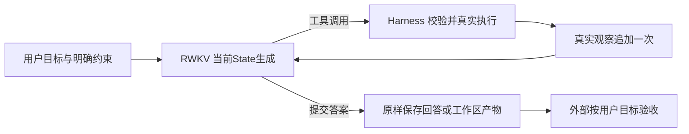

# dsh 源码复查与 RWKV 最小主架构决定

本轮是源码及已有trace复查，没有新增模型运行、项目Strict、任务质量分或角色通过率，没有删除生产分支。R5读取→总结8次均运行到模型提交回答，不能把旧捆绑清单0/8当作实际任务完成率；旧“错误完成8/8”只保留为已否定的指标定义，不再用作虚假完成或能力结论。旧报告/登记/raw不修改、不重评分。原5个未提交文件保持，R4读取说明保持。

## 1. 官方 dsh 实现，而非想象中的极简 Harness

只读核对DeepSeek官方仓库，固定commit `c291e7961a515f6d7af9304e7fd1d257929aef26`。未安装、启动dsh或调用DeepSeek模型，不能声称验证了dsh运行效果。查阅文件逐项SHA及MIT许可证随DSH_REVIEWED_SOURCES归档。dsh是一个可参考的成熟设计方向，不是RWKV质量的证明，也不是必须照搬的唯一架构。

- [主循环 agent.ts](https://github.com/deepseek-ai/deepseek-harness/blob/c291e7961a515f6d7af9304e7fd1d257929aef26/packages/core/agent-loop/src/agent.ts#L269)：turn内做request、执行模型生成的tool calls、把结果记入session，再继续。486–493行：没有tool-call便返回completed；有调用交给executeToolCalls，工具可显式concludesTurn。completed在这里是控制流状态，不等于外部任务验收通过。
- 481–484行遇max-tokens保留该终止原因，turn中保持其状态，不自动包装成正常完成。request-error重试有单独事件和原始attempt；这类工程恢复不能与“模型答得不好再强迫作答”混为一谈。
- [工具调度](https://github.com/deepseek-ai/deepseek-harness/blob/c291e7961a515f6d7af9304e7fd1d257929aef26/packages/core/agent-loop/src/tool-calls.ts#L145)：记录模型调用与真实结果，按模型顺序提交结果；并发、取消和中断也有记录。其工具runtime依然校验参数，有权限/超时等机制。删掉这些并不能简化出可靠Agent。
- [重复调用提醒](https://github.com/deepseek-ai/deepseek-harness/blob/c291e7961a515f6d7af9304e7fd1d257929aef26/packages/guard/repeat-tool-reminder/src/index.ts)：实际通过tools/post-execute加入additionalContexts，仍委托下游执行，不自行veto。基础bundle配置3/5/8次提醒；这是默认启用的附加干预，并不是“完全没有补偿”。[配置](https://github.com/deepseek-ai/deepseek-harness/blob/c291e7961a515f6d7af9304e7fd1d257929aef26/packages/bundle/base/cordis.patch.yml#L419)。
- [生命周期](https://github.com/deepseek-ai/deepseek-harness/blob/c291e7961a515f6d7af9304e7fd1d257929aef26/docs/agent-lifecycle.md)：自然结束仍有turn-stopping扩展点；插件可以继续注入上下文。不能从core循环简单推断所有dsh组合都没有后续干预。
- [session类型](https://github.com/deepseek-ai/deepseek-harness/blob/c291e7961a515f6d7af9304e7fd1d257929aef26/packages/core/session/src/types.ts)：日志有usage、stream、tool-result等审计信息。我们应借鉴“模型可见输入可从日志重建”和职责分离，而非复制整个插件框架、多个角色或UI。

参数合同也不能机械照搬：dsh的defineTool将参数编译为默认开放对象（core/tools/src/schema.ts:487），与本仓库additionalProperties=false的未知字段拒绝不同。其类型/必填及输出校验仍存在。本轮不改R4协议，也不假设dsh会拒绝同样49条未知参数。任何参数策略调整必须另登记，不能与删除强制完成混成收益。

## 2. 对现有补偿的具体处置

下面是主循环的清理决定和后续实施顺序，**不是宣称这些分支已经删除**。当前controller.py包含owner原有未提交工作，本轮先完成证据复查，不混入未经回归验证的整块删除。

| 机制与代码位置 | 判断 | 最小主循环处理 | 删除/调整前必须有的行为回归 |
|---|---|---|---|
| controller.py:459/467，重复边界或动作预算触发terminal_answer | 应移除其强制模型结束的职责 | 资源到限保存观察/State并中断；有预算时让模型自己下一步 | 预算到限不新增模型调用、不伪造final；恢复时观察恰好一次 |
| controller.py:702–730及5386，重复幂等写后强制Final | 应移除；无字节变化不证明整个目标完成 | 重复次数只记录，必要时作为效率信号；不强制选择工具 | 同一写入两次后仍能处理其他文件/返回答案；不被程序强制final |
| controller.py:733–744，三次相同只读结果就截停 | 不作为任务正确性或全局完成门 | 初级基线不加语义循环提醒；由统一token/时间预算限资源 | 多次读取后仍可正常完成；预算终止与答案合格分开 |
| atom_execution.py:89–95/835，按工具种类数量推导最低动作数；controller.py:590最低动作门 | 不进入通用任务主架构 | 用户确实要求读取/测试时验证真实证据，不把任意次数作为目标 | 不同合法工具路径得到相同合格结果；未执行却声称执行仍能被验出 |
| controller.py:5430–5500，中断后最多六次强制Final尝试 | 应移除中断后的额外生成补偿 | 保留最后真实输出，明确中断原因，可恢复State | 超时/预算不足无强制作答，不丢最后未注入观察 |
| Planner/Coordinator/分角色Auditor与计划返工 | 本轮简单任务全部不引入 | 一个RWKV行动/回答循环；验收在循环外 | 外部不满意不能自动进入额外模型或补偿闭环 |
| JSON/schema参数校验、Harness真实错误 | 必须保留 | 返回或记录真实错误，模型自己选择参数，不自动修字典 | 非法参数不执行、不伪报成功；正确错误处理可完成用户目标 |
| State父子绑定、exactly-once、同请求传输恢复、幂等执行保护 | 必须保留 | 工程正确性，不能因简化删除 | 断线重送不重复副作用；真实输出和下次State一致 |
| 重复SHA/chunk/revision等模型可见元数据 | 输入简化候选，不是已证明遗漏根因 | 日志完整保留；模型仅收到任务所需内容/路径/错误/完整性/续读位置 | 缩减前后全文/异常/来源不失真，原State/恢复/并发写约束不退化 |

已有tests/test_unified_controller.py明确固定了旧行为：212行最低动作拒绝，724行第三次相同读取进入terminal，750行第二次相同写入强制completed。这些测试证明目前行为存在，不证明该产品约束合理。改动时要先新增符合用户目标的失败回归，再一起替换旧期望；不能删测试来消除失败。

不要简单把所有min_actions字段全库删除：atom合同、worker、恢复和审计还在消费它。真正移除要在同一轮清理整条生产依赖和相应协议，不遗留第二个“简化Controller”长期并行。先由唯一现有生产入口承载无强制完成的基本循环，之后再逐项移除未使用层；每项都有源码冻结和red→green证据。

## 3. 旧trace到底证明了什么

只读汇总旧R5的arm_b_atomic与arm_b_atomic_continuation，共12份父event_log。共有134条protocol_rejection_recorded：85条调用结构/JSON/final字段格式问题、49条未知参数问题。这里没有发现PrematureFinalAnswer、重复动作强制Final事件或“最终答案正确但路径不同”的拒绝记录。源码里的潜在坏约束不等于在这批运行中确已触发，不能用删除它们解释或预告分数改善。

父日志有262次action_finished、139次action_session_started、140次supervisor_directive_committed。这表明旧架构存在很多阶段和模型State启动，但次数本身不能证明它导致能力退化。run_interrupted事件12次、run_completed事件1次并非13个独立任务：有一次恢复，最终状态不能直接按事件数计算。详细来源SHA、逐拒绝理由和事件位置见TRACE_REVIEW。

R5单文件总结的八条真实输入已在上一轮核验：全文到达观察child，16次generation均自然stop；不存在该轮“评分拒绝→自动补偿”循环。它的0/8首先是验收定义失配。个别摘要遗漏和threading模块无直接依据陈述是真实输出问题，但不能因此抹去闭环已经工作。

## 4. 确定的唯一主架构

资源到限或基础设施失败从循环退出为中断，保留可恢复State；外部验收不回接自动重试边。模型的合法调用和参数自己生成；Harness不替模型选、不填答案。工具不必按某个固定顺序调用，也不必有预定次数。

模型可见信息和审计信息分层：前者包含用户目标、相关历史、工具合同、真实内容/错误、足够的来源与完整性；后者完整保存token、raw、SHA、State和恢复信息。模型可见每一字节必须仍可重建。该分层只是设计方向，压缩输入的实际收益须独立冻结验证，不与本次评分纠正混成一次收益。

工具能力按阶段固定开放，不在每一步替模型选工具。例如单文件阶段可以只注册读取和提交答案；模型仍能选择读或答、路径及范围自己生成。若精简菜单，必须单独登记相对R5的输入变化，不能称为完全相同基线。原读取说明R4保持，不在同轮同时改参数文案、State和工具菜单。

## 5. 从简单到可用，每阶只增加一个难点

| 阶段 | 新增难点 | 看最终什么结果 | 看过程什么诊断 |
|---|---|---|---|
| 明确路径读取→总结（现在） | 获取内容并概括 | 主旨/核心规则准确，重要遗漏与无依据陈述可解释 | 工具合法、全文、State、token、调用效率 |
| 自主定位→读取→总结 | 找文件 | 找到用户所指内容且回答正确，不限定搜索顺序 | 定位失误与读后理解分开 |
| 单处修改 | 产生正确变更 | 文件满足用户变更要求，不限定patch/write工具路径 | 参数、实际diff、意外变更 |
| 修改并验证 | 检查自己的结果 | 行为正确，验证声明有真实支持 | 测试错误与实现错误分开 |
| 多文件小任务 | 保持跨文件一致性 | 外部行为和用户约束满足 | 定位/依赖/状态跨度和资源消耗 |

当前只完成复查，仍停留第一阶，不启动上述后续任务。每阶复用已有获准用例，先冻结结果合同/源文件/模型/State/预算，记录基线，再一次改一个变量。多遍达门只代表固定组，不证明普遍稳定。新datasets版本仍需owner书面授权。

结果评分应报告“满足/部分满足/不满足/无结果”及具体证据：主要信息遗漏单独记录，次要细节不与主旨捆绑一票否决；事实正确性另评；最终文件/行为任务直接用外部行为验证。不同正确路径同等通过，额外调用记成本。只有明确用户过程约束、真实副作用或不实声明才影响结果验收。final_answer不是声称隐藏评分通过；没有测试却说测试通过才属于不实完成声明。

下一轮先为既有四文件登记符合“主要内容”的原子要点和可省略细节，**不重新给旧8条套新分数当作改善**。例如健康脚本的用途、GET健康断言和不证明事务行为是主要信息，5秒和close可作补充；服务代码的初始骨架及db未使用则会影响理解，不能同等降为细节。新口径确定后再验证基本循环，首次代码清理优先取消强制Final；菜单/元数据缩减另轮评估。暂不增加通用插件框架或换模型来“解决”错误验收。

## 6. 本轮交付及验证边界

交付为本源码复查、具体清理清单、唯一主架构与递进路线；未声称清理已经实施或模型能力已修复。完整旧证据及失败候选保留。原生产/测试五文件SHA未变；完整1514 passed证据复用上一轮同源码PYTEST_FULL.log，没有把旧测试说成新跑，没有执行dsh测试。后续每项代码删除均须先失败后通过及仓库全量检查。
