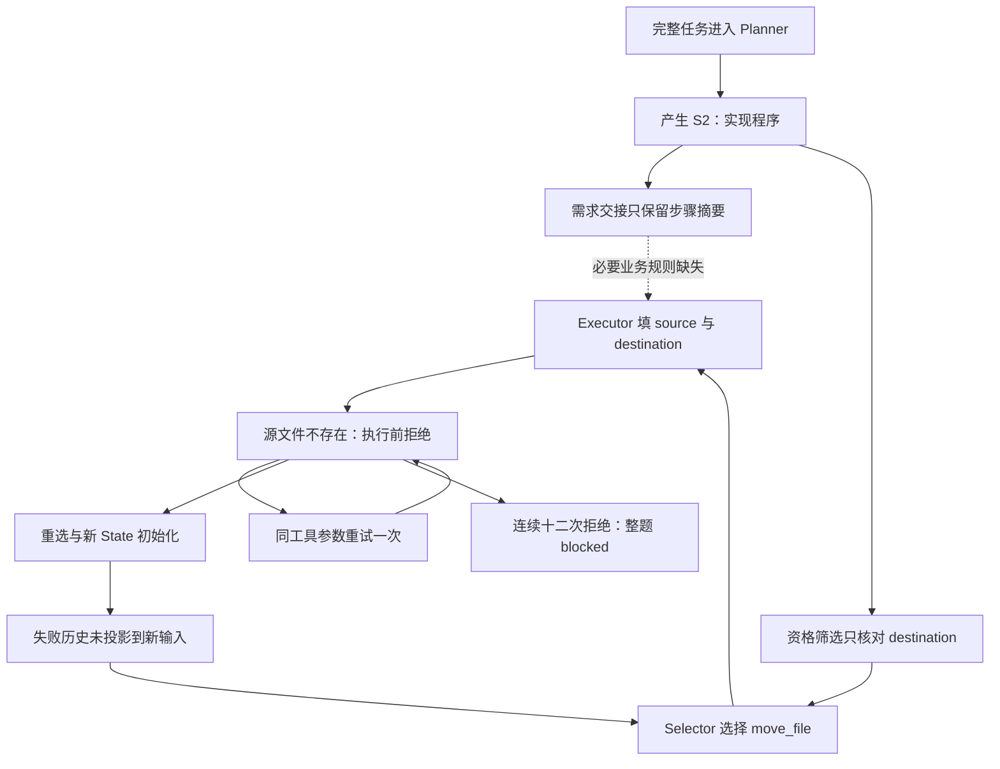

# 错误起点与放大链审计

分析于 2026-09-09 开始、2026-09-10 完成；源码 `1c54c7b0`，生产部分与实测 R3 的 `21ebbaa9` 相同。本轮没有更改生产代码，没有模型请求、训练或重新评分。

Agent 最新结果保持 **Strict 0/3、completed 0/3、mutation 0、动作 2**；终止分别为阶段检查 HTTP 500、Planner HTTP 500、连续协议拒绝阻塞。下面审查三轮共九条原始运行链，它们是同三题在不同冻结源码下的记录，不是九个独立测试题，也不合并为改善分数。

| 原始轮次 | Strict / completed / mutation | 实际动作 | 直接使整题停止的链 |
| --- | --- | --- | --- |
| R1 | 0/3 / 0/3 / 0 | 0 | Native 请求身份不兼容 → HTTP 400 → 每题重复八次 → Selector 尚未调用就中断 |
| R2 | 0/3 / 0/3 / 0 | 9 | 完整观察 → 审计接受矛盾缺口 → 错误反馈 → 重复同一观察三次 → 无进展阻塞 |
| R3 | 0/3 / 0/3 / 0 | 2 | 两题强模型 500；一题越过观察后，错误工具/参数与无反馈重选形成循环 |

角色级 R3：Planner 三次请求、两次接纳；Stage Checker 两次请求、一次 advance；Selector 八次交接、24 次菜单求值；Executor 十四次、Step Auditor 两次；Finalizer、Final Auditor 未到达。RWKV 十六次生成均自然 stop。优化器步数 0。

## 最重要的更正：错误比 move_file 更早

上一轮报告抓住了工具资格和重选反馈，但没有检查独立 Executor 的完整 Native 输入。本次沿十四次 Executor 请求的 bootstrap、append、disclosure、已提交生成逐段重建上下文，全部匹配记录的 checkpoint / 协议 SHA。第三题的十二次 S2 请求都缺少任务中的采金、装置激活、方向规则和输入格式。

它收到的任务核心只有：

> Implement the complete Python 3 solution in `main.py`, including efficient input parsing, the maximum-collection algorithm, and exact stdout formatting.

首次实现请求 CE-000026 的完整上下文有 **6613 字符**，包含空目录观察、各种 SHA、步骤编号、工具合同和上述摘要，但没有要实现的采金问题定义。S2 的约束中还提到 W*H 与 N，却没有它们的定义、装置的行为或完整输入合同。

因此即使将这一刻的工具选择修正为 write_file，**还存在“执行角色拿不到要解决的问题”的独立缺陷**。本次没有写代码，不能宣称测到了某个错误算法；可以确定必要任务信息在请求链中缺失。

信息断点有两个共同作用的位置：

- `stateful_goal_loop.py:2129` 将 `current_requirement` 设为 `frontier.objective`。
- `model.py:3355` 在独立 Executor 模式下不加入 `immutable_request`。步骤事件只含 active_step、机械进度和未展开的 O1/O2/O3/O4 编号；编号不能还原任务正文。

通用依赖探针固定同一个步骤、真实观察、工具和历史，仅把原始需求替换为另一道真实公开题：两个需求的 digest 不同，但 Executor bootstrap、唯一协议输入与绑定事实都完全相同。这证明缺失发生在输入构造，不是通过“模型可能忽略了题目”猜测归因。该探针仅调用输入投影，没有将替换后的需求登记为生产 trace 或训练样本。

代码历史也表明它早于最近的审计修复：独立 Executor 省略原需求的条件来自 `68352857`（2026-08-31），步骤目标替代 current_requirement 来自 `f478b51d`（2026-09-01）。9 月 7 日统一协议时仍保留了两端组合。这里给出相关改动来源，不把 blame 时间直接当作全项目首次故障时间。

Step Auditor 也只接收 active_step 及证据，没有独立的原始需求入口；如果成功标准同样笼统，完整业务规则依然不可达。当前两次观察任务的信息足够，判断也正确；实现审计尚未实际发生，不能报告它已经错判。

## 第三题的实际放大过程

| 事件 | 原始事实 | 因果判断 |
| --- | --- | --- |
| CE-000003 | 初始计划被接纳 | 暂未发现导致本次停止的计划结构错误 |
| CE-000016 / CE-000021 | 目录观察审计 continue，阶段检查 advance | 这段链工作正常，进入 S2 |
| CE-000022 | main.py=missing；资格菜单仍有 copy_file / move_file | 多参数资格只检查 destination；没有证明 source 可用 |
| CE-000025 | 三个菜单全部选择 move_file | 首个实际错误工具选择；没有正确票被投票器覆盖 |
| CE-000026 | Executor 输入含步骤摘要及空目录事实，缺完整题目 | 需求丢失在实际实现边界可复核 |
| CE-000028 | source=main.py、destination=main.py，被拒绝；action_executed=false | 校验正确阻止了移动不存在的源文件 |
| CE-000031 / CE-000033 | 同一选择的参数重试看到了拒绝，但仍提交相同参数 | 工具本身不可执行，继续限定它只能修参数不能解决这一问题 |
| CE-000037 起 | 参数重试额度用完，重新选择；新的 Selector 输入不含拒绝历史 | 本该修复错误的循环没有带回新信息 |
| CE-000037…CE-000085 | 六次 Selector 输入逐字节相同，十八张菜单票全为 move_file | 三菜单增加了求值次数，没有提供新的业务证据；不能把投票一致性当正确性 |
| CE-000094 | 十一次缺源文件拒绝、一次错误输出 envelope，共十二次；blocked | 预算止住了重复循环，没有把任务标成完成 |

其中最强的实测放大器是 **EP02：重选丢失失败历史**。`_pending_executor_protocol_retry()` 只支持同一选择的一次参数重试；用完后重选。`step_feedback()` 只投影接受的 Step Auditor 缺口，普通 action 协议拒绝的 feedback 为 null。因为没有真正执行工具，S2 的 assigned/failed action count 仍为 0、last_action 为 null。第一次错误没有成为下一次选择能使用的事实。

这不意味着应继承前一次的 WKV。各角色独立 State 是既有约定；正确做法是在新输入里保留适用于当前步骤的拒绝事实和修复归属。否则 State 重置与反馈丢失组合起来，就会把每次重选变成同一个错误的第一次。

那一次内部名称 `rwkv-lh.executor-action-commit` 的输出属于模型无效生成，parser 正确拒绝。该次生成之前的完整输入并不含此内部名称，不能把它断言为直接复制了输入中的内部字段；后一次重试才会携带被拒绝原文。它只占十二次拒绝中的一次，不是主要放大根因。

## 本次确认的八项现存问题

这是本次限定范围内的确认清单，不声称全仓库只有八个问题。详细位置及证据等级见 `FINDINGS.json`。

| 编号 / 优先级 | 缺陷 | 影响与证据边界 |
| --- | --- | --- |
| EP01 / P1 | 完整需求在独立 Executor 交接时丢失 | 12 次实现请求实际缺失业务定义；纯投影变形检查证明不同真实需求不能改变输入。广泛影响依赖用户规则的新实现与修改 |
| EP02 / P1 | 参数拒绝后的重新选择不带失败事实 | 六次相同 Selector 输入、十八张 move_file 票、十二次拒绝；把一次错误放大成整题停止 |
| EP03 / P1 | 多参数操作资格只核对 destination | 空 workspace 仍给出 copy/move，执行端再因 source 不存在拒绝；两类操作均用通用探针复现 |
| EP04 / P1 | move_file 范围校验遗漏 source 的删除副作用 | 临时源文件在本步 write_roots 外，前置校验仍通过。只做了校验，没有真的移动；R3 没有此类实际越界变更 |
| EP05 / P1 | trace 重建漏传 discovery_complete | 生产 false，重建默认 true，进而抛出合同不可重建；共享 Selector/Executor 数据路径受影响。R3 完整发现未触发，探针已复现 |
| EP06 / P2 | 新创作与复制事实使用含混的同一指令 | 输入笼统要求 code/text 必须从观察中原样复制，write_file 实际允许新内容且来源绑定数为 0；提示与行为不一致，模型影响尚未测量 |
| EP07 / P2 | Native trace 缺完整服务器输入 token 证据 | 14 个 Executor 上下文能按状态链重建，但 full input token proof 为 0/14；Native generate 未透传 return_token_ids，服务端能否完整回传还需验证 |
| EP08 / P1 | 独立角色仍前置依赖 Executor Native checkpoint | Selector 前、独立审计/Finalizer 前先准备/导入 Executor cache。R1 实际把 Native 初始化故障扩散到尚未调用的 Selector；请求身份已修，物理依赖仍在 |

EP03 的修复不能简化成“目标不存在就禁 copy/move”。目标可以新建，源文件也可以位于目标目录之外；需要统一每个参数的读/写职责、完整或未知的发现范围与真实前置条件。工具资格只是结构性可执行范围，write_json、make_directory 等语义上不适合本题的工具，不应因文件后缀被任意屏蔽；合适操作仍由 RWKV 选择。

EP04 是同一简化方式在副作用上的另一个后果。当前 `PATH_MUTATION_ARGUMENTS` 明确 move 的 source/destination 都会变化，Controller 却把 copy 与 move 一律按 destination 限定写范围。下游 Harness 只检查 workspace 边界，未接收本步 write_roots；move handler 确实删除 source。合法 copy 是本次控制组，修复不应把它的只读 source 错当写操作限制。该缺陷可能把执行错误扩散到其他步骤依赖的文件；本次没有据此宣称生产文件已遭破坏。

EP05 不只是“少一个提示字段”：`_frontier_facts()` 重建调用遗漏参数后，与冻结合同比较必然不同。抽取器该路径只捕获 SampleExcluded，这个重建错误会向上终止批次，CLI 返回 rejected，而非自动修正成真。大型目录、排除目录或不完整发现产生的合法 trace 因而可能完全不能被抽取。不能把它当作模型没有产生足够数据。

EP07 也须与当前 Selector 分开：Selector 使用另一条端点，本轮六条自动候选确有完整 token 证据；Native Executor 仅有可校验的文本 State 链与生成记录，不能把本地 token 重建冒充服务器完整输入证明。本轮实际代码分析不依赖伪造这项证据。

## 历史两条放大链与外部故障

**R1：工程接口错误被扩散成所有角色都没有表现。** 预检漏掉服务器要求的恢复协议，本地请求缺身份，HTTP 400 在每题重复八次。Native 初始化又在 Selector 前面，因此即使 Selector 服务可用，它也根本没有获得机会。`7854f518` 已修请求身份和不可重试错误处理；当前保留的问题是 EP08。R1 首题还曾有一次重复 required_phases 的 Planner 输出错误，但既有语义修复已纠正、计划被接纳，它没有造成最后的 Native 故障。

**R2：没有报协议异常，也能把错误变成系统反馈。** 六次完整目录观察的审计输入把“候选缺口”写成已发生的否定事实，模型全部选择 root-unproved；生产把结构合法的 REPAIR 接受并回传，三题都重复观察后阻塞。日志中没有异常，不代表事实正确。`21ebbaa9` 已统一候选条件与机械矛盾校验；R3 两次实际观察审计通过，证明到达过的边界已改善，不证明所有后续语义正确。

**R3 两个 HTTP 500 是独立外部故障。** 第一题在阶段检查、第二题在初始 Planner 请求遇到 500，各有两次客户端尝试。原登记 `supervisor_pending_resume_attempts=0`，所以保存 pending 后本次采集结束。Controller 没有改写为完成、没有把 HTTP 故障当作语义计划错误。网关内部原因未知；模型列表健康也不能保证每次生成可用。这影响观测长度，不构成 RWKV 能力得分的单独证据。

九条链里，每个成功建计划的 run 都只有一次计划提交；没有观察到“同一步未完成自动反复重规划”造成此次失败。当前主要放大来自同一步里的信息缺失和重试，而非本次频繁改变计划。

## 为什么测试全绿而真实任务仍然失败

已有 1162 项回归证明了其中覆盖的结构、State、事务与协议不变量，不能替代真实任务的语义检查。本轮没有改生产/测试/依赖，复用其全绿记录；新增七组诊断探针证明现有缺陷，没有把“检测到了缺陷”写成“修复通过”。

具体盲点可在 `tests/test_role_trace_inputs.py:129` 一带看到：mock 队列预先提供正确 write_file 内容和审计结果，角色输入即使漏掉必要需求，队列仍会给出相同正确输出。已有重建测试验证“生产与抽取字节相等”，两端若共同漏信息也会通过。另有目录发现测试覆盖了生产 false，却未把该边界送进 trace 重建；反馈测试覆盖审计缺口与同工具修参数，没有覆盖参数失败后的新选择。

后续回归应覆盖：改变任务规则必须改变执行/必要审计输入；重选必须看到当前适用的失败事实；所有参数的副作用范围一致；发现未知状态跨生产和抽取保持一致；复制旧事实与创作新代码的权限和来源分别成立。使用通用变形与跨模块不变量，不按题型写恢复特判。

诊断脚本首次尝试错误地用 model_role 字段筛选 normalized model_trace，该字段在这份源工件中不作为角色身份，导致数量断言失败。已改为按 `tool_schema_disclosed.checkpoint_id` 绑定真实生成请求；保留 `INVARIANT_PROBES_ATTEMPT_01.log`。该分析脚本错误不计入项目的八项运行缺陷。

## 对下一步和 StateTune 的影响

先修 EP01/EP06 的需求与内容职责，再统一 EP03/EP04 的工具参数前提和副作用，同时补 EP02 的反馈重选；再验证 EP05/EP07 的 trace 与训练输入证据，缩小 EP08 的物理缓存依赖。角色架构保持现有五角色，不用更换模型角色、提高重试次数或为某题指定 write_file 来绕过缺陷。

修完工程接口仍可能选错工具、写错算法、审计失准，这些才应继续成为逐角色 StateTune 的改进对象。18 条错误选择已真实存在，可按原边界独立复核；Agent 0 分和后序未到达不会自动禁止 Selector 训练。但当前只有 6 条自动正例、2 个边界且都在 train，原家族 train/dev/train 没有 confirmation；重复这三道题无法补出独立确认来源。不得把无法达到的来源覆盖长期解释为“模型还没足够好”。

本轮只是根因审计。八项现存问题均未标为解决；对未到达的实现审计、Finalizer、Final Auditor 和完整任务正确性，仍保留未验证结论。全部原始来源、重建输入、诊断结果、源码位置和脚本 SHA 见 `EVIDENCE_SHA256.json`。
