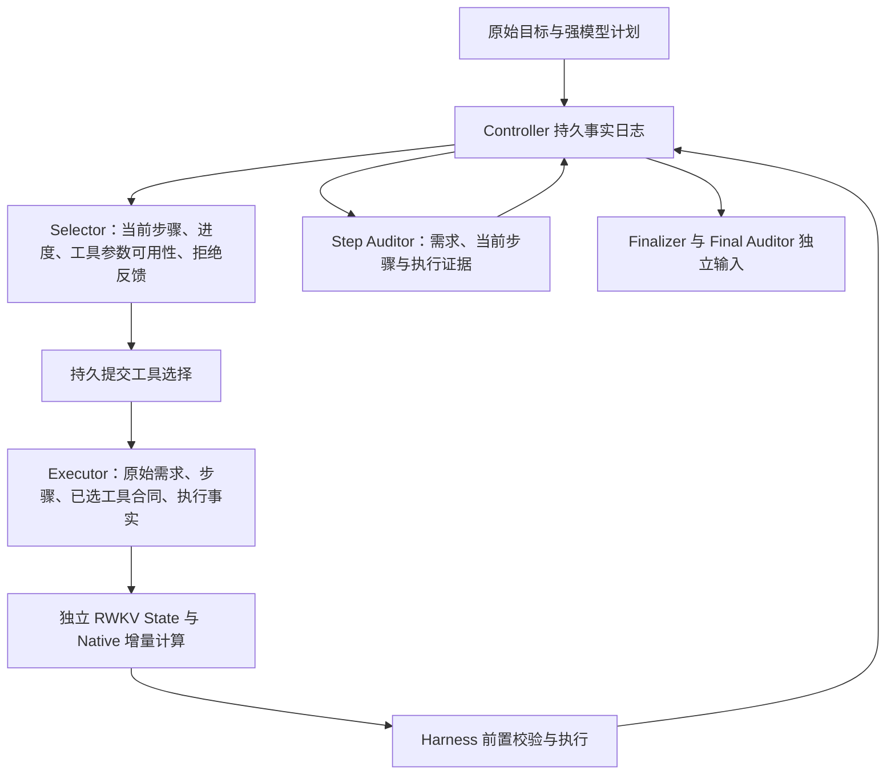

# 角色交接架构整改 R1

Agent 最新已封存结果仍为 UltraData R3：**Strict 0/3、completed 0/3、mutation 0、动作 2**。终止分别为 Stage HTTP 500、Planner HTTP 500 和连续工具协议拒绝。该轮保持原样，不重新评分。本轮是交接架构整改和部署验证；新架构 Agent 成绩由后续新冻结的 R4 报告。

角色级：本轮部署探针的 Selector 三种菜单顺序均完成请求；它们是工程夹具，不是角色训练样本。Optimizer steps **0**。完整工程回归 **1321 passed，0 skipped，229.95 秒**，包含 Torch/State 和必需浏览器验证。

## 根因与替换后的链路

五角色保持不变：Selector 选择操作、Executor 生成参数、Step Auditor 判断当前步骤、Finalizer 生成最终回答、Final Auditor 判断整体完成。Planner / Stage Checker 使用强模型 `gpt-5.6-sol`。数值 State 按角色独立；Controller 持久日志保存目标、计划、动作、协议拒绝和审计事实，并据此构造每个角色唯一的输入。

Native 是 RWKV 数值 State 的缓存与增量计算传输。它不再是 Selector、观察提交、审计或最终回答的前置依赖。Executor 先准备可持久化的逻辑输入，Selector 选择提交后才物化所需数值 State；物化失败保留选择身份，恢复不能重选或重复动作。独立角色不导入 Executor 的数值 State。

| 审计项 | 根因与替换 | 下游影响和回归证据 |
| --- | --- | --- |
| EP01 | 独立 Executor 只得到步骤摘要；Executor 与 Step Auditor 的唯一协议增加不可变原始需求 | 数据重建和生产逐字节相同，避免漏掉业务规则；`test_current_role_input_preserves_original_requirement` |
| EP02 | 重选只得到语义审计反馈，没有同一步的参数拒绝事实 | Selector / Executor 使用持久拒绝记录；同一步、同 revision、重启前后均保留，不转 Planner；`tests/test_stateful_goal_loop.py` 重选与重启回归 |
| EP03 | copy/move 资格只按 destination 计算 | 单一参数声明同时描述 source / destination 的类型和访问范围；缺少必需源不能因目标可创建而合格，有限发现仍允许 unknown |
| EP04 | move 的 source 删除副作用未纳入写范围 | 同一声明将 move source 标为 read_write；copy 可读范围外合法源，move 不得删除范围外源；参数前置校验与资格共用合同 |
| EP05 | trace 重建将 discovery_complete=false 补成 true | 从边界还原完整合同及资格，生产与数据保持相同的不完整性 |
| EP06 | 参数提示把全部新内容也限制为逐字复制已观察内容 | 新创作从原始需求推导；既有路径、事实、cursor、读改写依然要求精确来源；生产和标注使用同一 provenance 校验 |
| EP07 | Native 服务未保存和返回真正消费的完整 token 序列 | create / append / import / journal 恢复保存 token 历史和实际 BOS；generate 验证它与 worker 已消费数量及 pending token 一致；缺失证据不伪造 full_context |
| EP08 | Executor 缓存导入/写入失败阻塞其他角色及事实提交 | 逻辑输入可先准备并保存；工具选择持久提交后才物化缓存；观察和审计直接提交事实；后续角色从自身 zero / 注册 State 开始 |

EP01、EP02、EP03、EP04、EP05、EP06 的集中回归位于 `tests/test_role_chain_contracts.py`，另有生产 Controller、角色 prompt、provenance、数据链集成回归。EP07 使用真实服务实现、持久 journal 与 restart 测试；EP08 覆盖 Native 分配不可用、独立角色禁用 Executor 缓存调用、prepared input 重启重建和已提交选择恢复。

## 输入规模与协议唯一性

完整参数合同逐工具展开曾使 300 文件工程夹具达到 Executor **22783** / Selector progress **18126** tokens。新增失败回归后，完整合同留在边界日志；Selector 只得到各参数可用性摘要，Executor 只得到已选工具合同。每参数至多 32 个发现提示，所有显式步骤 roots 和原始需求完整保留，省略发现内容必须标记 incomplete。相同夹具降为 **1773 / 1363** tokens；这是工程夹具测量，不是实际任务输入统计。

Selector / Executor / Step Auditor 升至唯一 v6 模块，删除 v5 模块及字节码；Finalizer v2 和 Final Auditor v4 使用现有唯一模块。传输 envelope 与角色协议是不同层，未变的网络 envelope v5 不代表旧角色链路。

## 唯一部署实现与身份

服务器原服务、worker 与本地 Git 对象 `2dd1166a` 内容 SHA 一致。本轮将这些既有实现纳入当前项目源码及测试，修改 Native token 证据和 worker 加载身份；没有引入其他工作树未提交的 R35 改动。引擎的两个入口改为导入项目模块，删除引擎里的重复服务与 worker 文件，不保留 stub。

当前 Native / Selector 两个 unit 共用 `/home/chase/GitHub/RWKV-LH-role-chain-r1-20260910/source` 和同一 engine。旧 Native unit 停止并禁用，Selector 当前 unit 替换为新冻结 source。Native 使用新的 State store，不跨执行身份复用旧 State。服务器全程没有调用 Git。

- 项目：127 文件，manifest SHA `5648b11cb30b37ba9bea249ab394b22e11dfb83bc88b1df4e286a3875e6454db`。
- 引擎：6393 文件，manifest SHA `a798213bcbb931384f0d18c3c894e8364c66448d8cbc6158037cc5520c63fd4a`。
- Selector v6 decoder SHA `bd5d3720498f56ca9291d3f3033ea99cf73dabdd5d1c65a84e50e99ae484c610`。
- 2.9B 与 13.3B 已重新核验实际权重 SHA，见 `MODEL_WEIGHTS_VERIFIED.json`。

实际 Native 探针经过 create → append → 磁盘 export / import → generate → rollback，再重启整个服务并恢复相同 State。重启前后均返回完整 11 个输入 tokens（其中 1 个实际 BOS），与本地逐段编码一致；两次贪心生成的 16 个输出 tokens 完全相同。见 `LIVE_NATIVE_BEFORE_RESTART.json` 和 `LIVE_NATIVE_AFTER_RESTART.json`。这证明当前已部署后端的该条数值恢复与输入证据链，不能替代所有真实任务链验证。探针初次因本地 tokenizer 工具调用错误未完成校验，随后一次因服务尚未 ready 而中止；这些尝试不计成功。

## 验证纪律与剩余工作

先失败的证据包含 `RED_CONTRACTS.log`、`RED_NATIVE_FLAG.log`、`RED_NATIVE_DECOUPLING.log`、`RED_NATIVE_ALLOCATION_CORRECTED_02.log`、`RED_NATIVE_INPUT_TOKENS_03.log`、`RED_LARGE_HANDOFF.log` 和 `RED_WORKER_SOURCE_RELOCATION.log`。其中历史 Native 初始化根因通过本地 Git 提取原方法复现；夹具自身的早期适配错误保留日志，不当作根因证据。

最终完整回归日志为 `FULL_TESTS_ATTEMPT_04.log`。第一次完整回归的工厂 monkeypatch 适配错误已修正；第三次检查因 CPU 身份测试尚缺 vLLM fixture 主动中止，补齐 fixture 后重跑全量，没有删除或跳过失败测试。

工程通过不代表 Agent 完成或 StateTune 已运行。下一轮必须在新冻结源码上运行真实任务，检查所有角色输入与输出差异，再按既有预注册覆盖、固定切分和独立标签证据推进 Selector 训练。低 Agent 分数不是首轮训练禁令；固定三题没有 confirmation 家族的限制仍需通过已授权的更多任务采集解决，不改旧切分或旧结果。未读取 Holdout。
