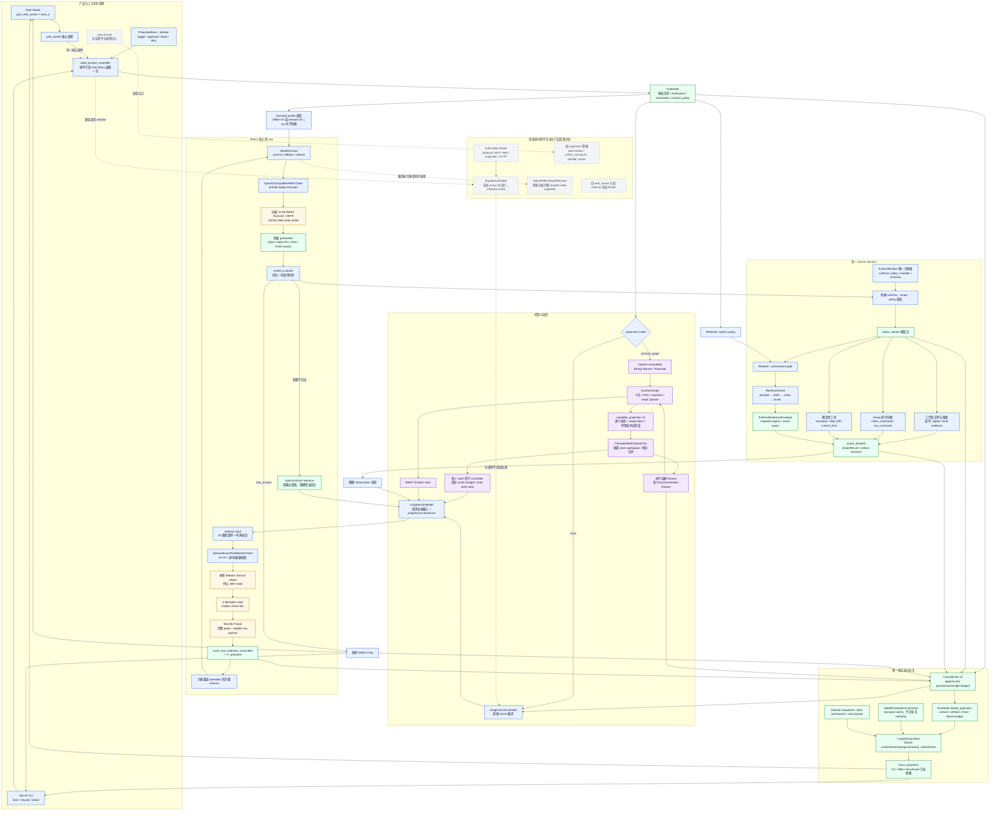
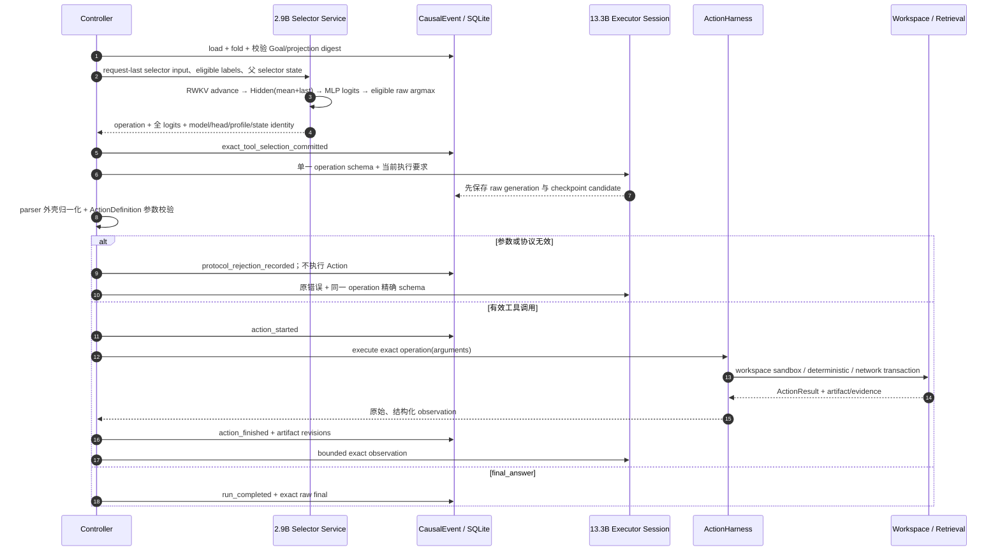
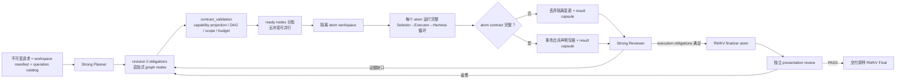
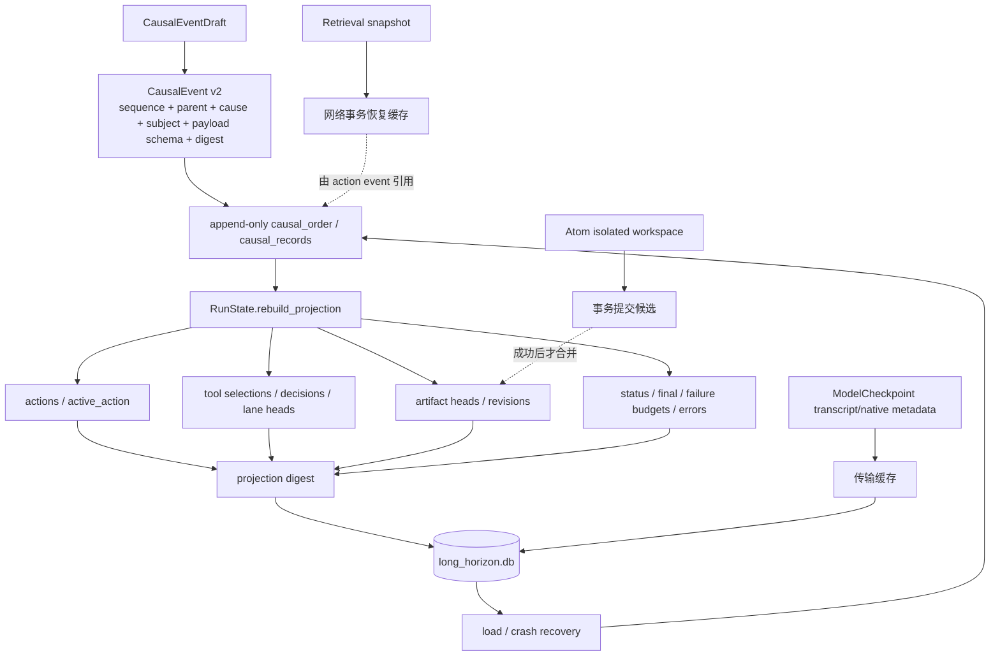
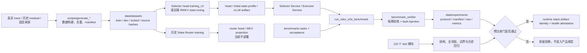

# RWKV-LH 全代码架构图

更新时间：2026-08-31（Asia/Shanghai）
代码基线：当前工作树 `chase/hybrid-product-v1`（包含未提交实验改动）

本文依据 `rwkv_lh/`、`scripts/`、`benchmarks/`、`tests/` 与产品前端源码生成。盘点范围为
332 个 Python 模块、37 个 Shell 脚本、2 个 JavaScript、2 个 CSS、2 个 HTML 和 1 个 C++
文件，共 376 个源码文件、120121 行。模型权重、数据集和历史实验结果作为数据面统计，不作为源码模块展开。

图例：蓝色为当前产品主链，紫色为可选 Contract Graph 控制面，绿色为持久化/证据，灰色为仓库保留但当前部署不启用的兼容或实验链。

## 1. 整体架构

## 2. 单次 Action 的真实调用时序

关键点不是“Controller 帮模型做决定”，而是它只负责提交边界：Selector 决定 operation；Executor
决定全部显式参数、是否继续以及 Final；Harness 只验证并执行已经提交的调用。

## 3. Contract Graph 可选链

Strong model 只编译义务图和审核公开证据；具体 operation、参数、实际执行推进与 Final 文本仍属于
RWKV。Controller 的 assertion evaluator、作用域检查、写根覆盖和事务提交都是确定性边界，不生成业务内容。

## 4. 状态与数据权威关系

`RunState` 的可变字段不是第二份事实；保存和加载都会从事件链重新 fold 并校验摘要。模型 transcript、
Selector 动态 WKV state、网络 snapshot 和 atom workspace 分别解决传输或副作用恢复，但都不能单独宣布任务完成。

## 5. 工具面

当前稳定 Selector 分类空间为 25 类：23 个产品 operation、`final_answer` 与 `ABSTAIN`。23 个产品
operation 由一个注册表机械投影：

| 类别 | Operation |
|---|---|
| 工作区读取/证据 | `list_directory`, `search_text`, `read_file`, `read_json`, `file_digest`, `bind_evidence` |
| 工作区变更 | `write_file`, `write_json`, `patch_json`, `replace_text`, `remove_line`, `append_file`, `make_directory`, `copy_file`, `move_file`, `delete_file` |
| 本地进程 | `check_command`, `run_command` |
| 确定性能力 | `calculator`, `date_diff`, `current_time` |
| 外部只读证据 | `web_search`, `connector_lookup` |

`noop` 仍存在于基础 Harness 注册表，供兼容/控制用例使用，但不在冻结的 23 个产品 operation 分类中。
网络工具是否 eligible 由不可变 retrieval policy 机械过滤；注册工具不等于授权执行。

## 6. 离线训练、评测与发布闭环

脚本层的 127 个 Python 模块与 37 个 Shell 文件主要承担四类职责：数据生成/定稿、远端 state tuning
准备与运行、候选验证/比较、冻结 E2E/能力阶梯执行。它们不进入单次产品 Action 的在线语义链。

## 7. 代码模块索引

| 层 | 主要代码 | 责任边界 |
|---|---|---|
| 产品装配 | `product_runtime.py` | 从已持久化 Goal policy 构造唯一 Controller、Harness、Selector、Supervisor 和 atom pool |
| 控制循环 | `controller.py` | 恢复、边界提交、调度、失败预算、Contract Graph/兼容策略；不补业务答案 |
| RWKV 语义面 | `model.py` | 双 lane handoff、progressive disclosure、Observation 回注、terminal answer |
| 会话与 wire | `model_session.py`, `model_io.py`, `tokenizer.py`, `token_budget.py`, `chunks.py` | checkpoint、commit/rollback、prompt replay/native 选择、调用语法与上下文预算 |
| 执行面 | `harness.py`, `operation_contracts.py` | ActionDefinition 注册、schema/scope、sandbox、文件/命令执行、恢复 |
| Selector | `exact_tool_selector/`, `inference/vllm_rwkv.py` | 输入协议、HTTP client/service、RWKV hidden/WKV state、head、logits、训练与覆盖验证 |
| Executor transport | `runtime/openai_compat.py`, `runtime/protocol.py`, `runtime/executor_profiles.py`, `runtime/sampling.py` | OpenAI-compatible 请求、错误分类、G3/G6 profile 一次性绑定、采样审计 |
| Strong control plane | `supervisor.py`, `supervisor_openai.py`, `contract_graph.py`, `contract_validation.py`, `capability_projection.py` | Planner/Reviewer 协议、义务图、typed assertions 与能力投影 |
| 并行原子 | `atom_execution.py`, `parallel_atoms.py` | atom contract、写根覆盖、隔离执行、依赖交接与事务合并 |
| 检索 | `retrieval/` | policy/provenance、providers、fetch/clean/chunk/snapshot、exact evidence contract 与投影 |
| 权威状态 | `schema.py`, `store.py`, `trace_projection.py` | CausalEvent、确定性 fold、SQLite 事务/租约、只读产品视图 |
| 主动任务 | `proactive.py` | trigger、job、approval、lease fence、heartbeat、退避、dead-letter、通知、workspace 串行化 |
| UI | `web_ui.py`, `web_worker.py`, `goal_web_assets/` | 本地 HTTP/API、每 run 独立 worker、状态/trace/files/export；不创建第二执行路径 |
| 部署 | `runtime/stack.py`, `scripts/manage_runtime_stack.py` | 本地进程所有权、远端 tunnel、Selector/Web/worker 启停与身份健康证明 |
| 历史/旁路 | `state_router/`, `inference/router_server.py`, `web_assets/` | 0.4B Router、shadow 与旧 UI；当前部署关闭，不得影响主链 |
| 评测 | `benchmark_verifier.py`, `scripts/run_rwkv_e2e_benchmark.py`, `benchmarks/`, `tests/` | 冻结任务、隔离验收、故障注入、源码/输出 manifest 与回归 |

## 8. 当前部署边界

- 当前产品装配只公开 `none` 与 `contract_graph` 两种 supervisor mode；Controller 中的旧
  plan-review、`online_microtask`、`parallel_atoms` 仍供历史 trace 和实验 runner 使用。
- 当前部署为本地 2.9B Selector、远端 13.3B Executor、可选外部 Strong Planner/Reviewer，以及本地
  Harness/Web/proactive worker。0.4B State Router 不在进程拓扑中。
- `ModelSession` 已实现 native recurrent-state 适配器，但当前 OpenAI-compatible Executor 未声明完整
  durable state API，因此实际选择可审计的 `prompt_replay`；初始 G3/G6 state profile 仍按请求绑定并校验。
- 产品 UI 使用 `goal_web_assets/`；`web_assets/` 是保留的旧界面资源。
- 这张图表示代码职责和真实调用权威，不表示能力已达到发布门。当前真实三题 Agent canary 仍为
  completed/external/strict `0/3`，联网检索组件通过不等于整体 Agent 闭环通过。
