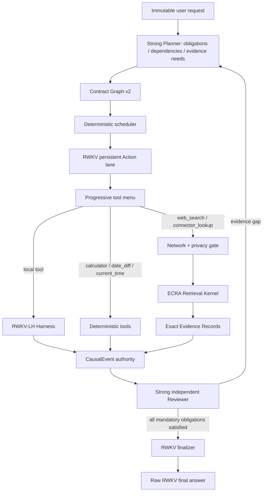

# RWKV-LH × RWKV-ECRA（RWKV-Scout）统合设计

状态：实现候选 v0.3；检索内核与产品入口已接入，冻结路由 Canary 未过门槛，不能宣称正式采纳

日期：2026-08-25

实现进度（同日）：

- 已冻结 `rwkv-lh-ecra-route.v1` 120 例和预注册指标；
- 已实现 `external-evidence.v1`、三种网络策略、出站 provenance、五个可选工具和产品级运行配置；
- 已实现 provider/fetch/SSRF redirect gate/clean/chunk、内容寻址 snapshot、per-run route freeze 和 CausalEvent ledger projection；
- CLI 与 Web Worker 已按不可变 Goal 接入 `offline/auto_public/explicit_egress`，恢复时不信可变请求文件；
- Contract Graph v2 已使用 Controller capability projection；Strong Planner 不输出 concrete operation；
- 本地全量单测为 `245 passed`；后续 3 个 P1、5 个 P2 审查整改记录见 `data/experiments/RWKV_HARNESS_P1P2_REMEDIATION_20260825/REPORT.md`；
- 真实 RWKV R9 七例 Canary 首工具精确率 `5/7`、网络 Macro-F1 `0.7083`、privacy rejection coverage `0.5`，未达到冻结门槛，因此没有运行 route120/Full90 confirmatory；原始错误见 `data/experiments/RWKV_ECRA_ROUTE_V2_CANARY_20260825/R9_ANALYSIS.md`。

因此当前是“工程主链已接入、模型路由质量未过门槛”，仍不能描述为已经完成可正式部署的主动 Harness。

本地参考基线：

- RWKV-LH：`chase/hybrid-product-v1`，HEAD `ca1c4c8`；设计时工作树已有用户未提交修改。
- RWKV-ECRA：本地目录 `/home/chase/GitHub/RWKV-ECRA`，项目当前名称为 RWKV-Scout，分支
  `chase/round71-original`，HEAD `4804b90`；设计时训练资料工作树已有用户未提交修改。

## 1. 结论

统合应以 **RWKV-LH 为唯一宿主运行时**，把 ECRA 中的检索、抓取、正文清洗、分块、精确证据和
来源连接器提炼成 `rwkv_lh.retrieval` 内核；不能把 ECRA 的 Orchestrator、Planner、Review、Writer 和
`AgentState` 整体嵌入 RWKV-LH。

最终职责必须固定为：

| 主体 | 唯一职责 | 明确无权做什么 |
|---|---|---|
| Strong Planner / Reviewer | 拆解不可变请求，建立义务、依赖、证据需求、作用域与风险；审核义务证据 | 不指定具体工具，不生成工具参数，不执行工具，不写 Final |
| RWKV Action Worker | 读取计划约束和真实 Observation，自主选择具体工具、生成完整参数、决定是否联网、决定是否继续、写 Final | 不绕过网络/隐私/Schema/作用域门禁 |
| Controller / Scheduler | 机械投影可用工具，调度不冲突节点，持久化因果事件，折叠状态，执行恢复 | 不判断业务上是否“应该联网”，不补查询，不改参数，不写答案 |
| ECRA Retrieval Kernel | 执行已经选定的检索动作，抓取、清洗、分块、提取可回定位候选证据 | 不规划下一步，不决定是否继续检索，不做完成判断，不生成最终回答 |
| Network / Safety Gate | 决定某个模型已选择的调用是否被权限、安全和隐私策略允许 | 不替模型选择其他工具或查询 |

“是否联网”不增加独立二分类器。**RWKV 选择 `web_search` 或 `connector_lookup` 本身就是联网决定；
选择本地工具、确定性计算工具或 `final_answer` 就是不联网决定。** 工具的 `capability_class` 由注册表
机械投影为审计分类，避免再维护一份可能与真实动作漂移的 `should_browse` 状态。

## 2. 为什么不能直接嵌套 ECRA Agent

ECRA 当前生产链路已经拥有 Task Plan、Planner、Retrieval Ledger、Evidence Ledger、Evidence Review、
Final Writer 和任务状态。RWKV-LH 同时拥有 Contract Graph、CausalEvent、RWKV Action lane、Reviewer 和
Finalizer。把两套完整 Agent 相互调用会产生以下系统性问题：

1. 两个 Planner 都能解释请求，无法确定哪一个是业务 authority。
2. ECRA 的 `finish_task` 与 RWKV-LH 的 `final_answer` 会形成两个终止状态机。
3. ECRA `AgentState`、Retrieval/Evidence Ledger 与 RWKV-LH `CausalEvent` 会同时宣称拥有恢复事实。
4. 外层 RWKV 看似选择了“联网”，内层 ECRA Planner 却重新选择查询和结束时机，实际工具权被转移。
5. 两套 Review/Writer 会重复调用模型并可能互相改写结论，掩盖 RWKV 自己的能力。
6. 崩溃后可能重放网络请求、重复证据或从不同网页快照恢复，无法证明因果一致。

因此采用“**一个 Agent + 一个检索内核**”，而不是“Agent 调 Agent”。

## 3. 目标架构



只有 `CausalEvent` 是业务事实源。Contract Graph、工具菜单、Retrieval Ledger、Evidence Ledger、UI 状态、
引用列表和恢复进度都必须能从事件链重新折叠；模型 checkpoint 仍只是传输缓存。

## 4. 两级“分类”，但只有一个动作权威

本地强模型存在的价值是做长程规划，不应因此夺走 RWKV 的每步动作权。

### 4.1 Strong Planner：任务级分类

Planner 负责输出：

- 原始请求对应的 mandatory obligations；
- atom 的目标、依赖、读写根、外部副作用级别；
- 所需证据类型、时效性、来源约束和风险提示；
- `investigate / mutate / verify / synthesize` 这类粗粒度 atom kind。

Planner 不再输出具体 `allowed_operations=("web_search",)` 或指定某个连接器。现有 Contract Graph 中由
Planner 给出 concrete operation kind 的能力应在 v2 中删除或降为兼容输入，不能继续作为新计划的输出。

### 4.2 RWKV Worker：动作级分类与选择

Controller 根据 atom kind、作用域、用户权限和注册表元数据，机械生成本回合可用工具菜单。研究型 atom
默认同时允许：

- 本地读取；
- 公共网页检索；
- 结构化连接器；
- 确定性计算；
- `final_answer`（仅在终局条件满足时）。

RWKV 使用现有 progressive disclosure 先从短菜单选出一个**具体工具**，再接收该工具的完整 Schema 并
生成参数。`tool_selection_accepted` 事件已经能证明选择来自 RWKV。系统按注册表给工具附加分类，不再
要求模型额外输出一个可漂移的分类标签。

```text
RWKV selected tool          deterministic audit class
read_file/read_json         local.workspace_read
write_file/patch_json/...   local.workspace_mutation
check_command/run_command   local.process
web_search                  network.public_web
connector_lookup            network.structured_source
calculator/date_diff/...    deterministic.compute
final_answer                terminal.answer
```

## 5. Contract Graph v2 的必要变更

现有 `SupervisorAtom.allowed_operations` 让 Strong Planner 有机会直接决定工具。建议新增 v2 atom contract：

```json
{
  "atom_id": "A1",
  "role": "work",
  "kind": "investigate",
  "objective": "确认请求中的当前外部事实并保留可引用证据",
  "obligation_ids": ["O1"],
  "evidence_requirements": {
    "kinds": ["exact_span", "source_object", "retrieved_at"],
    "freshness": "current_at_run_time",
    "source_preferences": ["primary", "structured"]
  },
  "depends_on": [],
  "read_roots": [],
  "write_roots": [],
  "effect_ceiling": "public_read_only",
  "action_budget": 6
}
```

Controller 只用 `kind + effect_ceiling + system policy` 机械投影候选集合。例如 `investigate` 可以看到本地
读取、联网检索和计算工具；Planner 的 `source_preferences` 只能作为目标提示，不能删除候选工具，也不能
预填查询。

为兼容旧 trace，v1 `allowed_operations` 可以读取，但新建 v2 patch 时禁止 Strong Planner 输出 concrete
operation。迁移期必须记录 `operation_allowset_source=controller_capability_projection.v1`。

## 6. 第一版模型可见工具面

保留 RWKV-LH 现有本地直接工具，新增以下五个 ECRA 能力。ECRA 的 `finish_task` 不接入，因为
RWKV-LH 已有唯一终局 `final_answer`。

| 工具 | 参数边界 | 用途 | 网络 |
|---|---|---|---|
| `web_search` | `query`, `max_results?` | 一般网页、精确 URL、文档、产品/服务状态页 | 是 |
| `connector_lookup` | `operation`, operation-specific args | GitHub、包注册表、论文、天气等结构化来源 | 是 |
| `calculator` | `expression` | 已知操作数的确定性算术 | 否 |
| `date_diff` | `date_a`, `date_b`, optional source refs | 已确认日期的日历差 | 否 |
| `current_time` | `timezone?` | 当前时钟观察 | 视本地实现为否 |

第一版不新增 `should_browse`、`research_agent`、`fetch_page`、`resolve_evidence` 或 `finish_task`。精确 URL 仍走
`web_search`，provider 选择、页面抓取和 chunk 处理是这个已选工具的内部实现，不再暴露成模型路由分支。

建议扩展 RWKV-LH `ActionDefinition` 元数据：

```text
capability_class / network_access / data_boundary / side_effect_class /
result_schema / cache_policy / recovery_policy / evidence_output
```

定义、模型菜单、参数校验、handler 和恢复元数据仍必须来自同一注册对象，保持当前五道 fail-closed 工具
完整性边界。

## 7. ECRA 代码的取舍

### 7.1 应提炼进 `rwkv_lh.retrieval`

| ECRA 区域 | 提炼后的职责 |
|---|---|
| `tools/registry.py` 的模型可见目录思想 | 转成 RWKV-LH `ActionDefinition` 扩展；不保留第二个注册表 |
| `tools/web_search_*`, `tools/connectors.py` 及结构化适配器 | provider 与 connector backend |
| `utils/network_fetch.py`, 网页清洗与 chunk 工具 | 有界 fetch/clean/chunk 管线 |
| `agent/page_evidence.py` | 受限 Evidence Compiler，不拥有路由和完成语义 |
| `agent/evidence_records.py` | 原子 Evidence Record 构造 |
| `agent/evidence_ledger.py` | 从 CausalEvent 折叠出的 Evidence projection |
| `utils/retrieval_ledger.py` | 从事件折叠出的重复路径、请求和 provider projection |
| 来源对象、freshness、注入防护、引用定位逻辑 | 网络证据协议与否决边界 |

### 7.2 不应接入

| ECRA 区域 | 原因 |
|---|---|
| `agent/orchestrator.py` | 与 RWKV-LH Controller 重复 |
| `agent/planner.py`、replan | 与 Strong Contract Planner 和 RWKV 直接动作权冲突 |
| `agent/unified_research.py` 的顶层循环 | 会形成内层 Agent 状态机 |
| `agent/state.py::AgentState` 顶层状态 | 与 CausalEvent/RunState 双权威 |
| `agent/evidence_resolution.py`、Evidence Review | 先由 Contract Reviewer 统一审核；如后续需要，只能做 advisory compiler |
| `agent/retrieval_synthesis.py`、Final Writer | RWKV-LH Finalizer 是唯一最终回答主体 |
| API、Task Runner、前端与历史任务存储 | RWKV-LH 已有产品入口和生命周期 |

建议的本地目录：

```text
rwkv_lh/retrieval/
  contracts.py          # RetrievalRequest / SourceSnapshot / EvidenceRecord
  policy.py             # network, egress, domain, budget policy
  actions.py            # ActionDefinition + handler adapters
  gateway.py            # provider/connector transaction
  fetch.py              # URL fetch and immutable raw snapshot
  clean.py              # HTML/text cleanup
  chunk.py              # deterministic bounded chunks
  projections.py        # retrieval/evidence ledgers folded from CausalEvent
  providers.py          # keyless web/GitHub/PyPI/Crossref/Open-Meteo adapters
  runtime.py            # immutable run policy + conservative provenance resolver
```

代码应按来源和本地 commit 记录 provenance，再逐模块移植和重命名，不能让 RWKV-LH 运行时依赖相邻
checkout 的 `PYTHONPATH`、`config.json` 或全局 ContextVar。

## 8. 联网、隐私和权限

模型拥有“需要哪个工具”的决策权，不等于模型拥有无限制出站权限。二者必须分开：

```text
RWKV decision: whether/what to call
System policy: whether that exact call is allowed
Harness: execute the accepted call exactly or return a typed rejection
```

建议部署策略：

| 模式 | 行为 |
|---|---|
| `offline` | 网络工具不进入菜单；恢复时也不可静默联网 |
| `auto_public` | RWKV 可自主调用公共只读检索；禁止把敏感本地内容放入查询 |
| `explicit_egress` | 网络工具可见，但包含本地派生内容或私有域时需要外部授权 |

每个可出站值都带 provenance label：`user_public_literal / model_public_query / workspace_public /
workspace_sensitive / secret / tool_untrusted`。`workspace_sensitive`、`secret` 和 `tool_untrusted` 不得进入网络
参数；Controller 不能尝试自动改写或脱敏后继续执行，而应返回 typed rejection 让 RWKV 重选。

网页正文永远是 `untrusted_external_data`。只有原始页面快照中可以精确定位的 span 能成为候选证据；网页
中的命令、System/Assistant 文本、工具调用 JSON 和“忽略规则”等内容都不能改变工具菜单、计划或系统
状态。

## 9. 证据与状态协议

网络工具的结果不能只是自然语言摘要。建议统一结果信封：

```json
{
  "contract": "rwkv-lh.external-evidence.v1",
  "action_id": "ACT-...",
  "route_id": "ROUTE-...",
  "tool": "web_search",
  "request_digest": "sha256:...",
  "as_of": "2026-08-25T...Z",
  "status": "evidence_committed",
  "records": [
    {
      "evidence_record_id": "E-...",
      "source_object": {
        "source_object_id": "https://...",
        "source_object_type": "web_page",
        "source_record_id": "..."
      },
      "url": "https://...",
      "title": "routing metadata only",
      "published": "...",
      "retrieved_at": "...",
      "snapshot_digest": "sha256:...",
      "exact_spans": [
        {"span_id": "S-...", "text": "literal source text", "locator": {}}
      ]
    }
  ],
  "provider_attempts": [],
  "truncated": false
}
```

事实只来自 `exact_spans` 或结构化 connector 的原始字段。title、URL、搜索 snippet、provider 标签和
Reviewer verdict 都是路由/控制元数据，不自动成为事实。

当前实现把完整 `external_evidence`、policy decision、snapshot digest 和 exact spans 绑定在统一的
`action_finished` 事件中，`fold_retrieval_ledger` 只从该权威事件折叠。后续如拆分更细事件，也必须保持
同一 action 因果关系。ECRA Retrieval Ledger 和 Evidence Ledger 只能从事件重建。不得把可变 ledger pickle/JSON 当作另一份
恢复 authority。

## 10. 网络动作的崩溃恢复

网络读取虽然没有写远端副作用，但同一 URL 在两次请求间可能变化，不能简单视作普通可重放读操作。

1. 执行前提交 `retrieval_action_started` 和完整 request digest。
2. 每次 provider 尝试记录 provider、状态、时间和错误分类，不记录密钥。
3. 原始响应先写不可变 snapshot 并提交 digest，再做清洗和证据抽取。
4. snapshot 已提交后崩溃：从相同 snapshot 恢复，不重新联网。
5. 请求已发出但没有 snapshot：标记 outcome unknown；只在策略允许时以同 action id 重试，并保留 attempt。
6. 同一运行内完全相同或达到固定相似阈值的重复路线返回 `route_frozen`，Controller 不生成替代查询。
7. provider 自动 failover 只属于同一个模型已选择的工具事务；不能从 `connector_lookup` 隐式改成一般网页并
   声称是同一路径，跨工具 fallback 必须由 RWKV 再选一次。

## 11. Evidence Compiler 的模型边界

ECRA 的页面证据抽取可以保留为内部、受限的 RWKV evidence lane，因为它只从单页 chunk 抽取候选 span，
不选择工具、不规划、不判断完成、不写 Final。约束如下：

- 输入一次只含单一 source object 的有界 chunk；
- 输出必须指回原始 snapshot 的精确 span；grounder 不通过即丢弃；
- 每个 retrieval action 有固定 chunk/model-call 预算；
- 使用本地 RWKV 运行时和统一并发门，不调用 Strong Planner 充当抽取器；
- 提取摘要不能直接关闭 obligation，只有已提交 Evidence Record ID 可被 Reviewer 引用；
- 保留纯确定性 chunk/ranking 对照组，证明额外模型调用没有取代主 RWKV 的路由能力。

## 12. 完整控制流示例

以“读取本地版本文件，并确认该版本当前是否有上游安全公告”为例：

1. Strong Planner 建立本地版本义务、当前公告义务和最终报告义务，不指定工具。
2. RWKV 从研究 atom 菜单选择 `read_file` 并读取本地版本。
3. Observation 提交到同一 Action lane。
4. RWKV 判断需要当前外部事实，选择 `connector_lookup`，明确 operation 和查询参数。
5. Network Gate 检查参数没有泄露本地敏感正文；ECRA kernel 获取并冻结来源快照。
6. Evidence Compiler 提交精确 Evidence Records；RWKV 可以继续选择不同连接器、一般网页、计算或结束。
7. Strong Reviewer 只能用本地 ActionResult 和 Evidence Record ID 审核义务。
8. 全部 mandatory obligations 关闭后，同一 RWKV 体系的 finalizer 基于 verified ledger 写原始 Final。

系统不会在第 2 步后由 Controller 规则自动联网，也不会在第 4 步后让 ECRA Planner 接管余下任务。

## 13. 分阶段落地

### Phase 0：冻结合同与数据集

- 建立本地/联网/结构化/计算/混合/隐私拒绝的固定路由数据集；实现前冻结文本和 SHA-256。
- 冻结 `external-evidence.v1`、网络策略和 CausalEvent payload schema。
- 保存当前 RWKV-LH、ECRA 来源清单与许可信息。

### Phase 1：先接工具面，不接真实网络

- 扩展 `ActionDefinition` capability 元数据。
- 将五个新工具用 frozen fake provider 接进 Harness。
- 保证 progressive disclosure、拒绝重选、恢复和 Contract Graph result capsule 全部通过。
- 把 Planner concrete operation 权限从新 v2 graph schema 移除。

### Phase 2：提炼 ECRA Retrieval Kernel

- 移植 provider、connector、fetch/clean/chunk、Evidence Record 和 ledger projection。
- 不移植 ECRA Orchestrator、Planner、Review、Writer、AgentState。
- 先运行冻结网页/connector fixture，再启用 live provider。

### Phase 3：证据审核与终局统合

- Contract Reviewer 接收网络 Evidence Record capsules。
- 验证 freshness、source object identity、artifact revision 和引用闭包。
- RWKV Finalizer 只读 verified ledger，原样交付 Final。

### Phase 4：在线消融与产品入口

- 固定 canary 后再跑全量；不得为线上结果修改指标、阈值或查询补偿规则。
- UI 显示“模型选择 / 策略准入 / provider 执行 / 精确证据”四类不同事件。
- `offline / auto_public / explicit_egress` 作为 run-level 不可变配置写入 manifest。

## 14. 采纳门槛

正式实验协议见
`data/experiments/RWKV_ECRA_INTEGRATION_DESIGN_20260825/PROTOCOL.md`。最小不可妥协条件：

1. Strong Planner 和 Reviewer 执行工具次数恒为 0。
2. 每个真实工具调用的名称和参数均能追溯到 RWKV accepted decision。
3. 未注册/未展示/错参数工具执行次数为 0。
4. 本地敏感/secret/tool-untrusted 内容出站次数为 0。
5. 所有网络事实都能定位到不可变 snapshot 的 exact span 或结构化原始字段。
6. 恢复后不改变已提交的网络 snapshot，不产生第二套状态 authority。
7. RWKV Final 不被 Controller、ECRA kernel 或 Strong Reviewer 改写。
8. 路由、事实质量、Full90 和固定相似度指标全部达到预注册阈值后才可宣称统合完成。

## 15. 当前代码映射

| 设计点 | RWKV-LH 当前入口 | ECRA 当前参考入口 |
|---|---|---|
| 直接工具注册与校验 | `rwkv_lh/harness.py` | `tools/registry.py` |
| progressive tool selection | `rwkv_lh/model.py` | Planner 的稳定模型可见 catalog |
| 唯一控制器与恢复 | `rwkv_lh/controller.py`, `rwkv_lh/schema.py` | 不接 ECRA Orchestrator/AgentState |
| 强规划和审核 | `rwkv_lh/contract_graph.py`, `rwkv_lh/supervisor.py` | 不接 ECRA Planner/Review |
| 联网工具事务 | 新建 `rwkv_lh/retrieval/actions.py` | `tools/web_search_*`, `tools/connectors.py` |
| 页面证据 | 新建 `rwkv_lh/retrieval/evidence_compiler.py` | `agent/page_evidence.py` |
| 原子证据 | 新建 `rwkv_lh/retrieval/contracts.py` | `agent/evidence_records.py` |
| ledger projection | 新建 `rwkv_lh/retrieval/projections.py` | `agent/evidence_ledger.py`, `utils/retrieval_ledger.py` |

这条路线保留了两个项目最有价值的部分：RWKV-LH 的长程因果状态、事务执行和强规划边界，以及 ECRA 的
联网来源、正文证据和检索质量工程；同时避免两套 Agent 互相接管。
