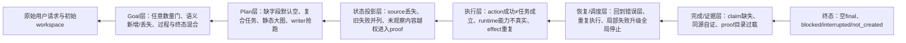

# Round22 全90题因果归因与下一步架构指导

## 1. 结论：下一步不是先选功能，而是重建完成语义

本结论来自Basic、Medium、Hard共90题的逐题反向审阅；每题的最短因果链见
[`CROSS_90_CASE_CAUSAL_INDEX.md`](CROSS_90_CASE_CAUSAL_INDEX.md)，三个难度组的展开证据分别见对应合成文件。

Round22的核心缺陷不是工具数量，也不能归结为“RWKV不会做Agent任务”。系统目前把以下五件本应分离的事混在了一起：

1. RWKV提出了一个目标、任务或action；
2. protocol成功解析了它；
3. Harness忠实执行了action；
4. 真实workspace中建立了任务所需的后置条件；
5. 某条验收条件获得了独立、可追溯的证据。

只要其中一层被当成后一层，系统就会出现两种方向相反、但来自同一结构的错误：

- **过早相信**：省略的dependency变成`[]`、writer payload同时成为expected、一次read被当成“读完全部集合”、错误或no-op写入被标记completed；
- **过早拒绝**：7个有效criterion因`max-5`整体失败、完整大Plan因外壳/长度无法进入执行、正确artifact因proof source或action wrapper错误被全局block。

因此，下一步不应以“再增加某个工具”“先修某类题”或“增加更多反作弊规则”为起点。应先把Controller改成一个以RWKV决策为主、以真实因果状态为约束的状态机：

> RWKV仍负责选择任务、source、action、参数、关系、值、分支和最终答案；架构只负责保存原始语义、暴露真实能力与观察、忠实执行、记录因果关系，并阻止一个尚未建立的事实被误记为已经完成。

这不是替RWKV做题。相反，它让系统真正测到RWKV在每一层能否做对，并允许RWKV在收到真实失败后修正自己的决定。

## 2. 从终态向前追溯：错误怎样被逐层放大

Round22结果是External `19/90`、Strict `0/90`、agent completed `0/90`，且全部final output为空。External已有19题通过而系统仍没有一题完成，证明“环境结果”和“Agent完成状态”已系统性脱节。反向追溯后，90题共同落在下面这条链上：



这条图需要从下向上修，但分析必须从上向下找首因。只看最后一个protocol error会误判：相同`blocked`终态之前，可能是正确producer、错误producer、没有producer，甚至没有Goal/Plan。恢复若只按最后exception统一处理，会继续放大首因。

### 2.1 终态与completion层

- Basic已有17题、全90已有19题External PASS，但全部agent completed为0。H04、M21及多道Basic题是明确completion false negative。
- 正确artifact在后置witness/proof或wrapper失败后被全run block；final output又依赖run完成，所以外部状态正确仍得到空final。
- 反方向上，H13、H16、LH01、LH03、LH04等题中，write payload或no-change被当成完成依据，使错误Task过早completed。

**归因**：completion不是单个布尔值。至少要区分action是否忠实执行、artifact是否物化、Task后置条件是否成立、criterion是否有证据、Goal是否全部闭合。

### 2.2 proof、恢复与调度层

- H04正确artifact没有独立Goal literal expected；LH02 Round21的15个产物全对，但简单关系展开为195个handles后仍不能闭合。
- H12展开821个handles并在上下文中断；这不是模型面对任务失败，而是模型面对证据目录失败。
- H03、H17、LH03、LH04的末端obligation不断增加reader/writer，却不回到最早的path、source或producer缺口。
- LH09真实API effect被整套重放三轮，产生8个409；H10相同CSV media failure执行三次。
- H01、H15、LH02、LH10的局部协议错误被升级成全局stop，原本ready且独立的artifact/docs任务不再执行。

**归因**：proof前端没有按因果角色渐进披露；recovery按终端异常而非最早未建立边恢复；scheduler没有区分局部阻塞、独立安全进展与不可重复external effect。

### 2.3 执行与runtime层

- H07的baseline exit 1其实成功取得了预期诊断，却被当作Task失败；H18的read/no-change又被当作业务条件成立。
- H01、LH10选择`python`，实际环境缺少该命令；恢复没有得到新的真实capability，只能复读相同argv或漂移协议外壳。
- LH09的create/update/finalize核心操作可以成功，但没有effect cardinality与immutable retry identity，验证/恢复会再次改变远端状态。
- H17中名为“验证no replay”的任务反复写subject，验证者本身破坏被验证对象。

**归因**：Harness action结果缺少typed outcome、真实runtime capability与effect role。command launch、exit verdict、业务里程碑和最终验收被压成同一个success/failure。

### 2.4 状态投影层

- H15和LH12中，直接看到contract的parser正确；后继analyzer只看到“file written”后立即发明API。H06中同一转换只有拥有对应source的dev精确，prod/stage猜错。
- H03每一级直接获得前驱snapshot时六级内容递推正确；这证明弱模型在正确投影下可以保持长链局部正确。
- H07最新functional failure仍与已经解决的ENOENT并列；增长的历史让模型继续关注失效原因。
- H12的proof反而读取了action从未观察的14个shards，越过了producer的因果ownership。

**归因**：append-only审计状态与RWKV当前工作视图没有分开。当前投影既可能丢失任务真正需要的source，又可能把未观察workspace或大量失效历史暴露给后置proof。

### 2.5 Plan层

- H09、H17、LH06省略dependencies后被静默解释为`[]`，writer/verifier抢在source producer之前运行。
- H05、H06、H12、H13、LH07把“每个/全部”集合压成一次read或一次write；H14、LH03的递归任务没有frontier/visited。
- H02的21-node Plan已接近可执行，却因已识别未闭环的外壳失败；LH11历轮在枚举46+动作导致length与把八次动作压成一个Task之间摆动，20轮都未执行。
- H08的纯计算决定没有typed output可持久化；H18的条件分支没有一等verdict；H16/LH08的补偿也没有事务阶段。

**归因**：一次性完整静态DAG与弱模型的输出预算、动态发现和单action约束冲突；同时schema将缺失语义字段解释为有效默认值，使尚未grounded的任务过早可执行。

### 2.6 Goal/requirement入口层

- H11和LH12因8项/7项要求超过任意`max-5`而整体拒绝；LH12在20轮中19轮死在入口。
- H03丢path/resume invariant；H09发明`source_payload`；H14把global total发明成per-entry；LH05在观察前猜primary/fallback cardinality。
- H07 baseline、H16/LH08 compensation、LH09 API lifecycle、LH01 stage progression说明过程milestone与最终artifact条件不是同一种criterion。
- 多题Goal正确或大体正确，却因Goal必须先形成完美紧凑对象才能创建RunState，导致后续RWKV能力根本未被测试。

**归因**：模型的Goal projection被错误地当成原始请求的权威替代品和运行入口硬门；数量限制又把表示预算伪装成语义约束。

## 3. 哪些是RWKV真实错误，哪些是架构没有测到

架构改造不能假设所有错误都来自基础设施。全90题至少要分成三类，否则会用规则替模型做决定。

### 3.1 RWKV已证明能做、但架构放大或否决

- H01、LH10在直接看到source/tests后一次写对核心代码；后续失败来自runtime/protocol和全局stop。
- H03六级递推内容正确，主要错误是Goal path与恢复扩张。
- H04正确抵抗prompt injection并生成正确安全artifact，proof仍不闭合。
- LH02 Round21曾生成15/15正确checkpoint，完成状态没有建立。
- LH09能完成真实API lifecycle核心状态，但result与重试语义错误。
- Basic 17题、M21、H04的External PASS共同证明External成功不是偶然单例。

这些题优先要求架构“不要丢失、不要误停、不要重放、不要错误否决”，而不是新增答案规则。

### 3.2 RWKV获得完整关键输入后仍真的做错

- H05看到`PRIORITY:no`仍纳入该项，并虚构未读成员。
- H16看到request、policy和两份config仍选择错误rollback值、过早回滚且漏runtime。
- LH04看到完整events仍稳定选择错误ledger schema。
- LH09在503后提前声称成功、改变payload，最终result shape也错误。

架构不得改写这些值、schema、分支或最终答案。它只能以真实source relation、transaction coverage、HTTP transition等反馈指出决定与观察的冲突，然后要求RWKV自己重选。

### 3.3 RWKV能力尚未真正被测试

- H02、H11、LH05、LH07、LH11、LH12在Round22是零attempt；不能据External FAIL判断模型不会完成对应业务。
- H14没有producer；H08从未到dedup producer；LH08从未建立requested full state；LH10从未请求README/manifest writer。
- 若只看最终External，会把“入口不可达”“调度未到达”“模型真实答错”全部记成同一个失败。

下一轮必须增加分层reachability指标，否则架构优化后仍无法知道模型能力究竟提高还是只是请求数量变化。

## 4. 下一架构：RWKV拥有决定权的因果状态机

建议不再围绕`Goal -> Task(COMPLETED) -> proof`三个粗粒度对象继续打补丁，而是在现有SQLite权威状态上建立通用因果图。它不是第二套状态库，也不要求引入多Agent。

### 4.1 权威对象与节点

| 节点 | 谁生成语义 | Controller允许做什么 | Controller禁止做什么 |
|---|---|---|---|
| `RawRequest` | 用户 | 原样保存、哈希、引用范围 | 改写或用Goal摘要替代 |
| `RequirementCommitment` | RWKV从request提出 | 校验source引用、角色和覆盖状态 | 自动拆分、合并、删除、补criterion |
| `TaskProposal` / `PlanSegment` | RWKV | 校验schema、action arity、source/effect可达性 | 补dependency、成员、分支、priority |
| `Observation` | Harness/外部系统 | 忠实记录bytes、类型、revision、capability、exit/response | 将观察解释成答案 |
| `RWKVDecision` | RWKV | 记录其所选source、operator、action、参数、分支 | 替换参数、值、tool或关系 |
| `Effect` | Harness/外部系统 | 记录实际影响、identity与cardinality | 为验证重复side effect |
| `ArtifactRevision` | Effect产生 | 记录base/new hash、writer与scope | 将write payload自动当expected |
| `CriterionClaim` | RWKV | 绑定owner、actual、expected和relation proposal | 自动选择expected/operator |
| `CriterionEvidence` | 确定性求值器 | 对RWKV所选关系求值并保留trace | 修改producer或把失败改成通过 |

节点之间只使用明确的typed edge，例如`grounded_by`、`depends_on`、`observed_by`、`produces`、`supersedes`、`claims`和`verifies`。这样collection、transaction、command、external effect、resume lifecycle都可以是同一因果图的不同投影，而不是继续增加互相冲突的小状态机。

### 4.2 Task状态必须拆开

现有`PENDING/RUNNING/COMPLETED/FAILED/BLOCKED`不足以表达真实过程。建议至少记录以下正交事实，UI可再投影为简化状态：

- proposal是否schema有效；
- source preconditions是否ready；
- action是否attempted且Harness忠实执行；
- effect/artifact是否materialized；
- Task postcondition是否established；
- criterion claim是否evidenced；
- 是否被新revision或新proposal superseded；
- failure属于哪一层、是否只阻塞本Task。

writer成功只能建立`materialized`，不能直接建立`task_established`；Task成立也不能直接代表Goal evidenced。相反，预期exit 1可以是一次成功Observation，而不是生产任务失败。

## 5. 各层应如何修改

### 5.1 Requirement：原始请求永远是权威，Goal只是RWKV的可审计投影

1. 在Goal创建前建立pre-run audit identity，使失败提案也进入lifecycle，而不是`RunState`之外消失。
2. 删除`max-5`语义硬门。原子要求可以全部保留；上下文中的紧凑视图由确定性投影控制，不通过删除要求控制。
3. 每个`RequirementCommitment`必须引用原始request的精确范围或真实Observation，并标记`constraint`、`deliverable`、`milestone`、`terminal_invariant`等角色。
4. Goal无效时保存raw、parsed、rejected reason并允许局部修复；不能让Controller自动把7项合为5项。
5. 用户指定不可修改的verifier/fixture可由路径与初始digest保护。这是scope policy，不是把hidden acceptance交给模型。
6. Run可以从immutable raw request开始进入只读观察/Goal修复，但在commitment覆盖未闭合时不得声称Goal完成。

这一层直接解除H11/LH12入口死锁，同时不会替模型写criterion。它还让H03、H09、H14、LH05中的新增/丢失语义可被明确定位，而不是静默冻结。

### 5.2 Plan：从一次性大DAG改成有界、增量、语义完整的segment

每次只要求RWKV提交少量当前可执行Tasks；真实Observation进入state后，再请求下一segment。每个Task必须显式给出：

- role：`observe`、`decide`、`produce`、`check`或`external_effect`；
- causal input refs；
- 单个Harness action，或一个不调用Harness但可持久化的typed RWKV decision/result；
- read/write/effect scope；
- typed outcome/postcondition；
- dependency、criterion claim role和优先级的显式值。

缺失dependencies不能解释为`[]`，字符串priority不能拖到Controller的`int()`才崩溃。schema repair与semantic feasibility必须分开返回：前者只指出JSON path/type，后者指出哪个source/effect/owner尚不可达，二者都由RWKV修正。

collection/recursive任务由Controller保存frontier、visited、member owner与revision，但成员选择仍属于RWKV。只有RWKV明确提交完整有序member refs和统一action template时，才可用预注册`MapSpec`做机械展开；Controller不得自动扫描`IMPORTANT`、`PRIORITY`或替模型筛成员。

同一路径应有base revision与writer ownership。新writer必须声明以哪个revision为base；旧并发writer不能覆盖新结果。这修复LH01/H17一类stale overwrite，但不决定正确文件内容。

### 5.3 Protocol：内部只保留一种协议，适配只发生在模型边界

1. 每个model request只暴露一种输出schema，避免相邻阶段在`action_type`、`name`、`action`之间切换。
2. action选择与arguments应由一次原子RWKV输出完成；不要先选类型、再用另一次请求物化参数，导致`python3`等选择丢失或tool漂移。
3. 仅对预注册白名单外壳做透明归一化：`task_graph.tasks`、单个`function/function_call/tool_calls`、`action.type+arguments`及JSON-string arguments。必须满足唯一候选、字段无冲突、arguments原样保留。
4. raw与normalized payload、规则版本和摘要必须同时保存。任何缺失语义字段都不得由normalizer生成。
5. correction只返回精确JSON pointer、expected type和最小invalid fragment；不要粘贴4K/8K截断旧输出诱导逐字复现。
6. `finish_reason=length`的外层对象不完整时，内部arguments不能冒充完整响应。

这层提高的是可达性和忠实度，不保证答案正确；因此必须与producer质量、FP/FN共同评价，不能只看protocol error减少。

### 5.4 Runtime与Harness：向RWKV公开真实能力，但不替它选择

capability registry应记录真实media type、interpreter/command locator、action arity、read-only/side-effect、idempotency及scope。模型根据当前Task选择capability；Controller不得把`python`静默换成`python3`，但可返回“`python`不存在、可用capability列表为何”的真实观察。

每个Harness结果统一返回typed observation和artifact/effect revisions。初始workspace audit可在内部预先哈希，但其内容/摘要只有在RWKV显式选择相关观察后才进入当前capsule，避免把全workspace暗中喂给模型或proof。

### 5.5 State capsule：完整审计与当前工作记忆分离

SQLite继续是append-only权威。`WorkingMemoryBuilder`只做确定性投影，当前capsule至少包含：

- immutable Goal commitments的相关子集及digest；
- 当前Task和显式causal input refs；
- 被Task pin住的source observations；
- 每个相关artifact的latest successful revision；
- latest material failure delta，而不是所有旧失败平权并列；
- 当前budget、runtime capability、collection/transaction/effect/lifecycle frontier。

失败和旧revision仍保留在SQLite，可由RWKV显式展开，但不默认占据上下文。raw text必须带start/end/newline/truncation metadata，防止截断文本被误当完整文件。direct-only dependency需要显式`inputs`/pinned refs，不能继续依靠title/tag启发式猜相关内存。

这对应可借鉴Prime Agent的“状态与compaction工程”，但状态胶囊必须由权威对象确定性生成，不能让自由模型摘要成为事实源。

### 5.6 Evidence：保留因果防作弊边界，重做选择入口

应保留现有same-lineage/provenance gate和确定性expression engine；不能为了让H04/LH02通过而允许writer payload自证。真正需要修改的是证据前端：

1. RWKV先为criterion选择有限的source roles；
2. 再选择预注册relation/operator；
3. 最后按需选择pointer/range/member refs；
4. Controller只对该表达式求值并返回实际类型、值、revision和lineage差异。

可预注册一组通用、非题目特判的表达式：exact equality、存在/不存在、text boundary/concat、split/filter/project/sort/stable-unique/count/sum、算术、JSON structural diff、hash、command result、API transition/cardinality与lifecycle lineage。表达式、source和参数都必须由RWKV选择；Controller不能根据hidden答案挑operator或输出值。

proof source只允许真实causal lineage和原始Goal中的精确literal。未被action观察的workspace成员不能因为proof阶段扫描到了就掩盖producer缺失。

### 5.7 Recovery与scheduler：回到最早未建立的边

failure至少分类为：

- Goal grounding；
- Plan schema；
- Plan semantic feasibility；
- source missing/stale；
- runtime/capability mismatch；
- expected negative branch；
- producer wrong/partial/no-effect；
- proof source/relation/expression；
- protocol；
- external effect/cardinality；
- lifecycle/resume。

恢复目标是该因果链中最早仍open的边，不总是增加一个末端reader，也不统一回到action choice。failure反馈只提供真实差异，不提供fallback、rollback、tool或答案。

material observation digest应排除增长的Task/history，包含真实workspace/artifact/external/lifecycle state、source revisions和failure class。相同deterministic read/pre-exec failure、相同action fingerprint和相同source revision时，不重复调用Harness或RWKV cross-check；记录RWKV重复决定、消耗recovery budget并要求它改变action或replan。外部/时效性观察不适用这一缓存。

Task局部block不得自动升级为全run stop；Plan admission确认无effect/dependency冲突后，独立ready且安全的Task可以继续。最终Goal仍必须等待全部required commitments闭合。

external effect ledger必须保存operation、request ID、payload、response、role和cardinality。`retry_same`应保持首次RWKV action identity；proof不得通过重放side effect获取证据。

## 6. 推荐实施顺序：先建立可测因果链，再提高长任务能力

下面的顺序由90题的上下游依赖决定，不是按功能偏好排序。每阶段必须独立预注册、单独消融；前一层未稳定时，不应把后一层得分变化解释成该层有效。

### Stage 0：冻结基线与增加分层可观测性

- 冻结Round22数据、prompt、参数、threshold、相似度算法和逐题索引；不改行为。
- 增加pre-run proposal、normalization、first source、first producer、artifact revision、effect和evidence lifecycle指标。
- 确保90题中“未到达”和“RWKV已决定但答错”可以分开。

### Stage 1：协议与状态基础

- pre-run audit identity；canonical internal protocol；白名单透明normalizer；typed local correction；消除`int(priority)`等未处理异常。
- action type+arguments一次原子输出；局部protocol block不再必然全局停止。
- 先验证H02、H09、H13、H15、H17、LH02、LH06、LH07、LH10等协议/类型入口，同时观察producer质量，不能以“请求被接受”判通过。

### Stage 2：Requirement ledger

- raw request权威、原子commitments、角色与source范围、protected artifacts；删除任意max-5 hard gate。
- 无效Goal可以局部修复并保留audit，不由Controller合并语义。
- 重点验证B12、M03、M06、M20、H03、H09、H11、H14、LH04、LH05、LH12及所有locator新增/遗漏同类题。

### Stage 3：增量语义Plan

- bounded segment/continuation；required fields fail closed；one action或typed decision；explicit inputs/effects/owner；collection/frontier/branch。
- 单写者/base-revision约束，静态大图不再是唯一入口。
- 重点验证零attempt、大集合、递归、动态fallback、依赖丢失和复合Task全部同类题，包括H02/H05/H06/H08/H12/H14/LH03/LH05/LH07/LH11。

### Stage 4：因果执行状态与deterministic capsule

- observation/decision/effect/artifact revision节点；Task状态拆分；真实capability；explicit pinned inputs；latest material failure。
- 用同run/跨轮配对检验source grounding：H01/H15/LH10/LH12、H06三环境、H03递推、LH01多writer、H07 runtime。
- 目标不是增加上下文总量，而是提高当前Task关键source覆盖并降低stale/越权信息。

### Stage 5：渐进Evidence

- claim绑定artifact revisions；source role -> operator -> pointer；保留provenance，去掉平权大目录前端。
- 必须恢复H04、LH02、M21和17道Basic External PASS中的completion false negatives，同时完整监控FP；Round2曾临时放宽的“FP不增加”要求到此必须恢复。
- 任何Strict提升都必须能由RWKV所选source/relation和真实lineage解释。

### Stage 6：按首因恢复、局部调度与effect/lifecycle ledger

- earliest-stage routing、unchanged material suppression、task-local block、安全独立进展、transaction/compensation/API/lifecycle状态。
- 重点验证H03、H07、H16、H17、H18、LH01、LH04、LH08、LH09、LH10及中断恢复历史用例。
- crash injection、僵尸进程、lease竞争、verifier超时和external duplicate必须纳入异常回归。

## 7. 现有代码的结构落点

这次分析不要求推倒现有实现。SQLite、Harness、proof expression engine和已有provenance gate都可以保留；需要改变的是对象边界和调用顺序。

| 文件 | 当前首要缺陷 | 下一步职责 |
|---|---|---|
| `rwkv_lh/schema.py` | Task只有粗粒度终态；dependencies有语义默认值；priority晚转换 | 增加causal refs、plan segment、typed observation/effect/revision、拆分Task事实与failure layer；缺字段保持缺失 |
| `rwkv_lh/store.py` | 主要保存Run快照/事件，pre-run失败难以形成同一生命周期 | SQLite继续做唯一权威，增加proposal、node/edge、artifact/effect revision索引与pre-run audit，不引入第二套JSONL状态库 |
| `rwkv_lh/model.py` | Goal `max-5`、一次性大Plan、旧错误大段回显、choice/materialization分离 | requirement proposal、bounded plan continuation、原子action、typed局部correction和渐进evidence selection |
| `rwkv_lh/tool_protocol.py` | 多种外壳在不同阶段不一致地解析/拒绝 | 唯一canonical internal protocol、预注册透明boundary adapters、raw/normalized audit与零semantic mutation |
| `rwkv_lh/controller.py` | action通过即可推动completed；局部block常升级全run；恢复偏末端 | 分阶段因果状态机、earliest-open-edge recovery、task-local scheduling、claim/effect invalidation和最终Goal闭合 |
| `rwkv_lh/memory.py` | direct dependency与启发式相关性混合，关键contract会消失，旧失败会并列 | 从权威state确定性构建capsule；显式pinned inputs、latest revision/failure、按需历史展开 |
| `rwkv_lh/harness.py` | catalog与真实runtime能力脱节，action result不足以表达业务outcome | capability observations、统一typed results、process/effect identity、base/new revision和scope |
| `rwkv_lh/proof.py` | 后端表达式与provenance已有价值，但调用时source/owner可能不正确 | 保留确定性求值与因果gate，接收RWKV显式选择的source/operator/pointer并返回结构化差异 |
| `rwkv_lh/witness.py` | 广而平的transform/handle目录占据上下文并诱发同源选择 | 改为按criterion/source role渐进展开；不扫描未观察workspace，不尝试多个表达式直到通过 |
| benchmark/tests | 终态指标掩盖未到达层，异常路径覆盖不足 | 固定90题与相似度，增加分层reachability、producer revision、FP/FN、effect cardinality及crash/timeout/lease回归 |

这个拆分的关键是：`model.py`拥有语义提案，`harness.py`拥有真实环境观察，`controller.py`只推进可证明的状态边，`proof.py`只求值RWKV已选择的关系，`store.py`保存完整审计，`memory.py`只投影当前所需事实。任何模块都不能兼任“替RWKV补答案”的角色。

## 8. 每阶段必须固定记录的指标

最终分数不能单独指导架构。至少记录：

| 层 | 指标 |
|---|---|
| Requirement | valid proposal率、commitment覆盖、grounded/unresolved/新增locator计数 |
| Plan | valid segment率、首次可执行Task率、dependency/source/effect显式率、compound action拒绝率 |
| Reachability | 到达first observation、first producer、first verifier、final evidence的case数 |
| Producer | 首版与最终revision的预登记相似度、source coverage、stale overwrite、no-effect次数 |
| Protocol | raw/normalized类别、透明归一化数、semantic mutation必须为0、局部修复成功率 |
| State | pinned source命中、stale failure暴露、capsule token、越权workspace disclosure必须为0 |
| Recovery | material fingerprint重复请求/动作、回到正确failure layer比例、独立Task继续数 |
| Effect | side-effect cardinality、duplicate operation、retry identity变化、进程树清理 |
| Completion | action executed、materialized、task established、criterion evidenced、Goal closed分别计数 |
| 总结果 | Strict、External、FP、FN、completed、model requests、Harness attempts、固定相似度 |

全阶段继续运行离线`112/112`、LH-Control `30/30`、完整E2E-90、边界/异常/历史恢复回归。标准答案与hidden acceptance只在run结束后连接，不能进入online state或恢复提示。运行后不得为了改善结果修改评价口径。

## 9. 防作弊边界：少而硬，不用规则筛选答案

下一架构只需要以下通用边界，不应继续堆叠会替模型筛答案的规则：

1. Controller不生成、修改或删除任务语义、dependencies、criteria、成员、参数、分支、值、代码、答案、final文件或RWKV最终输出。
2. transparent normalization只改变已预注册的无语义外壳；任何字段冲突或缺失都交回RWKV。
3. write payload、模型自述、自由摘要和hidden acceptance不能成为独立expected evidence。
4. Controller可以验证RWKV明确选择的关系，但不能根据结果替它选择source/operator或尝试多个表达式直到通过。
5. runtime capability、真实Observation、artifact revision和effect response可以忠实反馈给RWKV；这属于环境，不是答案。
6. collection/transaction/lifecycle ledger只记录发生了什么；selection、aggregate、rollback和retry decision仍由RWKV作出。
7. 每个新operator、normalizer、MapSpec或suppression条件必须在运行前登记并接受全数据集消融。

这组边界比大量题目特定反作弊条件更严格，也更不容易成为另一种“规则代答”。

## 10. 暂时不应做的方向

- 不先增加更多通用工具或特定`read_csv`快捷路径；H01/LH10已经证明有工具时根因仍在状态链。
- 不用更宽松schema把所有模型输出都放行；缺dependency静默成`[]`已经证明会扩大错误。
- 不让Controller自动修Plan edges、成员、priority、rollback或proof表达式。
- 不引入多模型provider、模型handoff、递归subagent来掩盖RWKV当前能力测量。
- 不把自由模型compaction、continual memory或Prime Agent摘要当权威事实。
- 不先建设TUI、MCP、技能市场或通用RLM产品形态；前端可以用于人工测试，但不会修复0/90 Strict的因果根问题。
- 不以减少protocol block、请求数或Task数中的任一单指标宣布改进。

## 11. 最终指导

全90题共同要求的不是某个新功能，而是一条不可跳级的完成链：

```text
原始要求
  -> RWKV明确承诺并引用来源
  -> RWKV提出语义完整、当前可执行的小段Plan
  -> RWKV选择action与参数
  -> Harness产生真实Observation/Effect/ArtifactRevision
  -> RWKV基于显式causal inputs提出Task postcondition与criterion relation
  -> Controller确定性求值
  -> 只修复最早仍未建立的边
  -> 全部required commitments有独立证据后才完成Goal
```

这条链既不会把RWKV第一次弱输出直接当答案，也不会用Controller规则修改RWKV的最终决定。它能把当前混在一起的三种失败——架构未让模型作答、模型作答错误、模型作答正确但系统未承认——稳定分开。只有先做到这一点，后续提高RWKV的Agent任务正确率才有可解释、可重复、不会作弊的方向。
