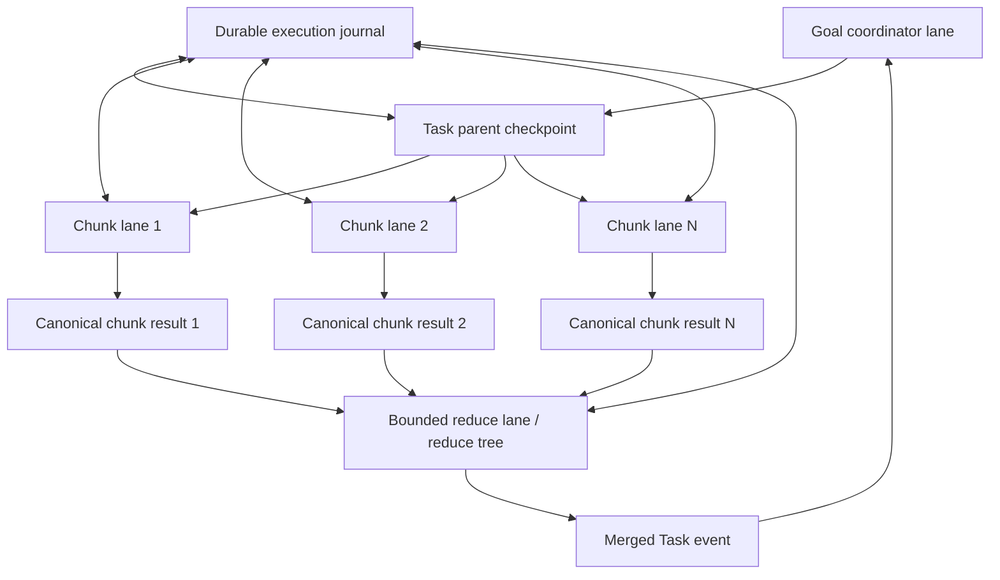

# Round79 chunking and concurrency design under a 16k window

Date: 2026-08-14

Status: architecture design incorporated normatively by
`UNIFIED_MODEL_IO_SPEC.md`. No implementation or E2E gain is claimed.

## 1. Constraint

The deployed model exposes a 16,384-token request window. Native RWKV state, if
added, provides causal continuity; it does not provide exact unbounded storage
for all source bytes, all observations or all parallel branches. Chunking and
concurrency therefore remain first-class architecture components.

The target is not one ever-growing transcript. It is a graph of bounded RWKV
lanes backed by one exact durable journal.

## 2. Lane topology



### Goal coordinator lane

Receives Goal-level progress, Task outcomes and final reduce results. It does not
receive every raw file chunk or every worker transcript.

### Task parent checkpoint

Contains the immutable Goal prefix, active Task contract, relevant tool/control
definitions and the observations needed to define the chunk workset. All
parallel chunk lanes fork from this exact checkpoint.

### Chunk lanes

Each chunk lane receives exactly one bounded assignment and source slice. It
owns an isolated RWKV state and cannot mutate the parent or sibling state.

### Reduce lanes

Consume canonical chunk results, not child recurrent states. If all results do
not fit, reduction is a deterministic tree with bounded fan-in. A parent lane
receives only the final merged Task event.

RWKV states are never averaged, concatenated or last-writer-wins merged.

## 3. Token budget

Every request computes its chunk capacity from the real RWKV tokenizer:

```text
chunk_budget = 16384
             - BOS
             - safety_margin
             - maximum_output_tokens
             - fixed_lane_prefix_tokens
             - current_event_metadata_tokens
             - boundary_carry_tokens
```

No action API may define chunks only in characters and assume they fit the
model. Character and byte cursors remain useful for exact source coverage, but
the dispatcher chooses their end boundary by tokenizing the candidate slice.

Initial target allocation for a chunk worker:

| Component | Target |
|---|---:|
| Fixed Goal/Task/protocol prefix | 1,500–2,000 tokens |
| Chunk metadata and boundary carry | 500–1,000 |
| Raw source chunk | 8,000–10,000 |
| Command/result output reserve | 1,000–2,000 |
| BOS, stop and safety reserve | at least 512 |

These are initial bounds, not hard-coded sizes. The exact preflight calculation
is authoritative. Prompt replay will generally have a smaller raw-chunk budget
than native state because it must replay the fixed prefix.

## 4. Chunk descriptor

Every source slice is registered before model execution:

```text
chunk_id
source_ref
source_sha256
media_type
byte_start / byte_end
token_start / token_end when reproducible
core_start / core_end
overlap_before / overlap_after
previous_chunk_id / next_chunk_id
complete_source
chunk_sha256
split_strategy_version
```

The core ranges of all chunks must cover the source exactly once. Overlap is
context only and cannot create duplicate completion credit.

Split boundaries are generic and media-aware:

- text/code: prefer complete lines and syntax-level boundaries when available;
- JSON: prefer object/array member boundaries while preserving source paths;
- directory/workset: page stable sorted member identities;
- opaque/binary: operate by byte range only through tools that support it.

## 5. Per-chunk model input

The child lane starts from the immutable Task parent checkpoint and appends one
assignment event:

```text
chunk identity and exact source range
Task-local operation
raw chunk content
explicit truncation/completeness fields
bounded overlap or ordered carry, when required
expected canonical result operation
```

It does not receive sibling outputs, the full run history, the full workspace
manifest or a new role prompt. Static tools are already in the parent state.

## 6. Chunk result

Each child emits one minimal semantic result. The runtime binds it to:

```text
child input-state digest
child output-state digest
chunk descriptor digest
command digest
produced artifact/result bytes
deterministic checks
completion/failure status
```

The result must retain source provenance. A prose summary without source range
and digest is not a valid chunk result.

For operations whose exact output can be written directly—copy, transform,
patch, extract—workers produce artifacts or proposed mutations rather than
lossy summaries. Summarization is used only when the Task actually requires a
semantic summary.

## 7. Concurrency classes

| Class | Parallel model calls | Parallel Harness execution | Merge |
|---|---|---|---|
| Independent read/analysis chunks | Yes, isolated forks | Yes | Canonical ordered reduce |
| Disjoint output paths | Yes | Yes after path-disjoint validation | Artifact/member ledger |
| Same output path, non-overlapping ranges | Proposal only | Commit in canonical range order | Conflict/range validation |
| Same mutable object or unknown overlap | No committed parallel mutation | No | Serial semantic resolution |
| Ordered scan with carry dependency | No across dependent chunks | Read prefetch may be parallel | Sequential state continuation |
| Non-idempotent side effects | No | No | Attempt journal and explicit commit |

Parallelism is permitted only when dependencies and mutation domains are
explicit. Runtime safety metadata may forbid parallel execution, but it cannot
invent the semantic operation.

## 8. Reduce tree

Chunk outputs may also exceed 16k. The reducer therefore uses token-bounded
fan-in:

1. sort results by stable source identity and core range;
2. pack as many canonical results as fit the reducer budget;
3. run independent first-level reduce lanes;
4. persist every intermediate result with child refs and digest;
5. recursively reduce until one Task result remains;
6. run deterministic coverage and provenance checks before Task completion.

The tree shape is derived only from token sizes and stable order. It cannot be
changed after seeing semantic quality to improve a benchmark result.

For set-like operations, deterministic union/deduplication may occur in the
runtime when it changes no semantics. For semantic conflict resolution, RWKV
receives only the conflicting result set plus their exact source refs.

## 9. Completion

A chunked Task cannot complete merely because one worker or one reduce node says
so. Completion requires:

- the workset is sealed or explicitly open with a continuation cursor;
- every required chunk core range or member is verified;
- no unresolved worker failure or merge conflict remains;
- the reduce root is bound to all required child result refs;
- RWKV emits Task completion from the final Task lane checkpoint.

The first four conditions are durable facts. The last is the semantic decision.

## 10. Local gap analysis

The current repository already has useful pieces:

- `read_file` / `read_json` cursors and `read_files` bounded results;
- exact RWKV tokenizer counting;
- `MemoryBudgets` and preflight prompt limits;
- runtime-owned collection members;
- dependency-independent Task frontiers;
- parallel execution for read-only Harness actions.

But these pieces do not yet form the target design:

- read chunk limits are character-based, while model capacity is token-based;
- `read_files` can return up to 48,000 characters, after which working memory may
  drop evidence to fit;
- model requests are intentionally serialized even when independent chunk lanes
  could be isolated;
- parallelism currently applies to read-only Harness calls, not full
  model-chunk lanes;
- there is no persisted chunk descriptor, exact coverage ledger or bounded
  reduce tree;
- no native parent/child RWKV state exists in the deployed service.

## 11. Implementation mapping

1. Add `ChunkDescriptor`, `ChunkResult`, `ReduceNode` and lane/checkpoint refs to
   the durable schema.
2. Replace character-first dispatch with tokenizer-preflight chunk slicing while
   preserving byte/character cursors for exact reconstruction.
3. Introduce a `ModelSession` API: bootstrap, fork, append, generate candidate,
   commit, rollback, export and import.
4. Build one canonical model-input renderer used identically by recurrent-state
   and prompt-replay transports.
5. Extend the frontier executor to run dependency-independent model chunk lanes
   concurrently against immutable snapshots.
6. Merge child results serially into the journal in stable order, then launch
   token-bounded reduce lanes.
7. Remove independent member/reviewer prompts once their semantics are expressed
   as events in the Task lane.

## 12. Required validation

- every model request is below its exact token limit;
- core-range coverage has zero gaps and zero duplicates;
- concurrency 1 and concurrency N produce the same canonical merge tree and
  externally observable result for deterministic tasks;
- worker completion cannot complete the parent Task;
- sibling state and journal writes cannot overwrite one another;
- crash/resume does not repeat verified chunks or unsafe actions;
- all child/intermediate/root result hashes are auditable;
- short7, all same-class historical cases and full90 use the same registered
  chunk policy and reducer.
