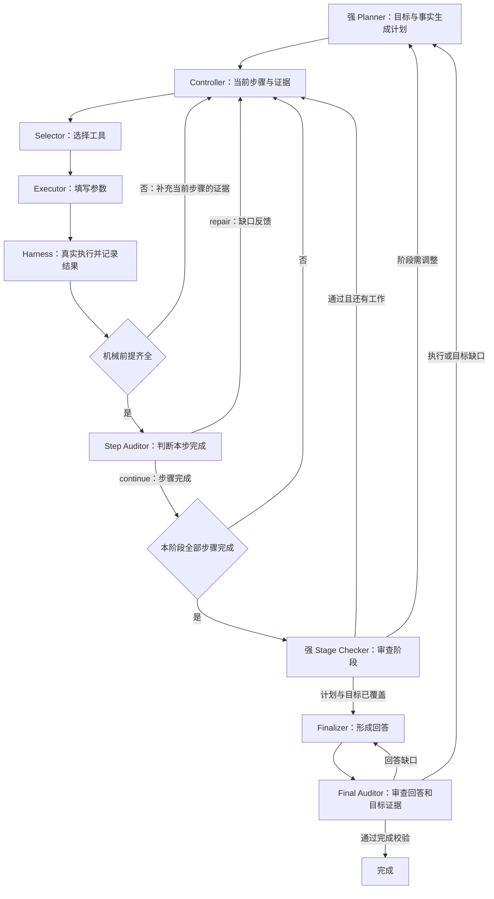

# ULTRADATA_COLLECTION_R2_20260909：真实执行与角色交接对照

Agent：固定三题全部有终止记录，**Strict 0/3、completed 0/3、mutation 0、动作 9**。每题成功执行三次相同的 `list_directory`，第三次在审计之前以 `identical_success_budget_exhausted` 阻塞。总墙钟 290.09 秒。没有改写原始评分、没有拼接 R1；三题运行期间生产源码清单未变。

角色：强 Planner `gpt-5.6-sol` 每题一次、共三次计划接纳；Selector 2.9B 共九次交接、27 次菜单求值；Executor 13.3B 九次生成；Step Auditor 13.3B 六次生成，全部自然 stop、合法 REPAIR；Stage Checker、Finalizer、Final Auditor 未调用。所有 RWKV 角色均使用各自 zero 初始 State，optimizer steps 为 0。合法输出不等于正确判断。

## 冻结与验证

- 生产源码提交 `7854f518`；同一三题、模型、State、菜单、scope、预算及相似度算法，继承 R1 登记，详见 `REGISTRATION.json`、`all_zero/RUN_PROTOCOL.json` 和 `DEPLOYMENT_BINDING.json`。Planner 8192、Executor 1800、Step Auditor 400 为相应输出 token 上限；每题 200 transitions / 1200 秒。实际终止是重复无进展计数 3，与 token 截断或墙钟耗尽无关。
- Native 传输修复后的实际生成、commit、审计 rollback 与工具链已发生；三题均无 `model_transport_failure`、无角色协议拒绝。不能因此声称端到端完成或所有恢复情形已验证。
- 沿用本源码与测试文件完全相同的 Native 修复轮完整回归：**1143 passed、0 skipped、180.63 秒**。日志 `../NATIVE_ROLE_LINK_R1_20260909/FULL_TESTS_FINAL.log`，SHA-256 `44072d38aabc730a2058fd8338e2f6d63067a0770eabcabf82ec8c2bdf769e63`。本轮只增加运行/分析证据和文档，没有修改生产代码或测试，不重复运行相同全套测试。
- 使用唯一角色 builder 重建全部六次 Step Auditor 输入，逐次与生产 `goal_auditor_session_started.prompt_sha256` 相等；原始工具结果、输出、反馈与事件 ID 见 `CONTRACT_COMPARISON.json`。这是来源对照，不是纠正后的训练标签。

## 一个真实案例：ULTRA-Code_00001

公开任务要求在空 workspace 中交付 Python 标准库 `main.py`，从 stdin 读取题目输入并输出计数答案，运行自己的检查。私有验收没有提供给模型；这里没有读取它来判断 S1。

Planner 实际输出四个阶段：S1 观察起始目录 → S2 实现 main.py → S3 运行样例/边界/独立检查 → S4 读回最终文件。四个阶段由该次计划生成，不是框架固定数量。S1 的公开成功标准是：观察记录现有文件，并确认是否存在既有实现或本地 verifier；read root 为 `.`，禁止修改文件。

| 交接 | 目前设置的标准 | 本次真实结果 |
| --- | --- | --- |
| Planner → Controller | 绑定目标、阶段、步骤、依赖、访问范围和成功条件 | 四阶段计划被接纳，当前步骤 S1 / observe |
| Controller → Selector | 提供当前步骤、机械进度、允许的操作和反馈；选择一个操作 | 首次选择 list_directory；同一边界使用三个菜单排列求值 |
| Selector → Executor | 冻结选择身份，披露选定工具 schema、目标合同与事实；只填写参数 | `path="."`、`recursive=false`、`max_entries=1024`、`start_after=""`、`max_tokens=4096` |
| Executor → Harness → 审计 | 参数校验后真实执行，保留动作 ID、结果和完整性 | A00001 succeeded；entries=[]、entry_count=0、truncated=false、next_cursor=""、metadata.complete=true |
| Step Auditor | 根据 S1 条件与 A00001 判断本步是否完成；observe 不要求先写代码 | 返回 repair、step_complete=false、evidence_refs=[]，选中三个预列缺口 |
| 审计 → Controller → 下一次选择 | REPAIR 保留当前步骤，将缺口交回 Selector/Executor | 又列同一空目录；第二次审计仍 repair；第三次相同观察后阻塞 |
| S1 通过之后的路径 | 阶段检查通过才进入 S2 的实现工作，最终还有回答与最终审计 | 未到达；不能把这些阶段记为运行失败或通过 |

首个 Step Auditor 的原始输出为 `name=audit_decision`，`arguments` 中的值如下（只摘录内层，字段和值没有纠正）：

```json
{
  "verdict": "repair",
  "step_id": "S1",
  "step_complete": false,
  "evidence_refs": [],
  "gaps": [
    "phase_evidence_unproved:observe",
    "read_root_unproved:.",
    "success_criterion_unproved:2e0070fa7018"
  ],
  "reason": "evidence_incomplete"
}
```

按这个公开 S1 条件，完整列出空目录已经证明“起始目录为空、没有既有实现或本地 verifier”。合理的语义判断应引用 A00001，完成 S1，随后交给阶段检查；它不等于算法已实现或整题通过。这是本次人工分析，不是正式双人复核标签，也没有注入训练或评分。

## 已确认的连接问题与因果边界

**候选缺口被写成否定事实。** `auditor_step_v4.build_gap_catalog()` 的注释说它构造“可能的缺口”，但它无条件为每个 read root 输出 `The active read root '.' lacks a successful complete observation.`，也预列 phase 未完成；模型可见提示没有清楚声明这些是假设选项。真实 evidence_records 同时含成功、完整的 A00001。六个审计边界的机械 missing_read_roots 都为空，但六个输出全部选中 read_root_unproved。根因位置为 `rwkv_lh/goal_state_protocols/auditor_step_v4.py:68`、`:82`、`:224`。

**合法 REPAIR 可以携带与机械事实冲突的否定断言。** 当前 `validate_source()` 校验缺口是否出自 catalog，`validate_audit_authority()` 对已完成步骤审查机械证据；未完成 REPAIR 不走该完成证据检查。接受事件随后把 catalog 中的否定句作为语义反馈传给 Selector/Executor。这里的 `kernel_validated=true` 只证明允许的结构、引用和权限约束，不能当作语义真值。位置为 `auditor_step_v4.py:190`、`goal_loop_protocol.py:1588`、`goal_state_protocols/feedback.py:97`、`model.py:1225`。

本轮能够证明“冲突信息进入同一输入 → 模型选中这些缺口 → 反馈到同一步 → 重复观察”，不能从单臂结果量化中性提示能改善多少，也不能把所有模型错误归结为提示词。下一轮需要共同修正条件、事实和模型判定的表达，并验证可机械核实的矛盾；业务语义仍由 RWKV 判断。不能把所有成功工具调用自动判成步骤完成。

三题都在第一步，三题 Planner 均只调用一次；本轮没有发生“步骤未完成自动要求重新规划”。目前继续同一步的路由按设计生效，但反馈内容错误。增加重复预算会增加相同观察，不能据此声称修复。Final Auditor 的 catalog 也无条件预列“回答遗漏结果”“回答缺乏证据”等否定句（`auditor_final.py:58`）；这是同类输入设计风险，本轮没有到达它，不能报实际误判次数。

## 当前完整链路与可以简化的部分



图中的角色交接通过共享输入协议、因果日志和证据引用完成，不把前一个角色的内部 WKV 混入下一个角色。协议错误留在原角色边界重试；已执行的工具不会因为审计格式错误自动执行第二次。计划批次结束但目标责任未覆盖时，Controller 也会请求 Planner 补充工作。

| 机制 | 本次判断 |
| --- | --- |
| 五角色分工、工具 schema、真实证据、反馈归属、最终完成校验 | 保留；它们各自承担明确职责 |
| 机械证据与 gap catalog 分别描述 root 是否已观察 | 优先统一事实来源与表达；当前出现已复核的矛盾 |
| 所有待选缺口都用已发生的否定句描述 | 应改为明确待判定条件，保留合法缺口引用能力；未修复前不能靠训练样本吸收这个接口矛盾 |
| Executor Native checkpoint 在 Selector 调用之前准备，Auditor/Finalizer 也先导入 Executor checkpoint | 已确认跨角色服务依赖；R1 因此在 Selector 之前失败。各角色自身 State 并不继承 Executor WKV，应缩小依赖，让选择与其他角色按其输入独立准备；修复恢复语义前不能直接删除持久化 |
| Selector 每次做三个菜单排列投票 | 额外成本已发生；是可做固定消融的工程选择，不是 StateTune 的定义要求。本轮没有单次选择对照，不能宣称删除后质量不变 |
| 单步骤阶段之后再调强 Stage Checker | 按当前契约做阶段级检查；本例每阶段较细会增加潜在调用。未到达该阶段，尚无证据支持直接删除它 |
| 观察输入中的原始 SHA、适配器/投影版本等元数据 | 可研究将纯机器核验数据留在日志，把必要事实、来源引用与完整性给模型；当前不能直接删字段或改写已冻结 trace |

Native 指推理服务直接承载 RWKV 的数值递归 State。StateTune 学习的是角色的初始 State，随后模型读取当前输入继续更新它；Native 句柄、缓存、fork/import/commit/rollback 与请求回执负责工程传输和恢复。业务阶段进度在 Controller 的记录里。当前每个 Executor 动作使用干净的角色初始 State，审计和 Finalizer 也独立初始化；StateTune 不是让五个角色共享一份不断增长的会话记忆。

## Selector 数据为何仍不合格

唯一抽取器得到九条自动标注候选，来自三个首次选择边界，各自三个菜单排列；train 6、dev 3、confirmation 0。另有 18 条后续重复选择进入独立复核队列，没有强行标为成功。候选全集 status=invalid。

本轮预注册的是至少 30 条已核验菜单行、十个不同选择边界、非空固定切分，并覆盖 py_root / mutate / execute / missing_target；本轮没有到达这些覆盖。三个题目虽然不同，角色输入都停在“观察空目录”，18 对跨 train/dev 输入相似度约 0.9835–0.9923，超过固定 0.95 阈值；不能把换题目 ID 或换菜单排列当作独立技能覆盖。

不足的是当前 Selector 的覆盖、独立边界和固定回归质量，不是要求 Finalizer/Final Auditor 先出现，也不是以 Agent 高分禁止首轮训练。没有新建正式 `data/datasets/` 版本，没有启动 optimizer，没有读取 Holdout。

所有运行、重建输入、候选清单和分析脚本 SHA 记录在 `EVIDENCE_SHA256.json`。外部完整题目、原始大 trace、候选文本保留在本地；Git 保存报告、清单及必要对照证据。当前报告确认问题与影响范围，没有将审计语义问题标为解决。
