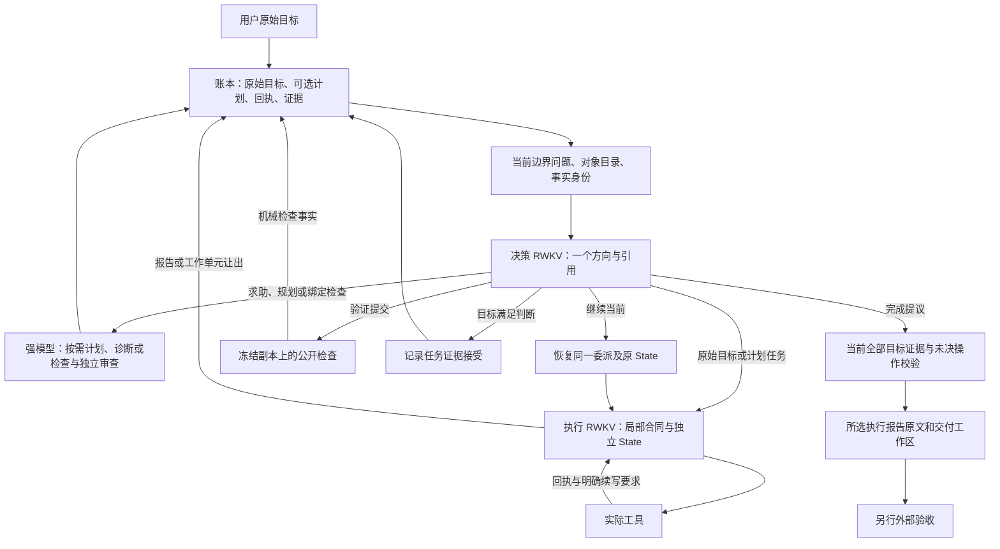

# 当前编码项目架构

当前实现将原始目标、可选设计和可执行证明分开保存。`goal`保存原始请求与调用方保护路径；默认首个模型调用是Decision。RWKV可以直接`delegate(original-goal)`调查和执行，也可以显式`replan`请求强规划、`help`请求诊断。Controller不按任务关键词、规模或重复次数选择路线。直接目标通过共享工作合同投影进入既有Executor、工具、回执、State和验证链；`plan`仍为null，没有自动安装单任务计划或伪造规划审查。调用方明确要求开工前规划时，可设置`CodingJob.require_initial_plan=True`或`--require-initial-plan`；这仅设置同一架构的初始规划请求。

直接工作提交后，Decision显式`bind_checks`请求强Planner依据完整原始目标和实际实现证据编写检查，再由独立lane审查覆盖、合法实现自由度及执行语义。该环节不要求编写项目设计；检查审查不是执行通过。Decision仍须选择实际`verify`、根据回执`accept_task`，最后`finish`通过既有完成门。空检查、过期工作区、未知操作和单独worker声明不能完成。替换已绑定检查须新ID及匹配的失败回执，旧身份不可改写。`plan_version`同时作为共享合同世代，在目标检查绑定时递增；不表示自动创建计划。

原目标工作中按需要安装首个计划时，保留原始目标和全部原始证据，清除原目标的当前报告、验证、接受和可恢复委派，防止将旧合同的完成声明转给新任务。目标检查绑定也丢弃旧可恢复委派，之后修复使用当前检查合同的新Executor State；合同不变的普通局部续行仍保存同一State。权限始终来自原目标保护路径并叠加计划保护，不能因没有计划失效。

目标、设计与检查分为三层：原始request是用户目标权威，requirements是可审查修订的模型解释，任务interfaces是设计选择；completion表达验收意图，checks是具体可执行证明。完整目标和所有计划义务始终保留，任务可先用checks=[]经独立审查后执行；空检查在Decision候选、实际验证、回执提交与完成门均不能产生通过。实现提交后由Decision显式选择replan，Planner基于原始目标和真实实现证据绑定检查，再独立审查。仅首次添加检查、且任务其他合同及需求解释完全相同时，可保留已提交实现声明供独立验证，不继承任何旧验证；改变设计或解释则重新打开相关任务。

需求ID保留，解释文本可在独立审查中有据纠正；review同时收到完整previous_plan与原始request，Planner必须说明修订并保留每项用户义务。解释变更会使相关任务及依赖后继的报告、接受、可恢复委派和验证失效，活动合同不得热改。此处语义保真依赖独立审查与最终验收，ID保留不证明语义没有遗漏。当前不支持任务删除／替代。Planner实际wire只展示当前mode允许的函数；未安装计划不展示检查替换，审查与诊断分别只展示各自函数和read_file/read_files。

公共命令沙箱在准备好的benchmark-web环境中只读挂载专用Chromium缓存，Python Playwright可实际运行；没有挂载整个home或仓库，也不提供全局Node Playwright。Planner的check_execution明确该运行合同。check_command写入仍丢弃，浏览器存在和程序语法通过都不代表用户行为已验证。

步骤展示仅有“已做／未做”：当前任务合同已有确认返回的工具动作即已做，无确认回执即未做；失败动作也属于做过。每步附实际发布路径与工具OP证据ID，每次增量输入明确展示当前步骤状态。Decision包含完整计划，Executor仅包含当前委派。该展示不选择下一任务，不替代报告、检查和目标接受，也不把未知结果当作已做。生产与trace重建共用步骤投影；训练单行适配器检查两状态结构，正式准入从完整原始账本重建事实。


模型可见文本由同一角色构造函数的语义快照统一渲染，不再先灌整份JSON、随后重复步骤和回执。宿主保留完整快照、投递哈希、原审计intent及内部task_status用于核验；模型读取完整计划、局部合同、报告/检查/接受事实，以及按当前函数参数分类的真实引用。已做/未做是动作发生展示，不与report_work.status共用含义。当前不合法的Decision方向不在参数引用目录中展示，但没有删掉合法方向或增加业务路由器。

确认动作以function/params展示，来源身份与调用分开；原始工具和检查输出保留真实换行，同一回执在当前输入中不再被多个视图重复展开。拒绝原文是数据，反馈绑定接收角色、出错角色、具体参数及schema；Decision不能被要求自己修Executor调用。即使外层信封解析失败，只要JSON对象顶层存在无歧义的显式函数名，也仅查找本角色实际Harness的合同用于纠错；函数名与schema共同留痕，原始拒绝与未解析command不改变。拒绝诊断以成员对保留对象，只投影唯一顶层函数名；参数内部重复键不再阻断schema披露，但原调用仍由严格parser拒绝，不选择重复值。未知、越权、多函数名、重复顶层键及额外调用容器不猜测；不搬参数、不补ID、不提交失败child。每次增量重申最近动作/拒绝、两状态和当前参数引用；未知结果不伪装成回执，拒绝报告不撤销已确认工作，旧合同错误不作为当前纠错目标。原始事实、完整计划与工具schema不截断，完成门不变。

连续拒绝事实从已确认模型回执和下一次原始输入重建：保留同一角色/lane/工作合同内连续拒绝数、末尾原输出与原错误均相同的重复数，以及起止OP。Decision以boundary和已选证据为上下文；Executor以委派合同和原始目标为上下文。已确认的新工具回执、成功模型调用或合同变化结束原序列；未知结果不新增计数。过往错误仍保留原文，但不冒充当前连续尝试。该投影不持久化第二份计数，不授予执行证据权限，不改变动作选择；完整历史继续保存在账本，干净Native anchor不提交失败生成。当前输入、delta、trace和数据重建共用同一角色builder及投影。

当前 Project 协议为 Ledger v10、Goal v1、Plan v5、Assignment v6、Planner v14、Decision v17、Executor v13；prompt布局v7、输入传输v2。旧输入和角色 State 不复用。计划将 `protected_paths` 与任务 `scope` 分开，两者都使用 `.` 或 `./path` 语法；错误反馈给出字段、索引与原值。调用方可用 `CodingJob.protected_paths` 或编码 CLI 的重复 `--protected-paths ./path` 固定保护要求，Planner 必须保留。未以调用参数明确的自然语言只读限制仍需模型遵守和审查提取；模型审查不能替代显式权限保证。

候选进入独立审查前，先在账本副本上执行与正式安装相同的全部结构、版本、检查替换和活动任务守卫，不修改真实账本。审查通过后安装仍重复守卫，防止中途状态变化。审查输入说明 scope 只约束写入、候选保护可扩展 owner 最小保护集合、完成检查在实现之后运行。

Project 单行 token/标签格式校验只证明样本结构。正式链路由 `project_training_sources` 重抽取真实生产来源，`project_training_labels` 核验独立纠错审查，再由 `project_training_freeze` 经 `freeze_dataset` / `admit_dataset` 校验两个 Project 角色的来源族隔离、独立边界、函数覆盖和唯一固定回归。准入重查实际原始证据，不接受调用方填报的覆盖度标志。链路可用不等于已有可训练数据或已完成训练，实际来源、训练及验收状态只见当前交接。

候选计划先进入 pending_plan，再由强 Planner 的独立 review 会话审查原始需求、完整候选检查、保护路径和已知证据。审查与作者会话隔离，每次审查或重试都计入原有调用/时间预算。只有无未解决问题的 accept 才能安装；reject 带候选身份和问题列表返回原作者修订。预算耗尽、输出无效、未知结果或审查期间工作区变化都不能放行候选。新增的是安装前模型语义审查，不是任意程序一致性的形式证明。

文件写操作先授权；全部工具在隔离工作区执行，变更按 scope 和保护路径检查后通过 Linux 原子目录交换发布。越界变更整批拒绝，不把允许的部分单独提交；符号链接和特殊文件拒绝发布。发布要求同一文件系统，发布结果未知时保留 pending，不自动重放。该机制保护项目工作区，生产命令的宿主隔离仍由 Harness sandbox 承担。

角色拒绝记录独立于瞬时反馈槽，求助携带有操作 ID 和回执摘要的模型错误，并明确不具有执行事实权威。工具、Planner读取和验证完成事务会自动把实际意图与原始回执登记进Decision证据流，不需要request_info获取刚发生的结果；每次Executor协议拒绝也按operation ID单独投递，标明不是执行事实。Decision保留证据身份而只追加新详情，不再向模型重复整份结果哈希目录；显式request_info用于补充取证并保持同一边界State。Executor只追加新工具观察，可按ID取回本委派或已声明依赖的原始回执。输入投递游标与返回的checkpoint同事务保存，生产与trace重建共用投影。没有checkpoint时重新提供完整相关证据，不依赖丢失的State。工具metadata的changed_paths列出实际发布变更，可与workspace_committed区分成功但无副作用的重复写入。

Native 采样支持角色配置 `RWKV_LH_PROJECT_EXECUTOR_SAMPLING_SEED` / `RWKV_LH_PROJECT_DECISION_SAMPLING_SEED`，seed 进入请求、原始生成证据、checkpoint 绑定及 engine SamplingParams。非 Native 传输显式拒绝带 seed 的生成，避免默默忽略。固定 seed 仅建立受控随机评测的参数通路，不保证跨硬件确定性。

编码 CLI、批量 coding 与 Web coding 都使用 `project_agent.run_project_job()` 和 `project_runtime.ARCHITECTURE` 指定的唯一架构；真实 RWKV/强模型能力尚未验收。运行状态仅见 [当前交接](HANDOFF.zh-CN.md)，设计经验见 [经验](LESSONS.zh-CN.md)。

RWKV 是状态驱动的续写基础模型。项目维护可检查的计划和事实；决策 RWKV 回答明确的方向问题；执行 RWKV 在局部合同下连续选择工具和写代码；强模型负责初始规划、证据支持的重规划和具体诊断。工具返回后，执行输入仍明确要求下一次应判断什么，不把追加结果文字本身当作推进协议。Decision/Executor的通用规则只在首次输入的事实之前提供；每次事实更新后只问“下一步、结束当前工作、还是求助”，保持一个function/params JSON调用。三个方向是认知提示，不是新路由器，也不替换既有允许动作。Executor结束仍须report_work后独立验证，求助仍经已有让出/阻塞与Decision链路。任务、检查、事实和原文引用不截断；规则/问题及渲染布局摘要进入checkpoint绑定，缺少该绑定或规则改变的旧State拒绝生产恢复。



## 职责与唯一协议

|职责|实现|权限与输入|
|---|---|---|
|合同|`project_contracts.py`|原目标、可选阶段/任务设计、依赖、接口、修改范围、独立检查；无固定任务或阶段数量上限|
|项目事实|`project_ledger.py`|SQLite 事务、单写者租约、事件摘要链、委派、工作单元、检查事实、目标接受和未知操作；不选择业务解法|
|强模型|`project_protocols/planner.py::build_input`|完整计划、原始目标、观察证据、工作区目录和求助；可在隔离副本中用 `read_file`/`read_files` 取得逐条只读回执，不能写入；提交可选计划、原目标检查、显式检查替换、独立审查或诊断|
|决策 RWKV|`project_protocols/decision.py::build_input`|边界问题、判断 ID、计划/工作区/委派身份、完整计划、报告、检查与目标判断、自动送达的实际操作/原始结果/逐次拒绝、允许方向、剩余预算|
|执行 RWKV|`project_protocols/executor.py::build_input`|局部合同、原始用户请求及相关需求（直接目标保留用户原文；计划需求为Planner解释）、依赖报告、实际工具结果、局部失败、按 ID 引用的任务诊断；不接收全局任务调度历史|
|角色 State|`project_sessions.py`|Decision 在项目内使用一个持续 lane，边界身份独立核验；Executor 在同一委派内持续。正常只追加变化，拒绝重试恢复干净 anchor；恢复校验模型、输入与证据绑定|
|推进|`project_runtime.py`|应用合法方向、让出与继续、验证和预算；不替模型补写方案或重写交付原文|
|Trace|`project_trace.py::role_boundaries`|验证账本事件链，调用同一生产输入构造函数重建；不自动判为合格训练样本|

角色输出使用 `function/params` 信封。每个角色只有当前一个协议模块和一个输入构造函数。旧版与未知角色输入、旧账本及不兼容 State 拒绝恢复；不并行保留旧产品控制器。计划合同结构未改变时不为模型升级另造协议版本；运行时标签取模块常量。

## 从目标到交付的完整步骤

1. 把源目录复制为本次可修改的工作区，核验文件身份；账本和原始日志位于工作区外。
2. 默认先由Decision判断直接执行原始目标、请求规划或求助。仅当模型显式请求规划或调用方要求初始规划时，强模型根据原始请求提交包含需求解释条目、任务目标、阶段、依赖、范围和公开检查的候选计划。规划/诊断/独立审查在需要核对源码事实时，可逐文件按字节游标读取只读隔离副本；回执写入账本，同一输入构造函数在下一轮展示事实，读取本身绝不放行候选或改变工作区。程序校验结构、引用、覆盖和无环，再进入独立强 Planner 审查；审查接受后安装。宿主不自动修改检查，也不替模型保证任意检查的语义完整。
3. 从账本构造当前问题和真实候选对象。决策回答 `delegate`、`continue_current`、`verify`、`accept_task`、`request_info`、`help`、`replan`、`bind_checks`、`finish` 或 `blocked`。输出绑定判断 ID、计划版本和工作区摘要；过期或越权回答拒绝。
4. 首次委派建立局部执行 State。合同来自原始目标的原文投影或已审查的Planner任务，决策 `reason` 只用于审计。`delegate`/`continue_current`可显式提供`handoff={text,evidence_ids}`，交接当前任务的关注点而非具体工具执行权。账本将它绑定原Decision操作、任务和合同摘要，标为`decision_suggestion`；Executor判断具体修法，不把建议当成事实。引用只允许当前合同任务、已声明依赖和工作区只读回执，原文随委派事务排入Executor证据流；同一委派已授权的证据不会因下一次省略handoff而消失，旧建议正文则不自动续用。复杂诊断仍走原有强Planner求助，并用任务所属advice_ids交接，不新增自动模型调用。
5. 执行器自主选择工具及参数。模型与工具操作先写意图，再原子记录已知回执和 State；原始工具输出按摘要另存，能够按证据 ID 展开。
6. 每次执行续写都有局部合同、已知结果和明确下一步要求。正常工具之间不插入一个判断模型调用。默认工作单元共享项目总预算，Executor可持续读、改、测、修，不再每两次调用强制交回。调用方可显式设置CodingJob.unit_calls/unit_seconds或CLI --unit-calls/--unit-seconds；配置额度时仍仅在已确认边界让出，不中途猜测副作用结果。Planner、Decision、Executor都收到实际剩余总预算，Executor还收到当前单元余量；恢复前预算计入已持久化elapsed。
7. 普通工具返回确定失败时，同一Executor收到原始失败事实并选择局部修正或主动求助；宿主不自动归因或切换业务方向。越界仍拒绝发布并交回，未知结果仍保留pending且不重放。执行器也可用 `yield_work` 报告局部进展和未决问题并主动让出，它不等于提交或完成。成功的普通工具可在工作单元内连续执行；额度达到时同样交回决策。只有选择 `continue_current` 才回到同一委派、同一 State，输入明确携带继续方向、任务 ID、进展报告和局部失败/验证反馈。不重放已确认写入，协议失败也消耗额度；额度不是计划步数上限，也不续发项目总预算。
8. `report_work` 只产生提交或阻塞声明，同时保存可恢复委派。失败、局部进展、任务提交和阻塞分别构造明确边界问题；阶段信息来自完整计划，不由计时器推断阶段完成。对已提交任务，决策选择 `verify` 后，公开检查分别在相同初始树的独立副本运行；命令、退出码、输出、检查合同与工作区摘要均留痕。
9. 检查成功只记录 `checks_passed`。决策必须明确以当前验证 ID 作出 `accept_task`，判断证据是否匹配任务目标及需求，才记为 `verified`。验证失败可继续原执行 State 修复，也可取证、求助或重规划。增加的是同一决策角色的明确判断，不增加审核模型角色。
10. 错误检查由Planner显式替换：计划任务用`revise_plan`，直接目标用`submit_checks`的replacements。两者共用替换守卫，绑定旧/新检查ID、同一工作及原需求、旧检查实际失败回执和理由，均须独立审查。复用ID改内容、无证据删除、拿通过回执冒充失败一律拒绝；历史ID永久保留身份。原始回执和旧版本留在账本链中，新合同的旧接受与验证失效。
11. 完成前，决策评估整个原目标覆盖，`finish` 选择已有执行报告。程序要求所有任务有当前检查和明确目标接受、工作区身份一致且无活动委派/未知操作。返回选中报告的原文和实际工作区，决策不另写实现说明，程序不改写答案。多任务需要综合交付说明时，由 Planner 按用户需要规划相应局部交付工作，不能把任一短摘要自动视为全项目总结。
12. 内部完成不等于外部Strict通过。隐藏验收既不进入模型视图，也不参与修复；实际运行和外部验收结果仅以HANDOFF引用的冻结记录为准。

## 继续执行与验收有效性分开校验

`project_contracts.assignment_dependencies_resumable()` 是决策允许目录与账本实际恢复共用的唯一条件。已有合法委派执行写入后，工作区摘要改变，旧依赖检查仍立即失效；如果委派保存的原始依赖验证通过、依赖合同摘要未变、当前依赖仅处于 stale/awaiting_verification，则允许 `continue_current` 恢复同一委派及原 State。这样不会因正常写入和工作单元让出形成死锁。

这一规则不授权新委派，也不接受过期证据：`delegate` 仍要求当前依赖 verified；已失败、合同变更或未曾验证的依赖不能借旧快照继续。`accept_task` 与 `completion_ready` 仍校验当前验证 ID、任务合同及工作区摘要，所有失效检查都须重新验证和接受后才能完成。继续、重新验证的顺序仍由决策 RWKV 选择，程序不替它编排业务方向。

StateTune 角色样本只从当前生产账本提取。`project_role_data.py` 重建角色边界但不授予训练资格；`project_token_data.py` 必须逐字节核对服务器返回的完整 Native 输入 token；`project_statetune_data.py` 仅接受当前协议、可验证来源、独立审查和固定切分中的行。离线合成场景和本地渲染 token 不能冒充真实 RWKV 轨迹。

## 三种 State 与恢复

- 项目事实状态：完整目标、计划、版本、工具/检查回执、明确接受、当前委派、原始证据。
- 决策输入视图：由当前事实构造的一个边界问题；不是 RWKV 隐状态。保留完整未完成计划，已确认执行结果自动增量送达；完整性字段来自实际选定证据。工具自身声明的输出截断仍随原始回执保留，交接层不裁剪回执或操作参数。
- RWKV 递归 State：角色续写状态。Decision 从固定角色初始 State 建立一个项目 lane，随后跨边界以无损字段变化续行，不在每个新边界重灌整个计划。边界身份仍从原始 model intent 与当前事实逐项核验，不把固定 lane 当成判断身份。Executor 在委派内连续，包括让出、恢复和失败修复。文本裁剪不等于递归 State 遗忘。

输入传输绑定 `project_input_delta.INPUT_HANDOFF_VERSION`，不是第二个角色协议。首次由唯一角色构造函数生成完整语义快照，再经共享渲染器展示；后续以同一函数生成当前快照，按上次已读快照计算set/remove并使用同一展示规则，未变计划和合同不重复。语义快照的无损重建与模型展示分开核验：内部状态枚举、投递哈希等宿主元数据不冒充模型必须理解的额外合同。checkpoint 在模型可见内容之外持久化当前输入和干净 anchor；失败重试从 anchor 追加本次变化，不接上一次失败 child。展开新证据时先正常追加并建立新 anchor，不能回滚到未读证据的 State 后又把投递游标当成已读。义务、依赖、错误与原文来源均保留，没有有损摘要或计划数量限制。旧的逐边界 Decision lane、缺少输入绑定的旧 checkpoint 均拒绝生产恢复，必须新 run；历史 trace 只允许离线按当时原始字节审计，不能作为生产兼容入口。

新角色使用 `RWKV_LH_PROJECT_EXECUTOR_*`、`RWKV_LH_PROJECT_DECISION_*`。未显式配置时从 zero 开始，不继承旧直接执行器 State；模型、tokenizer/build、State 身份按既有 Native 接口核验。

合同或依赖发生不兼容修订时新建委派；无关修订不重置仍兼容的委派。模型结果、提交或工具副作用未知时保留 `pending`，恢复停止等待核实，不自动重发。调用和时间预算跨恢复累计；耗尽只记中断，不伪装完成。工作单元时限在确认边界观察，外层 SIGALRM 是协作式总期限，清理和持久化可能略超时。

## 产品入口与展示

```bash
rwkv-lh --source-workspace /absolute/source --request '实现用户目标' \
  --output-dir /absolute/output --max-calls 64 --max-seconds 600
rwkv-lh --resume /absolute/output
```

命令会真实调用配置好的模型；当前已核验的项目诊断结果见 [当前交接](HANDOFF.zh-CN.md)。编码 CLI、批量 coding 和 Web 使用同一闭环。Web 分开显示检查结果与目标接受，导出一致 SQLite 快照和日志，恢复沿用原工作区。`files/inspect` 是独立的只读工具。底层历史研究库仍受原有回归覆盖，不是编码产品可选控制器。

## Planner装填与公开检查合同

Project Planner通过唯一`planner.chat_input`将固定规则与当前mode的工具名称放system，将唯一build_input的完整需求、计划、证据放user；参数schema只通过API tools发送，不在提示正文重复。规划、独立审查、求助和重试共用此装填，实际wire与语义输入摘要分别留痕。求助时完整记录运行Harness的Decision/Executor合同；它们随账本保留，读取后续行及trace重建不改用默认工具猜测。原始生成token数组保留在模型审计，不进入诊断正文；原输出、确切错误、操作身份与回执摘要保留。

`project_check_contract.CHECK_EXECUTION`是Planner和审查共用的执行语义：每个检查从相同冻结树的独立副本开始，检查之间的写入不持久；夹具在同一次调用中自足建立，但不要求检查提前生成它本来要验证的实现。检查需断言需求行为和非空测试，Web/全栈交互需真实Chromium，不以关键词或伪DOM替代。`validate_check`仅对可识别的Python内联代码及环境中可用的Node/grep/shell字面量作非执行语法预检；未知命令形式不被假称已验证。预检不启动候选程序，不读取被测文件，不证明通用语义正确。检查修订仍须原失败证据，安装前独立Planner审查与运行后的实际验证均保留。

Planner的规划、独立审查和诊断共用需求／设计边界：requirements只登记可追溯到原始需求的义务，必要但未被用户指定的实现选型写入任务interfaces和plan rationale并说明理由。审查需判断必要性、冲突与可实现性，不仅因用户未指定某个实现细节就拒绝；额外业务功能和未约定的身份/排序等假设仍不得隐藏加入检查。任务目标、接口与完成声明的重要行为承诺须有能区分缺失实现的行为检查，不能只依赖错误实现也可能通过的样例。此处是模型合同，不是自动接受计划的宿主判据，也不能证明模型已正确审查所有任意程序。

## 当前限制与能力门

已实现按需规划与直接原目标的共享执行、审查和验证边界；具体回归与新受控运行状态见HANDOFF。当前工程机制不能推出模型方向判断准确率、任务完成率、成本改善或训练收益。工作单元默认额度与持续增量决策 State 策略尚未通过固定题集和预算的 Agent 级真实消融校准。

当前实现将验收意图与检查程序绑定时点分开，并调整连续执行和预算事实；实现与真实收益是两种证据。已有任务删除／替代仍需明确义务迁移合同，当前不能直接抹除旧task或requirement ID；工作区变化仍使全局旧验证失效，新委派与最终完成受当前验证约束。多任务验证调度成本尚未有充分真实轨迹量化，不凭局部机制测试宣称全部架构问题解决。

检查替换的结构和失败证据可被程序核对，替换是否忠实于原需求仍需要模型判断与外部验收。项目不会用一套手写业务规则代替这项能力。现行实现不允许删除已安装task ID；已安装requirement ID保留，解释文本可以经独立审查修订，并使相关任务及依赖后继的旧声明和验证失效。requirements由Planner生成，结构覆盖不证明其与保留的原始request语义一致。长期上下文选择、存储回收、强模型接管执行尚未实现。预算/上下文不足必须中断，不静默截断计划。

新 Trace 只是生产边界记录；来源授权、标注、覆盖、冻结回归及预算准入另行完成。旧角色数据不得改标签后用于新角色训练。训练、付费生成和真实 Agent 评测必须遵守当前 owner 授权、预登记预算和证据要求，不得依据旧轮次的暂停或授权文字自行启动。

## 验收边界：按需规划不等于能力合格

默认Decision先判断是当前合同的入口策略。完整工程回归证明目标、权限、回执、State、检查及完成门机制；模型是否能用这些机制完成真实任务，必须由冻结源码、固定预算和独立验收的新受控运行证明。首个Executor更早、Planner调用更少、角色输出合法或worker报告submitted，都不能单独证明产品收益。原始拒绝、UNKNOWN和未完成保留，Controller不通过替选动作制造改善；具体当前结果与未完成项只从`docs/HANDOFF.zh-CN.md`进入。

## 工具合同与输入展示

role_definitions提供一份实际完整参数schema，包含必填/可选、嵌套约束、类型和边界；保留工具目的，不重复展开逐字段说明。自定义Harness合同保持原样并深拷贝。模型仍须生成完整实参，不是复制schema；参数校验和重复键拒绝不变。schema/说明身份进入tools_digest。

统一renderer首先呈现完整用户原文；目标、委派objective/completion、需求或handoff只有逐字相同才通过显式equal_fields路径共享文字。不同解释与设计、完整计划、真实回执及拒绝原文不截断。handoff共享文字仍保留decision_suggestion与原操作身份。delta缺少原文时保留literal，语义快照与精确delta不改。当前prompt布局v7拒绝不兼容State恢复；历史输入仅以原冻结源码审计，不能转成当前训练。token减少须与新Agent交付结果分别报告。

Executor区分写入、实际运行的验证和未运行限制，报告仍为worker_claim。Controller不代判自然语言正确性或改写Final。Planner thinking配置通过已知输入配对探针登记选择，不能以格式有效取代独立审查或Agent验收。

## 离线来源读取边界

所有Project离线账本读取使用`ProjectLedger.read_snapshot`：先取得既有锁文件的共享锁，再以immutable只读SQLite打开。活动写者、缺失锁及未checkpoint WAL均拒绝；不创建锁/SQLite旁文件。trace读取完整事件后在内存重建，候选/审查/正式来源提取在锁内验证依赖。候选登记字节与SHA一起固定，发布前变更拒绝。Controller写入入口保持既有独占租约。该边界不替代独立语义审查、来源隔离和正式训练准入。

## Project Native约束解码

`RWKV_LH_PROJECT_CONSTRAINED_DECODING=on` 将现有 role_definitions 的全部 Decision/Executor 动作派生为同一 function/params 输出grammar，不代选方向。服务必须声明当前 decoder 协议并使用 Guidance；缺少能力或返回合同身份不符时拒绝。生产默认开启约束，后续实际模型实验必须显式登记并核验开启；不得因Agent尚未通过而回退off。底层显式off仅保留供离线结构机制测试及历史证据审计，不作为新模型实验配置。强Planner使用下述官方strict工具传输。

Project边界的格式适配器只拆解一个明确、无歧义的调用外壳：`tool_call`、单项`tool_calls`、嵌套`function`及显式`response`函数名可映射到既有`function/params`；标准`arguments`字符串严格解析一次。原函数、参数、审查结论、原始返回和归一化记录全部保留。重复键、未声明的多调用组合、冲突名称或参数、未知外层字段不能通过适配；参数schema、角色/mode、证据和完成门继续独立校验。格式版本由模块常量绑定角色checkpoint，不能在恢复时静默改变解析身份。该适配不生成缺少的参数，不将reject改为accept。

合同同时保存原schema、生成schema、明确延后的uniqueItems和SHA；原角色、引用、参数、权限与完成校验保持。原完整schema中的数组唯一性在执行校验，其他不支持约束必须明确拒绝。合同贯穿Native请求身份、生成回执、角色checkpoint及trace重放，恢复不能静默切换规则。grammar/EOS控制输出结束，预算触顶仍中断；State预填充与精确重建不加输出grammar。服务器使用`--structured-outputs-config '{"backend":"guidance"}'`，固定seed实验设置`VLLM_USE_RAPID_SAMPLER=0`。格式合法不证明事实判断、工具方向或交付正确，工程修复收益须以新的约束开启运行验证；比较其他改动时，两臂均保持约束开启。

约束合同的当前版本还声明State输出消费策略：原始采样token完整留证，下一轮缓存仅排除一个合法终止EOS；服务器、客户端与trace核对独立state_token_ids。非法终止形状或证明缺失一律拒绝。Project增量在下一User之前关闭前一Assistant JSON围栏，提交和拒绝分支共用该规则。decoder合同与输入framing共同绑定checkpoint，旧身份不能静默恢复；输入预填充和已知正文token的State重建保持无grammar，不增加语义采样。


## 强 Planner 约束与检查交接

Planner当前chat布局v3。`strong_structured_output`从当前mode的同一role_definitions派生DeepSeek官方beta strict工具合同，明确tool_choice=required和thinking disabled。配置须为官方HTTPS origin，不能把中继凭据转发到其他主机，也不能静默退回文本JSON模式。函数参数直接保留原参数根对象，type=object与anyOf分支共同表达可选字段的省略语义，不增加params封套，不补null/default或猜参数。字符串长度按支持的pattern投影；API不支持的数组长度、唯一性及已有pattern上的长度约束显式登记由原角色schema校验，未知关键词拒绝。合同SHA、当前协议、mode工具及chat规则绑定checkpoint。

SSE按tool_calls index拼接实际name/arguments，保留ID和多个调用；流结束后续片段、冲突和损坏结构拒绝。官方原始流、原始envelope及运输归一化分别留痕，按当前直接参数根对象无损映射，函数名、参数内容和省略保持不变。只读批次以外的多个调用、混合正文、refusal或非法外壳不会自动选一项执行。约束不保证字符串里的程序语法、引用有效性、事实或行为正确，原角色/权限/完成门继续校验。

原目标checks/review_checks模式增加已有advise动作。模型可根据实际证据显式将实现修复或未解决问题交回Decision；账本校验当前goal_context、版本、候选lane和可见证据，保留完整候选与原回执，将建议标为非执行事实。此动作仅结束当前检查请求，不绑定/接受检查，不改变用户目标或既有完成条件，不自动继续Executor。下一步由RWKV决定；普通review reject仍回到检查作者，没有固定重试次数路由。忠实检查揭露实现错误本身不是检查缺陷，原目标中的入口、字段及可访问名称不能当作新增要求删除。

## 正式角色评测的约束输入

Project角色评测plan/run v2强制登记当前production decoder SHA，zero/candidate两臂共用同一约束。原始完整prompt_token_ids通过Native exact-token-input协议进入create，再generate并核对decoder、父State、完整输入、BOS、原始/State消费token和EOS；已知结果留痕后先rollback未提交候选，再以父State的state_ref/state_digest/cache_binding_digest release，不commit为后续Agent State；两项清理均核对真实返回身份，未知rollback不释放父State。服务缺少当前exact-token能力、Guidance或源码/权重身份证明时拒绝，UNKNOWN保留不重发。该入口不把原token先解码再编码，避免破坏历史append分段；不重新发明角色输入或训练样本。正式数据资格、固定回归、独立审查和训练授权保持不变。

官方DeepSeek strict存在已复现的schema违例，不能视为已证明的服务强制。精确token create返回真实_input_evidence，dispatch/重启回放与完整清理需真实服务核验；当前证据只见HANDOFF，不能由客户端夹具替代。

当前格式适配将Planner明确的read_file/read_files多调用组合完整映射为当前read_files工具，全部原参数及顺序保留，原工具ID仍在规范化审计中。批次schema在首条读取前完整验证；每条都走只读快照并生成独立planner_read回执，以原模型operation_id、index和count关联。完成最后一条前保留inbox，恢复只消费未记账部分。混合写操作、无效只读成员、重复工具ID、歧义和其他角色的多调用仍拒绝，不挑第一条，不生成路径/参数，不放行检查或完成。没有增加模型调用或固定批次数量上限。

prompt布局v7对同一次输入中完全相同的长渲染块使用本地共享原文表和位置引用。语义builder快照、原义务、完整检查、每条回执身份/顺序均不变；仅完整相同块共享，不做子串猜测、摘要、截断或任务特判。所有引用在本次更新内闭合，分隔标记不与原内容冲突，逆向展开逐字等于原渲染；计入声明和引用后若RWKV token不减少则保留原显示。原请求仍在BODY首部，原文字块放BLOCKS数据区，末尾仍是当前角色问题。当前layout身份绑定State/checkpoint，不重用旧prompt State。
