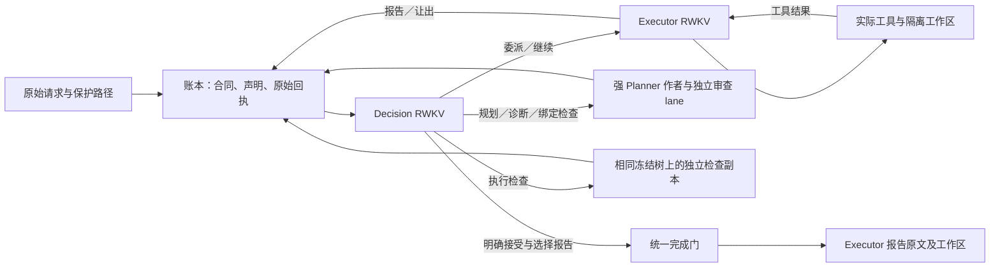

# 当前编码项目架构

项目使用 Decision RWKV 选择方向、Executor RWKV 连续执行、强 Planner 按需规划与审查。Controller 负责身份、权限、事务、预算和完成门，不选择业务方案、不补模型参数、不改写 Final。本文描述当前实现边界；实验成绩、服务状态和维护记录仅在本地管理。

## 唯一入口与职责

编码 CLI、批量 coding 与 Web 统一调用 `project_agent.run_project_job()`。`agent_jobs.CodingJob` 只定义任务数据；`agent_batch` 只接受该类型与独立 `ReadOnlyJob`，拒绝隐式子类及已退役的依赖集成、自动接管任务。包导入不装载模型或 Controller。`coding_agent` 仅保留离线 Direct trace 采集及必要回归；底层只读／旧角色研究不是第二条 Project 产品架构。

|职责|唯一实现／入口|边界|
|---|---|---|
|工作合同|`project_contracts.py`|原目标、可选计划、任务、依赖、范围与检查；不限制阶段／任务数量|
|项目事实|`project_ledger.py`|事务、单写者租约、事件链、委派、原始回执、验证、接受和 pending|
|强 Planner|`project_protocols/planner.py::build_input`|计划／检查作者、独立审查、诊断；可只读取证，不能改工作区|
|Decision|`project_protocols/decision.py::build_input`|完整目标／计划、边界问题、真实引用、报告、验证和剩余预算；输出一个方向|
|Executor|`project_protocols/executor.py::build_input`|当前委派、原目标、相关需求、授权证据、实际回执和剩余预算；自主选择工具／参数|
|角色 State|`project_sessions.py`|独立 lane、增量输入、干净 anchor、模型／协议／证据绑定|
|执行推进|`project_runtime.py`|应用合法操作、运行工具／检查、提交事实；不替模型改选动作|
|Trace|`project_trace.py::role_boundaries`|全链验真后使用生产 builder 重建边界；不自动授予训练资格|
|工具合同|`harness.py::ActionDefinition`|菜单、schema、权限、回执和 decoder 共用注册定义；Project 检查工具由 `project_launch.PROJECT_CHECK` 注册|

当前版本：Goal v1、Plan v5、Assignment v6、Ledger v13、Decision v21、Executor v17、Planner v16、prompt v8、Planner chat v4、输入传输 v2、边界解码策略 v1。每角色只有一个协议模块和一个 `build_input`，生产、数据与评测共用；运行时标签引用模块常量。旧／未知协议和不兼容 State 拒绝恢复。模型升级通过模型、tokenizer、State、容量和传输适配处理，不自动重写角色协议。

## 从原目标到交付

1. 核对源目录身份并复制为工作区，账本和原始日志位于工作区外。原始 request 是用户目标权威；调用方保护路径始终生效。
2. 默认首个调用是 Decision。它可直接 `delegate(original-goal)`，也可 `replan` 或 `help`；宿主不按关键词、任务大小或重复次数选路线。直接执行时 plan 保持 null，不伪造单任务计划。调用方可通过 `require_initial_plan` 明确要求先规划。
3. Planner 提交候选计划后，先在账本副本上预检正式安装的结构与版本守卫，再交独立 review lane 审查。accept 且无未解决问题才可安装；安装时重新核验真实状态。reject 返回作者修订，审查／重试计入原预算，不设固定重试次数路由。
4. 委派为 Executor 建立独立 State；兼容合同内持续读、改、测、修，普通工具间不插入 Decision 调用。默认工作单元共享项目总预算；显式 `unit_calls/unit_seconds` 仅在已确认边界让出。工具确定失败进入同一 Executor 的反馈；未知副作用保留 pending，不重放。
5. Executor 统一使用 `report_work`：`progress` 保存进度并保留活跃委派，`submitted` 提交待验，`blocked` 声明局部阻塞；后两者保存可恢复委派。报告须处于已确认的 Executor 执行边界。Decision 显式选择 `continue_current` 才恢复同一委派及 State；报告不接受任务或完成项目。
6. 对已提交的原目标或计划任务，Decision 通过 `bind_checks` 请求 Planner 编写检查并独立审查，再显式 `run_task_checks`。检查逐项从同一冻结树的独立副本开始，写入不在检查间传递；命令、输出、退出码、合同和工作区摘要均留证。
7. 检查成功只记 checks_passed；Decision 还须以当前验证 ID 执行 `accept_task`，判断其是否覆盖目标。失败后的继续、取证、修复或重规划仍由模型选择。空检查不能产生验证通过或完成。
8. `accept_task` 可带 `deliver_report_id` 原子接受并交付；也可接受后再 `deliver_report`。两者共用完成门：全部目标有当前非空检查、通过证据和明确接受，工作区一致，且没有活动委派、待审候选、未完成规划请求或 pending。任一条件不满足则整体拒绝。Controller 返回所选 Executor 报告原文，外部 Strict 另行验收。

Planner 的 requirements 是对原始需求的解释，interfaces 是实现选型，completion 是验收意图，checks 是执行证明。计划可先以 checks=[] 经审查后开工，最终必须补齐证明。必要实现选型可以说明理由，但不得隐藏增加业务要求；重要承诺应有能区分坏实现的行为检查。结构覆盖不能证明语义忠实，仍需独立审查及最终验收。

## 合同变更与权限

原始请求与所有计划义务完整保留，不截断数量。当前不支持删除／替代已安装 task ID；requirement ID 保留，解释文本可由独立审查结合 previous_plan 和原始请求修订。相关任务及依赖后继的旧报告、验证、接受和可恢复委派失效，活动合同不得热改。无关修订不重置仍兼容的委派。

检查维护统一走 bind_checks；改变设计或需求解释走 replan。替换检查必须使用新 ID，绑定同一工作的原需求、旧检查实际失败回执和理由，经独立审查安装；不能改写旧身份、无证据删除或用通过回执冒充失败。检查合同变化后保留实现声明，但清除受影响的旧验证、接受及委派。原目标执行中首次安装计划时，清除原目标当前报告和完成声明，全部原始证据仍保留。

`assignment_dependencies_resumable()` 是允许目录与实际恢复的共同守卫：原依赖验证通过、依赖合同未变且当前仅因写入处于 stale/awaiting_verification 时，可恢复既有委派。新 delegate 仍要求当前依赖 verified；失败、合同变更或从未验证的依赖不能继续。最终接受与完成始终要求当前合同、验证及工作区身份，不能借此接受过期证明。

调用方 `protected_paths` 与任务 scope 分开，语法为 `.` 或 `./path`；Planner 只能扩展最低保护集合，scope 只约束写入。自然语言限制仍需模型识别和审查，不能替代显式权限。工具先授权，再在隔离副本执行；核对范围和保护路径后，以同文件系统的 Linux 原子目录交换发布。越界变更整批拒绝，符号链接和特殊文件拒绝发布；未知发布结果保留 pending。

## 输入、证据与 State

项目事实、模型可见视图与 RWKV 隐状态分别保存。Decision 在项目内持续一个 lane，并逐边界核对判断身份；Executor 在兼容委派内持续。两个角色不互相复制 WKV 张量。未显式配置角色 State 时从 zero 开始，不继承旧直接执行器 State。

唯一 builder 生成完整语义快照，首次渲染完整输入，随后以 set/remove 无损表达变化。规则只在首次事实前提供，每次更新后仍有明确续写问题。内部枚举、投递哈希和审计 token 不冒充额外模型合同。相同文字仅在逐字一致且可逆时共享；引用在同次输入内闭合，保留每条回执身份／顺序，计入引用成本后 token 不减少则保留原展示。原目标、义务、检查、错误和实际参数不作静默摘要或裁剪。

工具、Planner 读取及验证的实际意图和原始结果自动送入 Decision；Executor 收到新工具观察。`read_receipt` 只补取已授权原始回执，不需要再次读取刚投递的返回。Decision 的 handoff 绑定原操作和当前合同，标为 suggestion，不能变成执行事实；引用限于当前工作、已声明依赖及工作区只读证据。省略新 handoff 不撤销既有授权，但旧建议正文不自动续用。delivery_context 中其他 worker 报告也是声明，不扩大权限。

步骤只有“已做／未做”：当前合同存在已确认工具返回即做过，失败也算做过，unknown 不算。真实发布路径和 OP 证据随之展示，不替代验证或接受。连续拒绝及重复数从同 lane／合同的已确认回执和相邻输入重建，不持久化第二套计数；新工具事实、成功模型调用或合同变化结束原序列，拒绝本身没有执行权威。

checkpoint 绑定当前输入、工具合同、模型、State、证据与干净 anchor。拒绝后从 anchor 追加当前反馈，不接失败 child；新证据必须先进入 anchor 再推进已读游标。没有 checkpoint 时重建完整相关输入，旧布局或缺失绑定拒绝恢复。模型返回、State 提交或工具效果未知时停在 pending，已知结果与 UNKNOWN 分开留证，不自动重发。

中间 State 默认内存存储，每 worker CPU 缓存默认 64 GiB；不足明确失败，不能丢弃活跃句柄。GPU 淘汰后从受控内存导入，正式 release 退役无引用且非 pending 的 State。内存模式有事务审计但没有跨服务重启张量恢复；storage epoch 防止旧句柄冒充有效 State。需要张量分析或持久恢复时显式使用 disk。权重、训练 State、输入／输出 token 和原始 journal 不属于缓存清理范围。

Native 实例的 request_lock 串行执行实际 State 操作，generate 另持 State 锁；并发 HTTP 不代表并行生成或 fully async 训练。权重更新钩子会清空递归 State 和缓存，接入训练必须另验在途请求及前缀重建。角色 seed 进入 Native 请求、回执和 checkpoint；非 Native 传输拒绝 seed，固定 seed 不保证跨硬件确定性。

## 工具、检查与沙箱

工具说明与参数的权威来源是 ActionDefinition；角色投影深拷贝注册定义，schema／说明身份进入 tools_digest。`schema_validation.validate_schema` 为角色和 Harness 共用的递归校验器，检查对象必填／多余字段、数组及标量约束；Harness 另核权限、工作区路径和真实文件身份。约束解码与执行校验使用同一原合同，不因格式合法跳过权限或证据门。

`search_files` 搜索 UTF-8 内容；`read_file` 返回原始字节及原文件 SHA；`read_json` 使用规范 JSON 分页，不能作为精确文本替换原文。`replace_text.count` 要求匹配总数恰好相等，all 才替换全部；`remove_line` 只删明确非空完整行。copy/move 的目标必须是确切文件路径，目录目标在变更前拒绝；bind_evidence 核验完整闭区间，不越过 EOF 缩短引用。完整参数、分页、版本前置条件与能力声明见各注册 schema。

`run_shell(command)` 执行一次独立非交互 Bash 脚本，支持管道、变量和重定向，没有终端续接；显式 stdin 后关闭，省略即 EOF。它不接受旧 argv/shell/timeout_ms 入口，不改写脚本正文中的宿主路径。最终退出码沿用 Bash；需要前序失败中止／管道传播时，由调用者明确配置。普通失败不证明脚本从未写入。

`check_command(argv)` 直接执行参数数组并丢弃副本写入。两种命令共用进程／沙箱后端及 PATH 规则：显式值替换默认值，保持搜索顺序，空／相对项相对 cwd；仅映射已有挂载路径，不增加挂载或展开变量。省略时使用默认项目 Python。普通命令隔离宿主网络；Chromium 专用缓存只读挂载，不挂载整个 home／仓库，也不提供全局 Node Playwright。

`project_check_contract.CHECK_EXECUTION` 供检查作者和审查共用：检查须自足、非空并断言需求行为，Web／全栈须实际 Chromium。语法预检只解析已识别的内联形式，不执行候选程序或证明一般语义。忠实检查揭露实现错误不等于检查错误；checks/review_checks 中的 advise 可显式交回问题，不绑定／接受检查、不改目标、不自动继续 Executor。

显式 launch 支持根 index.html 的静态项目和标准 Vite/build→dist/index.html 前端，在独立副本记录文件身份、安装、构建、HTTP 就绪与停止回执；后端、SSR、自定义输出仍未覆盖。`check_project` 在一次有界调用中复用该生命周期，可通过 `RWKV_LH_PROJECT_URL` 运行模型明确给出的 Python／Playwright检查。检查所见服务副本只读，原工作区不变；省略 argv 只证明 HTTP 就绪，返回时服务已经停止。墙钟中断先清进程，再保留未确认操作。

启动／检查的 bubblewrap 路径显式共享网络，只挂载项目副本、系统工具及 DNS 文件，不继承模型凭据。仅接受公开 HTTP(S) 代理；大小写冲突、凭据及非根路径等拒绝且不回显地址，loopback 绕过代理，元数据仅登记是否启用。运行／安装／检查的成功都不自动改变 Agent 完成状态。

## Native 与强 Planner 传输

所有新 RWKV 模型运行开启 Project 约束解码。服务须声明当前 decoder、Guidance、源码／权重及 State 证据；缺失或不匹配则拒绝。合同保存原 schema、生成 schema、显式延后的 uniqueItems 和摘要；其他不支持约束明确拒绝。生成结束由 grammar／EOS 控制，预算触顶仍中断；输入预填充和已知 token State 重建不加输出 grammar。off 只保留离线机制测试／历史审计，不作为新模型实验配置。

`project_decoder.build_role_decoder` 从同一工具 schema 和生产输入生成本次约束：Decision 只允许 boundary 的当前方向，ID 必须来自 references；建议、交接及验证引用按任务绑定。Executor 无授权回执时不提供 `read_receipt`，报告证据为空时只允许空数组。静态工具目录及策略身份绑定 lane，每次实际 grammar 摘要绑定原始生成回执；合法边界推进可改变 grammar，不能改变目录／策略或重置 State。bootstrap 仍保留完整静态工具合同，逐次约束不宣称减少每次输入 token。运行、精确 token 重放和正式角色评测共用当前生成函数。

原始采样 token 完整保存，State 消费只排除一个合法终止 EOS；服务、客户端及 trace 核对 state_token_ids。下一 User 前关闭前一 Assistant JSON 围栏，提交与拒绝共用 framing，身份变化不能静默续用旧 checkpoint。正式角色评测必须使用精确 token 重放，记录 State 回滚与释放回执。

格式适配只拆解单个无歧义的 tool_call/tool_calls/function/response 外壳和一次严格解析的 arguments 字符串；函数、参数、原返回和转换记录保留，不生成缺参或把 reject 改 accept。重复键、冲突、多义或未知外层字段拒绝。Planner 明确的 read_file/read_files 多调用可完整归并为有序 read_files：首条执行前校验整个批次，每项独立只读回执绑定原 OP、index/count，完成前保留 inbox，恢复仅消费未记账部分。其他角色、多调用混入写入或无效项均拒绝，没有固定批次数量上限。

当前 Strong 请求共用 `deepseek_api.chat_request`，只接受官方 HTTPS 根／v1／beta 并规范化端点，关闭重定向和自动 fallback。Planner 使用 beta strict tools，tool_choice=required、thinking disabled；非工具纠错／审查走 JSON Output。退役 backend、私有 tokenize／token 字段和未支持扩展参数在联网前拒绝；旧 Native 只读 Goal 的独立 phase 不回落 Chat。

`planner.chat_input` 将规则与当前 mode 的工具名放 system，将 build_input 的完整需求和证据放 user；参数 schema 仅在 tools 中发送。诊断保留当时实际工具合同、原输出和确切错误，不灌原始 token 数组。实际 wire 与语义输入分别留痕；容量预检和发送共用 wire 构造，完整审计 checkpoint 容量另记，本地 tokenizer 估算不是供应商容量上界。

`strong_structured_output` 从同一角色定义投影 strict schema：对象明确 properties／required／additionalProperties=false，params 封套中的 anyOf 保留原参数省略，不补 null/default。不支持的数组／字符串约束明确登记交原 validator 执行，未知关键词拒绝。SSE 按 index 拼接 name/arguments，保存原 stream/envelope/归一化；混合正文、refusal、冲突或尾部损坏拒绝。reasoning_content 与 content 分开，不自行拆正文标签。API 接受 strict 不证明服务强制，角色、权限和完成门仍独立校验。

## 持久化、离线读取与能力门

模型／工具先记意图，再原子记已知回执与 State。`generation_accounting` 为文件流和内存事件共用身份、顺序和重复检测；预留、开始、返回、发布及 pending 分开核对，未知计数不填零。所有角色和审查消耗同一项目调用／墙钟预算，恢复累计已持久化耗时；耗尽只能中断。SIGALRM 是协作期限，清理和持久化可能略超时。

离线读取统一用 `ProjectLedger.read_snapshot`：先取既有共享锁，再打开 immutable SQLite；活动写者、缺锁、未 checkpoint WAL 均拒绝，不创建旁文件。`scan_verified_events` 在同一事务内逐条验完整链及 current，只保留所需投影。角色边界必须全链验证后才返回，快照与来源提取保持锁及相邻原事件核验，不信任调用者缓存；登记字节和 SHA 同时固定，发布前变更拒绝。写入仍用独占租约。

训练准入分别核验生产 trace、完整 Native token、来源授权、独立纠错、覆盖与固定回归。合法单行、原始轨迹或工程回归不自动授予训练资格；旧角色数据不得改标签复用。

更早进入 Executor、减少 Planner 调用、合法输出或 worker 提交不能单独证明完成率、成本或训练收益。持续 State、工作单元及多任务验证成本仍需冻结源码、固定预算和独立验收的 Agent 对照；长期上下文选择、存储回收、任务删除／替代和强模型接管执行尚未实现。运行状态、实验记录和下一步仅在本地维护。
