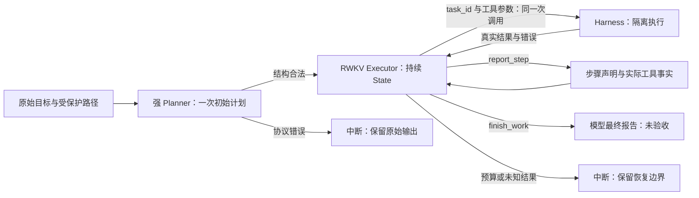

# 当前编码项目架构

当前编码产品采用一份初始强模型计划与一个持续 State 的 RWKV Executor。Executor 自主选择计划步骤、工具与参数，接收真实结果后继续执行、自测、修复或结束。设计目标是先观察完整执行轨迹：能看见模型实际做了什么、收到什么反馈、在哪里失败以及如何结束。工程闭环不代表模型已经具备正确完成任务的能力。

产品仅有这一条链路。Decision、在线计划审查、阶段审查、重新规划、诊断求助及独立完成验收已移除；没有开关、旧协议兼容模块或自动回退。

## 执行流程

初始 Planner 只允许 `submit_plan`，收到原始请求、workspace 清单、请求明确引用的已有文件材料、保护路径和剩余预算。材料入口按实际相对路径匹配，不特判文件名或扩展名；完整 UTF-8 正文、字节数与 SHA 和初始工作区身份绑定，非 UTF-8 文件明确标注而不伪造文本。材料捕获前后及逐文件身份均核对，发现变化即拒绝；这不是对任意外部写者的原子文件系统快照。未引用的源码与间接引用仍由计划中的调查步骤交给 Executor 读取；不要求执行证据先于执行。阶段与步骤数量按任务需要决定，没有固定数量上限或静默截断。

宿主校验字段、唯一标识、需求引用、依赖结构与路径权限，不评价计划是否正确合理。不合规的初始返回结束为 `planner_protocol_error`，同一任务恢复时不会重新调用 Planner。

计划安装后，宿主建立一个覆盖原目标的稳定 Executor lane，完整计划送入首次输入。每次工作区工具调用都由模型显式给出 `task_id`；工具 intent 与这次选择在同一事务持久化，权限和回执绑定该步骤。切换步骤不会更换 lane、重新委派或清空 State。依赖描述计划顺序，不构成已验证依赖门；模型可以选择和重访任意已声明步骤。

## 唯一入口与模块职责

CLI、批量 coding 和 Web 统一调用 `project_agent.run_project_job()`，恢复入口为 `resume_project()`。`CodingJob` 只保留请求、workspace、总调用/时间预算、保护路径和生成快照选项。没有单元交回预算或可选初始规划参数。

|职责|唯一实现|边界|
|---|---|---|
|原目标与计划合同|`project_contracts.py`|结构、引用、路径与身份；不作语义验收|
|持久记录|`project_ledger.py`|单写者、事务、事件链、原始回执、步骤选择、声明与未决操作|
|初始材料|`project_materials.py`|完整捕获被请求引用的文件；不解释需求或授予写权限|
|初始 Planner|`project_protocols/planner.py::build_input`|一次规划；不执行工作区工具|
|自主 Executor|`project_protocols/executor.py::build_input`|原始目标、完整计划、当前步骤、声明、工具事实、回执与预算|
|工具步骤绑定|`project_action_binding.py`|显式步骤选择；当前协议下受控比较调用边界，不推断步骤或扩大权限|
|State 与实际传输|`project_sessions.py`|Native 增量、干净重试锚点、模型/协议/工具/采样身份绑定|
|运行器|`project_runtime.py`|执行合法模型操作、落实权限、提交真实事实与预算中断|
|Trace 重建|`project_trace.py::role_boundaries`|全链验真后调用当前生产 builder；不授予训练资格|
|工具合同|`harness.py::ActionDefinition`|菜单、schema、权限、回执与 decoder 共用定义|
|项目自测工具|`project_launch.py`|Executor 可选的隔离启动、HTTP 与浏览器检查|

当前版本：Goal v1、Plan v7、Assignment v7、Ledger v18、Executor v21、Planner v23、prompt v10、Planner chat v10、输入传输 v3、边界解码策略 v4、调用包装 v9。运行标签引用模块常量。旧协议、账本、prompt 和不兼容 State 一律拒绝恢复或改标签重用。

底层只读工具与独立研究依赖不构成另一条编码产品入口。模型升级通过权重、tokenizer、State、上下文和传输配置适配，不自动改变角色协议。

## Executor 操作与反馈

- Harness 工具：模型在同一次调用中提供 `task_id` 与读写、搜索、运行命令或检查项目的参数。缺失或未知步骤一律拒绝；宿主不猜测、不沿用上次步骤来补参数。每次调用得到真实结果，再由同一 Executor 决定下一步。
- `report_step(task_id, status, summary, evidence_ids)`：记录 `progress / done / blocked` 声明。不会自动切换步骤、触发审查或交回其他角色。
- `read_receipt(evidence_id)`：重新投递已有工具回执原文，不重新执行工具。
- `finish_work(status, summary, evidence_ids)`：`finished / blocked` 结束整个项目，报告原文保留。允许步骤未声明完成、未测试或错误时结束；宿主不补写正确答案。

当前默认绑定方式为 `with_tool`，菜单和 decoder 不提供单独 `select_step`。同一当前协议保留仅供预登记配对实验的 `before_tool` 条件：模型先调用 `select_step(task_id)`，工具仍必须显式提供相同 `task_id`；初始未选步骤时工具不可调用。它使用同一 Controller、schema、事务与权限，不接受旧协议或省略参数，没有面向用户的切换选项。绑定方式纳入输入、checkpoint 身份和 Native 回放验真，不能在同一 State lane 中更换。这项结构变更仍需真实模型配对实验验证，工程正确性不代表完成率提升。

步骤观察记录工具次数、失败次数、实际提交变更次数、路径、回执与当前选中状态。模型声明单独记录。读取文件、失败操作和成功空操作均不会被宿主写成“步骤已完成”。

最新工具原始结果自动送达。回执按确认顺序提供 `receipt:N`，只在有类型的引用参数位置转换为原 OP；文件、工具内容与报告正文保持字面值。每次显式读取都有可见投递 revision，同样的正文也会再次进入增量。游标只确认实际输入包含的投递事件；无变化的旧工具正文不因后续选择或报告而重复追加。

非法输出保留原文、错误、实际参数合同和连续拒绝事实，回到同一 Executor。拒绝生成不会提交其候选 State；干净锚点中的已确认事实保留。新工具事实或步骤变化推进正常父 State 链。Controller 不替模型选择修复、不补语义参数、不引入额外模型。

## 权限、事务与中断

工作区来自经身份核对的源目录副本。写入权限为该次工具明确选择步骤的显式范围，并叠加 owner 与初始计划的保护路径。禁止写入、路径逃逸及未知操作结果仍由宿主阻止，这些是执行边界，不是模型正确性检查。

任务 `scope` 是字面写入路径集合：空数组表示只读，可读取材料但不能提交任何文件变更。字段缺失仍属协议错误。路径采用工作区相对路径规则，`file` 与 `./file`、`.` 与 `./` 权限相同；保留模型和 owner 的原始拼写，按 POSIX 路径身份比较保护范围，不猜测文件、不展开通配符。绝对路径、`..` 路径分量、反斜杠与 NUL 一律拒绝。Planner schema、计划验证、计划安装与执行权限遵循同一语义；旧计划不通过自动补字段或改路径迁移。

工具在隔离副本执行。显式越权写入在执行前拒绝；命令运行后的整体变更若越权，全部不发布。合法变更以完整事务发布。失败和无变化分别保留原始回执，不产生假 mutation。命令没有跨调用持久后台服务保证；需要启动并检查项目时由模型选择现有工具。

SQLite 事件与内容寻址记录保留输入、输出、checkpoint、原始回执和因果身份。模型/工具调用先登记 intent，再确认返回。失联、取消或发布结果不确定时保留 pending，不自动重放。断点恢复保留总预算、lane 和已确认 inbox；已完成的写入不重复执行。服务不再持有必要 Native State 时不得假装恢复。

内容记录在每个 RecordStore 内按 64 MiB 字节预算复用已校验节点，避免共享历史超过固定节点数量后反复读取与验真。预算计算节点对象、键与条目开销，超大节点不缓存；它不限制 SQLite 缓冲区、返回的完整历史或进程总内存。展开后的可变结果不共享，新读取事务重新校验，事件链检查仍覆盖全部历史；缓存不改变存储格式、模型输入或事实权限。

Planner 材料与原始输入一同持久化；Trace 通过唯一 builder 重建并核对身份，不重读已变化的工作区。输入超出部署容量时记录完整输入与估算，按中断处理，不截断计划或材料。总预算耗尽、输出预算耗尽和超时均不能伪装成完成。

## 可观察输出与结果语义

执行目录保留：

- `project.sqlite3`：可验真的完整事件链与模型输入/输出。
- `model_trace.jsonl`、Strong trace：实际传输、采样与原始返回。
- `raw_tools/`：完整工具结果。
- `PROGRESS.jsonl`：逐次模型命令、步骤、反馈和对应真实工具正文的可读投影；SQLite 为权威记录。
- `RESULT.json` 与外层 `DELIVERY.json`：最终状态、终止原因、模型报告、步骤事实和 mutation。
- 开启选项时的 `generation_snapshots/`：每次生成前实际 workspace 的身份与快照。

`status=finished` 与 `model_finished=true` 表示模型选择结束。当前执行流程始终保持 `completed=false`、`acceptance=not_evaluated`；外层超时可能标记不可评估。退出码 0 只表示模型正常结束并返回报告，不表示功能验收成功。Web 将步骤声明与工具事实分开显示，不能用绿灯或“已验证”代替真实验收。

真实开发评测的 Strict、功能完成与 mutation 必须在独立结果中报告。后续独立验收不能回写这次运行的模型报告、冻结源码或评分口径。

## 数据与后续实验

生产、trace、候选提取、StateTune 校验和角色评测共用当前输入构造与 renderer。当前只有 `project_executor` 角色数据入口；旧 Decision 数据不能重标为 Executor。

候选来源需重验事件链、生成前快照、Native 完整输入 token、父 State、原始生成与实际 decoder。离线候选审查与训练准入仍独立存在，仅用于授权后的数据工作，执行器不会调用它们。未审查轨迹、机制夹具、脚本输出和参考实现不会自动成为训练数据。

所有实验使用冻结源码清单与预登记预算；当前运行不依赖旧实验、旧 State 或旧调度。训练与新数据集版本另按明确授权执行。公开 CI 只验证发布源码与构建；完整工程回归和真实 Agent 成绩分别报告。
