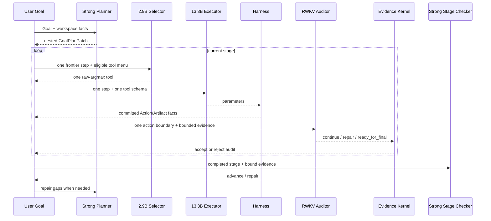

# RWKV-LH 当前代码架构

更新时间：2026-09-01（Asia/Shanghai）
当前分支：`chase/rwkv-goal-loop-v2-cleanup`

本文只描述当前产品链路。旧 Contract Graph、Atom Pool、State Router 和历史实验代码不是产品入口，不作为当前架构组成部分。

## 1. 请求到完成



`U` 在图中表示 `StatefulGoalLoopController` 与 Causal Ledger，不是另一个模型角色。

## 2. 阶段计划

模型可见 PlanPatch 是嵌套 JSON：

```text
GoalPlanPatch
├── add_stages[]
│   ├── stage
│   └── steps[]
├── replace_stages[]
│   ├── stage
│   └── steps[]
├── discard_step_ids[]
└── reason
```

`goal_loop_protocol.py` 在提交前展平步骤索引并验证：

- step ID 唯一，完成步骤不可改写；
- 依赖存在且无环；
- 依赖只来自更早阶段；
- 同阶段读写根无冲突；
- 当前 frontier 只来自最早未完成阶段；
- 整个阶段完成后生成带 step revision 与 evidence refs 的确定性 boundary key。

Stage Checker 的模型输出只有 `verdict/gaps/reason`。review ID、stage、step IDs、evidence refs 和 schema version 由 Controller 绑定，避免模型复制内核字段造成格式失败。

## 3. 权威和 State

| 对象 | 责任 | 是否事实权威 |
|---|---|---:|
| `GoalState` | 不可变用户请求与策略 | 是 |
| `CausalEvent` | append-only 因果历史 | 是 |
| `DecisionRecord` | 当前已接受 RWKV 调用 | 是 |
| `ActionRecord/ArtifactRevision` | 已执行动作与工作区事实 | 是 |
| Executor/Auditor/Selector WKV | 续写加速和角色状态 | 否 |
| Strong Planner/Checker 文本 | 计划或检查建议 | 否 |
| staged tool selection | Selector 到 Executor 的候选交接 | 否 |

Executor 使用一条持久 action State。Auditor 每个边界从 clean State 启动，不继承或合并 Executor WKV。默认可复用同一个 13.3B 推理服务，但 session 和 State 必须隔离。

## 4. 当前并发状态

协议已经表达同阶段同级步骤并拒绝冲突，但运行时目前顺序执行，因为产品只有一个持久 Executor lane 和一个未决 Audit boundary。

真正阶段并发必须先增加：

- 每步独立 Executor session/State；
- 并发 Action 的独立事务身份；
- 每步独立 Audit boundary；
- 只合并 Harness/Evidence 事实的确定性提交协议；
- 外部副作用和全局写的串行门；
- 崩溃后能区分已完成、在途和未开始步骤的恢复投影。

这些条件未完成前，不能把旧 `ThreadedRWKVAtomPool` 接回主链，也不能把共享 `RunState` 的线程执行称为安全并发。

## 5. 当前模块

| 模块 | 当前责任 |
|---|---|
| `product_runtime.py` | 按 `.env` 装配唯一 `stateful_goal` Controller |
| `stateful_goal_loop.py` | rolling plan、阶段屏障、动作/Audit/Stage Review 调度 |
| `goal_loop_protocol.py` | PlanPatch、Stage、Audit、Evidence Kernel |
| `supervisor_openai.py` | Strong Planner 与 read-only Stage Checker 的结构化调用 |
| `exact_tool_selector/` | 2.9B frontier-only 工具分类 |
| `model.py` | 唯一工具 handoff、13.3B 参数生成、clean-State Audit |
| `model_session.py` | prompt replay ablation 与 native state+delta session |
| `runtime/native_state.py` | WKV create/append/generate/commit/rollback/import |
| `harness.py` | 工具 schema、策略、执行、结果和 Artifact |
| `schema.py` / `store.py` | 事件 schema、投影、SQLite 事务和恢复 |
| `web_ui.py` / `web_worker.py` | 同一产品 Controller 的界面和 worker |

## 6. 角色配置

```text
RWKV_LH_PLANNER_*   Strong Planner + Stage Checker
RWKV_LH_SELECTOR_*  2.9B model + matched Head/protocol identity
RWKV_LH_EXECUTOR_*  13.3B Executor
RWKV_LH_AUDITOR_*   optional Auditor override
```

未配置 Auditor override 时继承 Executor 部署配置，但不继承 Executor State profile。模型代际、权重路径、服务地址和 SHA 都不写死在角色逻辑中。

## 7. 完成条件

一次 Goal 只有在以下事实全部成立时才完成：

1. 所有计划阶段及步骤有 Evidence Kernel 接受的证据；
2. 每个完成阶段通过 Strong Stage Checker；
3. 13.3B Executor 明确输出 `final_answer`；
4. final boundary 的独立 RWKV Audit 返回 `ready_for_final`；
5. Controller 校验 Final 只引用已接受步骤证据。

预算、协议错误、模型服务暂不可用或难题失败只能 yield/repair，不能由 Controller 编造 Final。
