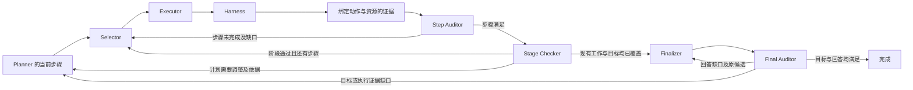

# Controller 与角色的链路契约

状态：2026-09-10，交接架构整改 R1 已提交并实测，REALPROJECT R1 为 Strict 0/12、completed 0/12、mutation 0；首次生成的数值 State 捕获边界仍有偏差。R2 当前完整回归 1341 passed、0 skipped，两道原始失败输入的真实 GPU 与重启验证已通过；工程通过不等于 Agent 或完整交接验收通过。最新证据与各轮 SHA 见 [当前交接](HANDOFF.zh-CN.md)。

Owner 本轮明确：保留当前五角色，先分析链路连接；兼容各种任务依靠统一设计，不依靠题型、路径或后缀穷举。此前的逐角色 StateTune、取消固定三轮上限、重新部署 2.9B 并验证训练后端的授权继续有效；当前先完成本链路工作。

2026-09-11 信息流整改：累计动作和已提交的传递依赖共用责任范围投影，审计原始拒绝输出及具体诊断持久化传递。依赖只提供上下文，不替代当前步骤执行；当前角色输入不得因预算而退化成丢失frontier的通用摘要。协议版本和本地工程证据见[统一协议计划](G1J_UNIFIED_PROTOCOL_ITERATION_PLAN.zh-CN.md)及[整改报告](../data/experiments/ROLE_INFORMATION_FLOW_REPAIR_R1_20260911/REPORT.zh-CN.md)。本轮无新真实Agent成绩。

## 1. 固定职责，修复交接

Selector 选择操作；Executor 填写该操作的参数；Harness 执行；Step Auditor 判断当前步骤是否有充分证据；Finalizer 根据事实作答；Final Auditor 审查最终回答与目标。Planner 和 Stage Checker 保持既有计划与阶段职责。Controller 负责授权、事务、证据引用、预算与执行顺序。

不增减五个训练角色，不引入外置 Head、第二套 Controller、替代模型或按题目编写的恢复流程。下面的投影与校验是现有因果日志上的纯函数，不是另一套拥有完成权限的状态机。RWKV 仍负责工具选择、参数、语义完成与回答判断。

任务状态与模型缓存分开：需求、计划版本、动作、拒绝和审计结果以同一份持久因果日志为准。Selector 的选择绑定已保存的逻辑输入及模型/State 身份，先提交交接，再由 Executor 按原始输入段加载数值缓存。缓存故障不撤销已提交的选择；新的工具选择、独立审计及最终回答不导入上一角色的缓存。已发生动作的结果先记录，再由下一次角色输入投影读取。

Executor v7 同时接收 immutable_goal 与当前步骤；Step Auditor v7 接收原始需求和具体成功条件。新内容可以依据需求创作，现有事实、游标、路径及 RMW 基础版本仍要求准确来源。Selector v7 / Executor v7 的 recent_rejections 从同一步骤 revision 的未消费拒绝记录重建，和审计语义 feedback 分别保留。

工具路径合同由 operation_contracts.py 的参数声明统一导出结构前提和读写副作用。copy 的 source 为工作区内读取；move 的 source 是修改，必须在完整 write_roots 内。Selector 接收各参数的可用性和副作用摘要；Executor 只接收已选工具的参数合同。原始需求、显式范围完整保留，附加发现提示有界且省略时标记不完整；完整描述留在原始交接边界中，生产与 trace 使用同一投影函数。

Native 指直接管理 RWKV 循环 State 的推理传输。服务、worker 和请求身份代码以当前仓库为唯一来源；部署引擎直接导入，删除引擎内重复实现。服务持久记录实际消费的 token，跨 append/import/restart 保留；只有与本地逐段输入重建匹配的 full_context 及真实 BOS 记录才构成训练输入证据。

生成结果的发布规则统一为“已核验父 State＋实际返回 token IDs”。采样的 worker 行可能在前端 stop 判定后继续推进，只作为私有工作区；通过现有精确 token 物化操作建立输出边界后，才导出、持久化并返回候选。角色语义只采样一次，缓存消费 token 数、物化请求数和耗时单独记录。缺失或冲突的 token 证据不得修改计数后接纳；失败不能返回成功候选或重新采样结果未知的请求。Native、Selector 与训练导出共用唯一 State profile loader。

Final Auditor 的 catalog 显式声明 repair_scope。answer 缺口回到 Finalizer；execution 缺口带 accepted audit 和对应条件进入现有 Planner 补丁路径。Controller 不根据 reason 关键词猜测计划错误，也不改写 Final。

## 2. 六项通用契约

### 2.1 任务、权限与成功条件分别表达

每次交接必须绑定同一个 goal、plan revision、step id/revision，以及依赖证据集合。自然语言目标和成功条件原文不可被哈希编号替代；编号只负责引用与去重。

资源访问范围回答“允许操作哪里”；前置条件回答“执行该操作前必须知道什么”；成功条件回答“要证明什么”。三者不能互相推导。例如访问一个目录、读取一个文件、修改一个文件分别证明不同的事实，不能仅因覆盖了 root 就认为业务目标完成。允许写入一个范围，也不应被普遍解释成必须无意义地改动其中的内容。

Planner 的阶段标签帮助组织工作，不负责选择具体工具。缺少某个动作的前置证据时，反馈应说明缺少的资源版本和事实，由模型选择获取方式；只有证据表明现有计划遗漏责任、依赖冲突或目标覆盖不足时，才有计划修复依据。不能从一次调用失败推导计划失效。

### 2.2 工具能力只声明一次

沿用 Harness 的工具注册和实际校验作为能力来源，逐步统一输入资源要求、权限范围、前置条件、产生的证据、副作用和恢复语义。Controller、Selector 菜单、Executor 参数校验和 trace 重建应消费同一份声明，不能分别维护任务特判。

工具名称是注册项，不是任务类型清单。新增工具需要声明其真实能力；新增任务、目录或文件名不应要求增加 Controller 分支。

兼容判定区分 **满足、不满足、未知**。只有已证明违反权限或实际执行前置条件时才排除操作。有限目录投影、未读取的文件内容和推测的后缀不能把“未知”变成“不兼容”。解析一个文件是否为 JSON 应由工具真实解析产生结果；内容诊断是合法观察，不能因为它可能失败就提前屏蔽。

目标列表用于给模型可见信息，不能成为不完整的全局允许列表。目录中加入无关文件、改变枚举顺序或把目标排到展示预算之外，不应让原本合法的操作消失。显式 root 必须完整绑定；发现过程有预算时必须标记未发现范围，不能把未展示资源当作不存在。

### 2.3 证据说明“证明了什么”

证据应绑定产生它的 action、step revision、资源身份/版本、事实类型和完整性。继续沿用真实 Harness 结果及现有 artifact/revision 引用；不同引用必须解析到同一来源动作，不能拿 artifact id 当 action id 比较后丢掉事实。

执行成功、观察覆盖、语义充分性分别记录。目录列表不等于文件内容；摘要不等于完整内容；命令退出码不等于任意文件已被读取；已接收的审计输出不等于独立真值标签。Controller 只验证可机械证明的约束，RWKV 审查成功条件是否满足。

当前责任边界需要的证据不能按最后 8 条、12 条等固定数量静默删除。必要事实须完整可达；允许有明确标记的内容投影，但不能留下证据编号后假装内容也已经提供。超出模型实际上下文时，登记输入预算问题；不能伪装成任务证据不存在或让模型修计划来弥补数据传输缺失。

### 2.4 反馈必须到达负责修复的角色

在既有因果日志上统一投影反馈：来源角色与边界、目标角色、适用的步骤/候选版本、缺口代码与对应条件原文、证据引用、错误详情，以及是否已经被后续动作或修复消费。

同一份事实和反馈投影由生产输入、角色数据抽取、评测调用。Selector 与 Executor 不需要相同长度的输入，但影响工具选择的语义缺口必须让 Selector 看见；影响参数的细节必须让 Executor 看见。不能只在日志中写下 gap，也不能只传一个无法还原语义的摘要编号。

Finalizer 重答时看到被拒绝的候选及其具体缺口；自身格式错误另存 retry_feedback，不能覆盖前一份语义反馈。重建干净 State 不代表可以丢掉业务反馈；反馈应作为当前角色的新输入，不能通过继承另一个角色的 WKV 来补救。

反馈只对绑定的责任边界有效。步骤换版本、候选换版本、对应反馈已消费后，不得因扫描历史失败事件再次触发修复。重复失败计数与反馈是否仍适用必须分别计算。

### 2.5 根据错误归属继续，不能猜测计划失效

| 已有证据表明的情况 | 接收者与后续动作 | 不得产生的隐式效果 |
| --- | --- | --- |
| 参数不符合选定工具的合同 | Executor 在预算内修参数；沿用既有选择绑定 | 不能直接改计划或执行未校验参数 |
| Harness 调用失败，当前步骤仍适用 | 将真实失败交给 Selector / Executor 继续该步骤 | 不能把失败次数当作计划错误证据 |
| Step Auditor 判断步骤未完成 | 将语义缺口交给当前步骤的 Selector / Executor | 不能完成步骤，也不能自动重规划 |
| 某个角色输出格式无效 | 保留当前边界，重试该角色；预算耗尽如实阻塞 | 不能授权重做已成功的 Harness 动作 |
| Stage Checker 有证据要求调整阶段工作 | Planner 产生绑定该审查的最小计划补丁 | 不能仅追加无关工作来消费反馈 |
| 现有批次已执行完，仍有目标责任未覆盖 | Planner 继续补充覆盖缺口的工作 | 不能把计划批次结束当作任务完成 |
| Final Auditor 发现回答表述缺口 | Finalizer 接收原候选和缺口后重答 | 不能无反馈地重复相同输入 |
| Final Auditor 发现目标或执行证据缺口 | 通过既有 Planner 补丁新增必要工作，再执行和审查 | 不能只改回答措辞来弥补缺失的执行 |
| 资源、输入或传输预算耗尽 | 保留事实、角色和边界，记录阻塞/中断 | 不能改成完成，也不能清零历史预算 |

Final 的修复归属应是协议中明确的语义信息，或由审计选择的已声明条件类型确定，不能在 Controller 中猜测自然语言关键词。混合缺口先处理执行证据，再形成新的回答；Controller 不替模型改写 Final。

重试仍使用既有角色调用及实际预算，不额外调用裁判来替代模型能力。最关键的事务不变量是：审计自身失败不撤销真实执行，也不授权复制该副作用。未成功的审计不能提供完成权限。

### 2.6 State 与业务进度各有身份

每次角色请求绑定模型/词表/协议/State 身份及实际输入 token 证据。各角色按既定策略独立 bootstrap，不混合 Selector、Executor、Auditor 的 WKV。反馈、事实与资源版本从因果日志恢复，不能依靠某个进程的临时变量。

恢复后必须回到未完成的同一责任边界：未消费 handoff 恢复同一选择；已执行未审计的动作只继续审计；已接受未提交的审查应幂等提交。不会因为进程切片而重置错误预算、再次消费同一反馈或重新执行已提交动作。

RWKV 更新通过适配层验证层数、宽度、head、rank、词表、上下文、精度和 State 布局。接口不变时不用重写角色契约。确需修正本轮发现的输入语义缺陷时，应统一升级受影响的协议，删除旧入口和字节码、重新冻结新 trace，不保留兼容分叉，也不将旧 trace 伪装成新输入。

## 3. 验证方法：约束与变形，不穷举题型

验证单位是跨模块的不变量。测试可以用小任务承载不变量，但断言必须覆盖实际交接输入、调用归属、绑定和副作用，而不能只给 mock 排好下一条正确输出后检查最终完成。

1. **反馈可达**：改变审计缺口，负责修复的下一角色输入必须随之改变；不相关角色不能继承该角色 State。
2. **同义资源不变性**：相同内容和权限下，改名或扩展名不改变合法诊断操作；真正的类型/权限变化仍受工具校验。
3. **投影不改变权限**：加入无关文件、改变枚举顺序、跨过显示预算，不得排除仍合法的操作。
4. **证据完整性**：增加同一阶段的必要步骤后，相关事实全部可达；引用从 action 改为其 artifact/revision 时事实来源不丢失。
5. **重试归属**：在每个角色边界注入协议错误，验证只重试该责任，已经提交的副作用计数不变。
6. **恢复等价**：连续运行与在选择、执行、审计、反馈消费处中断再恢复，得到相同业务事实和预算账目。
7. **范围隔离**：旧步骤版本、其他步骤或已消费反馈不能污染当前输入；真实反例不能被过度隔离而丢掉必要依赖。
8. **完成真实性**：执行成功不自动完成，计划为空不自动完成，预算耗尽不完成，Final 只能来自模型候选及合法最终审计。
9. **三链一致**：从请求边界恢复出的生产输入，与数据抽取和评测输入逐字节一致；不完整 token/State 证据仍排除。

全部工程契约稳定后，再冻结已授权开发题集进行生产 trace 采集。首轮 Selector 不要求后序角色已通过，不要求 Agent 先高分；但不能在输入连接仍丢失关键信息时，把稳定重复的工程错误误记成纯模型能力不足。

## 4. 落地顺序与边界

先统一事实和反馈的数据来源，再更新当前角色 builder 与 trace 重建；随后接通按责任处理的审计重试、回答修复和证据修复；统一工具能力/资源可达性投影，移除数量裁剪造成的事实缺失。每个根因先建立跨模块失败断言，修复后再跑完整回归。

这是一条当前架构内的整改顺序，不是新增产品架构，也不是按 CLI、Web、HTTP 等任务类别分别开发适配器。中途发生输入合同变化时重新冻结采集，不读取保留题集、不重评分旧 confirmation。

本轮验证覆盖实际输入差异、同一边界重试、恢复、执行补证、阶段证据来源和五角色逐字节 trace 重建。测试中的模型输出是显式 fixture，不能作为生产 trace 或 StateTune 标签；最新 Agent 成绩和未证明的模型能力见 HANDOFF。
