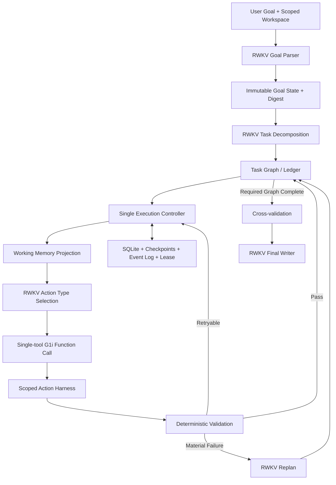
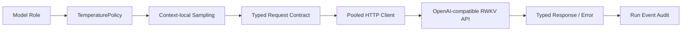

# RWKV-LH 长程 Agent 设计

## 1. 目标与边界

RWKV-LH 解决的是“模型需要在较长时间内完成多个互相依赖的真实动作”这一类问题，而不是一次问答。

系统必须保证：

- 原始目标和硬约束不会在长时间执行中漂移；
- 任务进度不依赖模型上下文记忆；
- 副作用、验证结果、失败和恢复动作可以审计；
- 模型说 `done` 不等于任务完成；
- 中断后从持久状态继续，而不是重新执行全部任务；
- rapid-sampling 参数和请求关联元数据按每个模型请求隔离，而不是进程级固定参数。

仓库不包含网页检索流程、答案 Judge、检索 benchmark 或前端。外部能力通过显式 Harness Action 注入。

## 2. 执行架构



RWKV 负责 Goal Parse、Task Graph、Action Selection、语义交叉验证、失败后的 Replan，以及最终用户输出。

确定性系统负责保存 Goal、校验 DAG、在副作用前创建 Attempt、限制作用域、执行动作、运行 verifier、管理恢复与投影有界工作记忆。确定性系统不得替模型改写最终答案。

## 3. 持久状态

SQLite 是默认状态存储，`StateStore` Protocol 保留替换数据库实现的边界。主要表包括：

- `runs`：当前 RunState、goal digest、状态和 revision；
- `task_index`：任务节点的可查询索引；
- `checkpoints`：关键里程碑快照；
- `events`：模型请求、动作、验证、失败、恢复和状态变更；
- `run_leases`：保证同一个 run 同时只有一个 Controller owner。

写入使用 revision compare-and-swap。旧 revision 不能覆盖新状态。Goal 在创建时计算 digest，恢复和执行前都会检查。大输出保存为 artifact，由相对路径和 SHA256 引用。

## 4. Task Graph 与 Attempt

每个 TaskNode 记录 task id、依赖、GoalCriterion 绑定、动作、完成条件、重试策略、尝试记录、输出引用、错误和 supersede 关系。

状态包括 `pending`、`running`、`completed`、`failed`、`blocked` 和 `superseded`。

每次动作执行都有独立 Attempt。Attempt 在副作用之前持久化，并记录 action fingerprint 与 idempotency key。发生崩溃时：

- 只读动作可以安全重试；
- 幂等动作可以重新执行并验证；
- 无法确认结果的非幂等动作不会自动重复，而是进入 blocked 状态。

## 5. Working Memory

完整历史不进入每次 prompt。`WorkingMemoryBuilder` 只选择不可变 Goal、当前 Task、依赖输出、显式 memory reference、相关 evidence、最近一次材料性失败和 Action Contract。宿主机绝对 workspace root 不进入模型工作记忆；模型只看到逻辑 scope `.`，所有工具路径必须保持 workspace-relative。

RWKV 官方 tokenizer 随包提供，用于真实 token 计数。工作记忆先按 13,600 tokens 上限选择内容，再根据当前请求的 `max_tokens`、16,384 上下文上限、服务端 BOS 和安全余量做最终投影。不可变 Goal 和当前 Task 不会被静默截断；放不下时请求在发送前失败。

## 6. Harness 与扩展能力

核心 Harness 提供文件与 JSON 写入、精确替换、追加、复制、删除、目录创建、文件读取、带行号 evidence binding、`shell=False` 的 argv 命令以及显式 noop。

所有路径必须位于 Goal workspace root。命令使用 argv 数组，不经过 shell。在 Linux/WSL 检测到 bubblewrap 时，命令只看到只读系统和唯一可写 workspace；审计事件记录实际 sandbox backend。无 bubblewrap 的平台会明确记录为 unsandboxed compatibility mode。

第三方能力使用 `ActionHarness.register_action()` 或构造参数 `actions` 注入。每个扩展必须通过 `ActionDefinition` 明确：

```text
read_only
side_effect
idempotent
default_timeout
argument_schema
required_postconditions
```

核心包不会扫描或自动加载检索工具。

动作物化保留两个职责清楚的阶段：RWKV 先从紧凑 catalog 选择一个 action type，再用 `g1i-tool-dialog.v1` 对只包含该动作的 `System: Tools` 生成 `{name, arguments}`。这不是三套相互校验的状态机；第一阶段限制选择空间，第二阶段遵循 G1i 线上函数调用格式。完整工具表一次生成在固定消融中发生工具选择退化，因此不作为默认。

内建 action 的 postcondition 由 Harness 从固定 action arguments 确定性生成；只有自定义 action 缺少内建映射时才请求 RWKV 设计 verifier。`write_file` 作为幂等 action 强制 `overwrite=true`，否则未知结果后的安全重试语义不成立。

## 7. 结构化 OpenAI-compatible RWKV runtime



模块边界：

- `runtime/settings.py`：环境配置、URL、模型、超时、重试、TLS 和 proxy policy；
- `runtime/sampling.py`：ContextVar 隔离的 rapid-sampling 参数、request id、task id 与 lane；
- `runtime/protocol.py`：请求、响应、usage、health 数据结构和错误分类；
- `runtime/openai_compat.py`：线程隔离 Session、连接池、UTF-8 JSON、有限重试和 OpenAI-compatible endpoint。

生成请求只自动重试确定尚未提交的连接超时，以及明确返回的 425/429/500/502/503/504。发送后发生读取超时或连接中断时，副作用结果记为 `unknown`，禁止自动重复生成。协议错误和普通 4xx 不会用重复请求掩盖。

## 8. Request-level temperature

| Request type | 默认 temp | 目的 |
| --- | ---: | --- |
| goal_parse | 0.03 | 稳定保留目标约束 |
| task_decomposition | 0.18 | 允许有限策略空间 |
| tool_action | 0.05 | 稳定结构化动作 |
| validation_cross_check | 0.03 | 保守判断证据 |
| replan | 0.28 起 | 在材料性失败后改变策略 |
| final_answer | 0.05 | 忠实表达已验证结果 |

同一协议输出失败最多做一次同温度格式纠正。只有重复策略失败才提高 replan 温度；出现新证据时重新从基础 replan 温度开始。采样参数通过 ContextVar 进入 HTTP payload，并在请求返回后恢复。

vllm-rwkv 当前强制使用 rapid-sampling。RWKV-LH 只开放源码实际支持且语义明确的 `temperature`、`top_p`、`top_k`、`presence_penalty`、`frequency_penalty`、`penalty_decay`、`min_tokens`、停止字符串和附加 `stop_token_ids`。当前路径不支持显式 `seed`、greedy (`temperature < 1e-5`)、`min_p`、非 1 的 `repetition_penalty`、`ignore_eos` 或 thinking budget；这些能力不会出现在运行入口中，兼容层收到显式 seed 时会本地拒绝。

## 9. Completion 与 Validation

任务完成条件是 required completion criteria 全部通过。Verifier 覆盖文件状态与内容、JSON、命令退出码、哈希、HTTP 字段、evidence binding、memory reference 和 model cross-check。

G1i function call 的 `arguments` 允许模型返回 JSON object，或返回 vLLM/OpenAI 常见的 JSON string；协议层把后者解析为 object，并记录 `model_protocol_normalized` 事件。未知 name、未知顶层字段、额外 action arguments、绝对路径和非对象 arguments 都在副作用前 fail closed。

Run 完成还要求所有 required GoalCriterion 被 active completed tasks 覆盖。最终文字只在这一状态之后调用 RWKV 生成。

## 10. 测试定位

`LH-Control-30` 是 Architecture Regression。它用确定性 fixture 检验状态机、Controller、Verifier、恢复和采样隔离，不能代表 RWKV 自主完成 30 个任务。

真实 RWKV E2E 测试必须满足：

- 仅提供用户目标、初始 workspace 和允许工具；
- 不提供答案、Task Graph、动作序列或 replan 路径；
- 最终由独立、不可见的 acceptance checker 检查 observable result；
- 报告保存模型输入输出、温度、工具调用、重试、replan、恢复和最终验证。
