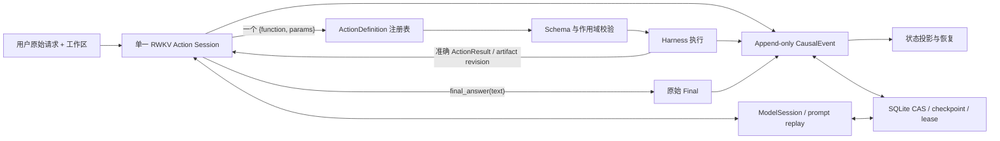

# RWKV-LH：面向 RWKV 的单会话因果 Agent Harness

## 当前完成度

截至 2026 年 8 月 20 日，研究计划 R119–R132 共 14 轮，已正式完成 R119–R129，
即 **11/14 轮**。当前最佳确认架构为 R126：正式运行 Strict `36/90`、FP `30`、
FN `0`；同源码确认运行 Strict `34/90`、FP `31`、FN `0`。预注册终局目标是
Strict `>31`、FP `≤24`、FN `≤1`、`90/90` 有效，并由同配置重复确认。当前仅 FP
未达标，因此项目尚未完成。

R130 正以单并发和逐题 worker 回收运行。本文定稿时已落盘 `30/90`：Strict `14`、
Agent completed `23`、FP `9`、FN `0`、interrupted `7`。这 30 题由 Basic、Medium、
Hard 各 10 题组成，只是运行进度，不是正式分数。R130 还剩 60 题，之后还有 R131
和 R132 两个计划轮次。此前并发 10、并发 2 的运行因传输超时或 WSL 内存压力作废，
不进入质量比较；当前运行内存已由逐题回收稳定在较低水平。

| 项目 | 状态 |
| --- | --- |
| Harness 主架构 | 已实现 |
| 工具完整性与 fail-closed 执行 | 已实现并验证 |
| CausalEvent 权威状态与恢复 | 已实现并通过离线回归 |
| 固定 E2E-90 全量验证 | 已完成多轮 |
| 当前最佳完整结果 | R126：Strict 36、FP 30、FN 0 |
| 终局指标 | 未达到，主要差距为 FP `30→≤24` |
| 剩余实验 | R130 剩余 60 题、R131、R132 |

## 摘要

RWKV 具有线性递归计算和持续状态建模潜力，但通用 Agent Harness 常按 Transformer
模型设计：它们依赖多阶段规划、工具选择器、reviewer、重建上下文和多套状态机。这些
结构会让基础 RWKV 在真正执行任务前反复完成元判断，并可能丢失模型原本正确的动作。
本文设计并实现 RWKV-LH，一套面向 RWKV 的单会话因果 Agent Harness。系统将用户请求、
工具调用、真实 Observation 和最终回答保持在同一 RWKV Action session 中；模型每回合
只生成一个已注册工具调用或 `final_answer`。Harness 负责 schema 校验、安全执行、事件
持久化和崩溃恢复，但不替模型选择工具、补语义参数、判断业务答案或改写最终输出。

本文复核了项目中 2249 个实验文件，并重点比较固定 RWKV-E2E-90 上的完整运行。早期复杂
proof 架构在 R4–R23 的 Strict 均为 0；两阶段工具选择使 R46 的 Strict `31/90` 降至
R50 的 `6/90`；同模型 reviewer 在 R53 净损失 8 个 Strict。随后，原子因果 Task、单
RWKV Action spine、append-only CausalEvent 和固定状态邻接逐步恢复能力。R126 仅调整
bootstrap 字段顺序，将不可变请求放到闭合 JSON 的最后，Strict 从 R119 的 `30/90`
提升到 `36/90`，FP 从 36 降到 30，FN 保持 0。该结果说明，对 RWKV 而言，Harness 的
关键不是增加推理角色，而是减少语义边界，并控制事实、动作和续写点的因果邻接。当前
结果仍未达到 FP `≤24`，因此本文报告的是已验证架构和阶段性上限，而不是完成声明。

**关键词：** RWKV；Agent Harness；工具调用；因果状态；长程任务；提示邻接；实验消融

## Abstract

General-purpose agent harnesses are commonly designed around Transformer-style multi-stage
planning, tool selectors, reviewers, reconstructed contexts, and multiple mutable state machines.
For a base RWKV model, these layers introduce extra semantic decisions before useful work can be
performed and often discard otherwise valid actions. We present RWKV-LH, a single-session causal
agent harness specialized for RWKV. The user request, direct tool calls, exact observations, and
final answer remain in one RWKV action session. At each turn, the model emits exactly one registered
operation or `final_answer`. The harness validates schemas, executes actions, persists causal facts,
and recovers from crashes, while never selecting tools, inventing semantic parameters, judging task
correctness, or rewriting the final answer.

Across a fixed 90-case benchmark and a long sequence of preregistered ablations, proof-heavy,
reviewer-based, selector-based, and context-rebuilding designs consistently degraded performance.
The best confirmed configuration, R126, achieved 36/90 strict passes with 30 false positives and
zero false negatives, compared with 30/90, 36, and zero for its R119 baseline. The only change was
placing the immutable request last inside a closed bootstrap JSON object. The findings suggest that
RWKV-oriented harness design should minimize semantic boundaries, preserve append-only causal
history, and place authoritative state next to the continuation point. The terminal false-positive
target has not yet been met; the paper therefore reports a validated intermediate architecture and
its measured limitations.

## 1. 引言

Agent Harness 连接语言模型、工具、工作区和持久化状态。它决定模型看到什么、每次需要
输出什么、错误如何反馈、动作何时执行，以及进程中断后如何恢复。对基础 RWKV，这些边界
不是中性的。一个在自然语言中已经正确的动作，可能在 selector、参数阶段、reviewer 或
completion gate 中被丢失；一个真实 Observation 也可能被重复模板和重建状态淹没。

本研究的目标是：**为 RWKV 设计、实现并验证一套专用 Agent Harness，使模型的正确决定
能够直接执行，错误决定不会被系统放大，并且全部业务事实可审计、可恢复。**

本文回答四个问题：

1. RWKV Agent 的在线控制链应包含多少个语义决策边界？
2. 工具、Observation 和长期状态应如何表示，才能避免接口漂移和状态冲突？
3. RWKV 的续写特性如何影响 bootstrap、历史追加和请求位置？
4. Harness 能改善哪些失败，又有哪些业务错误仍属于模型能力边界？

主要贡献如下：

- 提出单会话、单动作、直接注册工具的 RWKV Agent 控制链。
- 用 append-only CausalEvent 统一动作、产物、失败、恢复和 Final 的业务事实。
- 建立 fail-closed 工具完整性边界，非法调用在副作用前被拒，并返回已选工具的准确 schema。
- 通过 R1–R129 的历史架构与固定 E2E-90 实验，给出正向设计证据和可复用的负向结论。
- 明确区分 Agent completed 与 External acceptance，避免把“模型宣称完成”当作任务正确。

## 2. 背景与设计动机

### 2.1 RWKV 的 Harness 需求

RWKV 以递归状态承载历史信息，但当前实验后端只提供 OpenAI 兼容文本接口。项目中的
`ModelSession` 因此使用 `prompt_replay`：系统追加并重放可审计 transcript，而不是直接
保存或恢复原生 recurrent tensor state。本文不把 prompt cache、checkpoint 或重放历史
称为原生 RWKV 状态。

尽管如此，RWKV 的续写行为仍直接影响 Harness：

- 最近、闭合、格式一致的状态更容易成为下一步生成依据。
- 重复注入同一请求会形成同质尾部，诱发回显和完成崩溃。
- 每回合重建近似相同的 working set，在低温采样下容易形成确定性不动点。
- 多阶段调用要求模型多次重述同一个决定，增加信息损失。

因此，本研究不把 Harness 视为模型外部的普通工作流，而把它视为 RWKV 续写状态的组成
部分。

### 2.2 Harness 与业务能力的边界

Harness 可以保证：

- 展示的工具与可执行工具一致；
- 非法调用不会执行；
- 参数、动作结果和产物版本不被静默改写；
- 进程中断后能够从已提交事实恢复；
- 最终回答保持模型原文。

Harness 不能保证：

- 模型选择了业务上正确的工具；
- 模型写入的内容满足自然语言目标；
- 模型对列表、代码、算术或结构转换的理解正确；
- 一个自产结果的读回可以证明业务正确。

该边界决定了本文不引入 Controller 业务修正，也不使用隐藏 acceptance 反馈模型。

## 3. 研究方法

### 3.1 数据集

主数据集是冻结的 RWKV-E2E-90 v1，共 90 题：Basic 30、Medium 30、Hard 30。
Hard 内进一步标记一般 Hard 18 和 Long-Horizon 12。任务覆盖文件读写、JSON/CSV、代码
修复、命令执行、多文件集合和长程依赖。隐藏 observable 和参考答案不进入模型输入。

原有 42 题的 acceptance 在本研究阶段前已经存在，因此不能宣称这部分严格盲测；新增
48 题在任何 RWKV 运行前冻结。所有正式比较固定 catalog 与摘要，不在运行后改题或改
验收口径。

### 3.2 模型与运行参数

主要完整实验固定如下：

| 项目 | 配置 |
| --- | --- |
| 模型 | `rwkv7-g1i-13.3b-20260805-ctx16384` |
| 上下文 | 16384 |
| transport | `prompt_replay` |
| temperature | 0.05 |
| top-p / top-k | 1.0 / 0 |
| presence / frequency penalty | 0 / 0 |
| 最大 transition | 200 |
| 正式并发 | 1 |
| 协议拒绝预算 | 12 |

R130 进一步使用逐题进程回收，并通过 systemd 限制 CPU 和内存，以防 WSL 资源压力影响
运行完整性。基础设施崩溃产生的部分结果会单独标记 INVALID，不与有效模型结果混合。

### 3.3 指标

设 External acceptance 为外部可观察结果是否正确，Agent completed 为模型是否提交有效
终局：

| 类别 | Agent completed | External accepted |
| --- | --- | --- |
| TP / Strict | 是 | 是 |
| FP | 是 | 否 |
| FN | 否 | 是 |
| OTHER | 否 | 否 |

Strict 是主指标。FP 衡量模型错误完成，FN 衡量 Harness 阻止了已经正确的工作区。产物
比较另使用预注册的 `utf8-byte-ngram-cosine.v1`，`n=5`；相似度是辅助指标，不替代
External 和 Strict。

### 3.4 实验纪律

每个架构轮次遵循以下流程：

1. 预注册变量、数据、参数、阈值和停止规则。
2. 冻结源码 manifest，并检查运行前摘要。
3. 小型 canary 只用于确认链路，不用于宣布整体提升。
4. 候选必须在完整 90 题上比较 TP、FP、FN、分组和逐题转移。
5. 对提升做同源码确认运行，不选择多个样本中的最好结果。
6. 结合 flip matrix 和首次偏离做因果归因，不只比较聚合分数。
7. 运行完成后不修改评价口径。

项目历史审计覆盖 `data/experiments/` 中 2249 个文件，包括 329 份报告、311 份结果、
168 份运行协议、164 份源码 manifest、68 份人工因果分析和 111 份 Round 级预注册协议。

## 4. 历史架构纵向研究

历史变化不是线性加功能，而是多次增加复杂度、失败、再收缩。主线可概括为：

```text
Task Graph / Proof / Memory
→ Reviewer / 多阶段控制
→ G1i 直接工具协议
→ Task / Goal 状态重构
→ 原子因果 Task
→ 单 RWKV Action Session
→ CausalEvent 权威状态
→ 固定状态邻接
```

### 4.1 Task Graph、Proof 与 Memory

R1–R3 使用宽 Task 外壳、Goal coverage 和多种状态对象。R4–R23 又加入 criterion proof、
assertion、witness、obligation 和 provenance。External 一度达到 24，但所有这些轮次的
Strict 均为 0，通常没有 Agent completed。模型有时已经做对工作区，proof 系统却不允许
结束。该阶段证明：更多证明对象不等于更可靠的完成。

R27–R46 逐步缩小协议。R46 使用局部 Task、一次完整 Action、真实 Observation 和
decision-last commit，达到当时最佳 Strict `31/90`、FP `24`、FN `1`。其 Basic 为
`24/30`，Medium `5/30`，Hard `2/30`。收益来自缩小在线边界，而不是扩大证明系统。

### 4.2 Reviewer 与多阶段控制

R50 把工具名和参数拆成两次模型调用，Strict 从 31 降到 6。R51 只增加透明的
`tool_name→name` 别名便恢复到 17，但仍显著低于 R46。R53 让同一个 RWKV 在动作前
review 自己的候选，Strict 为 23：相对 R46 只减少 4 个 FP，却损失 8 个 Strict。

这组对照说明，同模型 reviewer 没有新增事实，只新增必须正确通过的语义边界。两阶段
selector 也会迫使模型重新表达已经完整存在的动作。

### 4.3 G1i 直接工具协议与状态重构

R78–R85 统一 `{function, params}` 接口、ModelSession 和 workset，但 selector、Task
contract 和完成链仍未统一。R80-r2 与 R81 两次完整 90 均为 Strict 0、External 10；
R85 去掉一部分间接层后仍为 Strict 0、External 7。接口统一是必要条件，但不能弥补双重
推进器和互相冲突的状态机。

R86–R115 围绕少量 canary 修复 Task、Goal、recovery 和 evidence contract。R100 在四题
达到 `4/4`，相邻完整运行 R101 却只有 `12/90`。这证明局部路径通过不能替代完整分布验证。

### 4.4 原子因果 Task 到单 Action Session

R116 把 Task 缩为原子因果推进，Basic30 Strict `8/30`。R117 进一步建立单 RWKV
Action spine，Strict 提升到 `20/30`；R118 以 CausalEvent 作为权威事实源，Basic30
达到 `21/30`、Agent completed `30/30`、FN 0。

随后系统删除在线 Goal/criterion 解析、Task DAG、selector、reviewer 和 completion gate，
让用户原始请求直接进入一个持续 Action session。R119 在完整 90 题上达到 Strict 30、
FP 36、FN 0，建立当前架构族基线。

### 4.5 固定状态邻接

R120–R129 研究状态组织和续写几何。主要结果如下：

| 轮次 | 单一变量 | Strict | FP | FN | 结论 |
| --- | --- | ---: | ---: | ---: | --- |
| R119 | append-only 单会话基线 | 30 | 36 | 0 | KEEP |
| R120 | step/progress scaffold | 22 | — | — | 回显形成重复吸引子 |
| R121/122 | 重复 guard | 约 27 | — | — | 降 token，不提升质量 |
| R123 | 每回合重建 working set | 0/29 | — | — | 确定性不动点，终止 |
| R124 | stuck 后升温 | 27 | 42 | 0 | 循环转成 FP，没有转成 TP |
| R125 | 每回合重复注入请求 | 12 | 4 | 19 | 完成崩溃 |
| **R126** | **闭合 JSON 内 request-last** | **36** | **30** | **0** | **KEEP** |
| R127 | 请求移到 JSON 外尾部 | 30 | 25 | 4 | 开放尾部导致不结束 |
| R128 | 可选 `reduce_json` | 31 | 35 | 0 | 2/90 采用，0 个目标改善 |
| R129 | 拆分同质 bootstrap 块 | 28 | 31 | 0 | 0 个目标修复，REVERT |

R126 与 R119 内容和 token 数相同，只关闭 `sort_keys`，并把 `immutable_request` 放到
bootstrap 闭合 JSON 的最后。结果出现 FP→TP 5 题、OTHER→TP 2 题、TP→FP 1 题，
Strict 净增 6。其确认运行 Strict 34、FP 31、FN 0，说明提升方向成立，但单次运行仍有
约 ±3 的波动。

R127 进一步把请求移到 JSON 外，虽然更接近续写点，却破坏了闭合结构，产生 completion
collapse。R129 把同质列表拆到独立块，改变了 bootstrap 几何，Strict 降至 28。由此得到
固定状态邻接原则：**权威请求应接近续写点，但必须位于稳定、闭合、低歧义的结构中；状态
位置和结构不可分开优化。**

## 5. 从历史证据提炼的设计要求

| 要求 | 正向证据 | 反向证据 |
| --- | --- | --- |
| 每回合一次直接动作 | R46、R117–R126 | R50 两阶段调用崩溃 |
| 单一 RWKV 语义会话 | R117–R126 | 多 lane / selector 的 R80–R85 |
| append-only 历史 | R119–R126 | R123 重建上下文形成不动点 |
| 请求只在 bootstrap 出现 | R126 | R125 重复注入导致 FN 19 |
| 请求在闭合结构中置末 | R126 | R127 开放尾部不结束 |
| 工具定义与 handler 单一权威 | R118 以后 | 历史 selector/schema 漂移 |
| 错误调用 fail-closed | R118–R128 工具审计 | 猜参数会隐藏模型错误 |
| 一个业务事实源 | R118 以后 | Action ledger 与 Observation 分裂 |
| Controller 不做业务判断 | 全部有效基线 | reviewer/gate 同时制造 FP 与 FN |

同时得到六项稳定负向结论：

1. 同模型 reviewer 不应放在动作前后重复裁决。
2. 工具名与参数不应拆成两次语义生成。
3. working set 不应在每回合重建并替代追加历史。
4. step scaffold 和重复模板会成为模型回显目标。
5. 提高温度不能修复业务语义循环。
6. 模型可选的额外 reduce 工具采用率过低，不能承担核心状态压缩。

## 6. RWKV-LH 架构

### 6.1 总体结构



在线控制链只有：

```text
immutable request
→ one RWKV Action session
→ one registered operation or final_answer
→ exact Observation
→ the same RWKV Action session
```

模型决定 operation、全部显式参数、是否继续和 Final 文本。Runtime 只负责接口、安全、
执行、事件和恢复。

### 6.2 单一工具权威

一个 `ActionDefinition` 同时生成模型可见 schema、参数校验和 handler 绑定。系统不维护
独立 selector 工具，也不使用 `operation_args` 间接信封。模型看到的工具集合与可执行集合
一致，从源头避免描述、校验器和 handler 漂移。

### 6.3 工具完整性边界

一次候选调用依次通过五道闸：

1. **呈现：** 每回合显示注册表生成的准确工具定义。
2. **解析：** 只接受一个 JSON 调用；仅归一化透明外壳和 Markdown fence。
3. **成员：** 工具名必须在本回合展示集合中。
4. **注册：** 定义和 handler 必须一一对应。
5. **参数：** 必填、未知字段、类型和工作区路径全部按 schema 校验。

失败候选先 rollback，不进入 committed transcript，也不触达副作用 handler。若模型已经
明确选择一个注册工具，但参数错误，系统返回错误文本和该工具的准确 schema，让同一会话
重试。Controller 不猜缺失字段，也不替换工具。

R128 前 65 题共出现 154 次非法或错 schema 调用，42/65 题至少被拒一次，其中 29 题最终
完成；8 题耗尽 12 次预算。非法或虚构工具实际执行次数为 0，原始生成拒绝率约 11%。这
说明工具错误是常见模型行为，完整性来自确定性执行边界，而不是假设模型永不犯错。

### 6.4 CausalEvent 权威事实

每个持久化业务事实只追加一个 CausalEvent：

```text
schema_version / event_id / run_id / sequence / parent_id / cause_id /
subject_id / event_type / payload_schema / payload / digest / created_at
```

`parent_id` 表示全局追加顺序，`cause_id` 指向直接原因，`subject_id` 聚合同一 request、
action、artifact 或 session。Action 使用 `action_started` 和 `action_finished` 两个事件；
模型决定、协议拒绝、产物 revision、rollover 和 Final 进入同一事件链。

`RunState.actions`、artifact heads、failure budget、active action、Final 和 UI 步骤都是事件
fold 的可丢弃投影。保存和加载时重新 fold，并校验事件 digest、关系和 projection digest，
避免旧对象引用或部分写入成为第二套真相。

### 6.5 副作用与恢复

Harness 在动作执行前持久化 `action_started`：

- 幂等动作在 started 后崩溃，可按同一 action id 和参数恢复。
- 非幂等动作不会自动重放，而是记录 interrupted finish，向模型暴露“副作用未知”。
- failure budget 从稳定 causal key 投影，不能通过新 Task ID 或 replacement 重置。
- artifact revision 只记录事实，不判断内容是否满足用户目标。

SQLite 使用 revision compare-and-swap、checkpoint 和 lease 协调恢复。ModelSession transcript
是 transport cache，不拥有业务完成语义。

### 6.6 Final 边界

正常完成必须由同一 RWKV session 调用 `final_answer(text)`。Runtime 校验终局结构，但不
改写 `text`。达到 transition、协议或传输预算时，系统仍请求一个 terminal Final；若模型
不能遵守结构，则保留最后原始输出并标记失败。Final 非空、动作成功和 External acceptance
是三个不同事实。

## 7. 系统实现

当前实现按职责分为六层：

| 模块 | 职责 |
| --- | --- |
| `rwkv_lh/model_io.py` | direct-call wire grammar 与透明外壳归一化 |
| `rwkv_lh/model_session.py` | transcript、checkpoint、commit/rollback、rollover |
| `rwkv_lh/model.py` | 单 Action lane、工具呈现、schema rejection feedback |
| `rwkv_lh/harness.py` | ActionDefinition 注册表、sandbox、执行与 ActionResult |
| `rwkv_lh/controller.py` | Action→Observation→Final 循环和中断恢复 |
| `rwkv_lh/schema.py`、`store.py` | CausalEvent、投影、digest 与 SQLite 事务 |

模块边界遵循两个原则：每个模块只承担自己的职责；任何业务事实只在 CausalEvent 中拥有
一个权威表示。Web UI 复用同一 Controller，不建立第二条执行路径。

安全边界包括工作区相对路径、参数 schema、`shell=False`、受控命令环境和副作用前持久化。
这些机制用于限制执行范围，不参与自然语言答案判断。

## 8. 实验结果

### 8.1 关键完整运行

| 轮次 | Strict | External | Agent | FP | FN | 主要结论 |
| --- | ---: | ---: | ---: | ---: | ---: | --- |
| R1 | 5 | 7 | 11 | — | — | 初始复杂协议 |
| R2 | 7 | 8 | 19 | — | — | 格式改善，但仍受宽协议限制 |
| R4–R23 | 0 | 最高 24 | 通常 0 | — | — | proof 系统阻止完成 |
| R46 | 31 | 32 | 55 | 24 | 1 | phase-local 历史基线 |
| R50 | 6 | 11 | 14 | 8 | 5 | 两阶段调用崩溃 |
| R51 | 17 | 22 | 39 | 22 | 5 | 透明别名恢复部分能力 |
| R52 | 3 | 3 | 17 | 14 | 0 | 强制 frontier 退化 |
| R53 | 23 | 24 | 43 | 20 | 1 | reviewer 净损失 8 Strict |
| R80-r2 | 0 | 10 | 1 | 1 | 10 | lane + selector 失败 |
| R81 | 0 | 10 | 0 | 0 | 10 | 同源码重跑确认 |
| R85 | 0 | 7 | 0 | 0 | 7 | direct Task 仍未接通 |
| R101 | 12 | 21 | 32 | 20 | 9 | 复杂恢复链退化 |
| R119 | 30 | 30 | 66 | 36 | 0 | 当前单会话 full90 基线 |
| **R126** | **36** | **36** | **66** | **30** | **0** | request-last，新最佳 |
| R128 | 31 | 31 | 66 | 35 | 0 | reduce 低采用，REVERT |
| R129 | 28 | 28 | 59 | 31 | 0 | 拆分同质块，REVERT |

R46 与 R126 代表不同取舍。R46 的 FP 24 达到终局上限，但 Strict 只有 31，未满足
`>31`；R126 Strict 多 5，FN 少 1，但 FP 多 6。因此 R126 是 Strict/FN 最佳，不支配
R46，也不能被描述为终局成功。

### 8.2 R126 分组结果

| 分组 | Strict |
| --- | ---: |
| Basic | 23/30 |
| Medium | 10/30 |
| Hard | 2/18 |
| Long-Horizon | 1/12 |
| 合计 | 36/90 |

R126 相对 R119 的主要变化为 FP→TP 5、OTHER→TP 2、TP→FP 1。byte precision 保持
`5/5`。提升主要来自信息位置，不是额外 token、模型调用或业务规则。

### 8.3 当前剩余误差

R126 的 30 个 FP 已成为主要障碍。人工因果分析显示：

- 约一半是单次读取后的内容或结构回显，缺少可供融合的多路证据。
- 一部分是多次读取后的结构回显或字段合并错误。
- 另一些是数据逻辑、输出 envelope 或自然语言契约理解错误。
- 自产文件再读回只能证明写入事实，不能证明业务正确。

R128 的可选 `reduce_json` 仅被 2/90 题采用，0 题产生目标改善；R129 的结构拆分也没有
修复四个目标 case，并使 Strict 降 8。这说明剩余 FP 不能通过简单增加工具或重排更多块
解决。

## 9. 消融结论

### 9.1 有效变量

- **局部因果边界：** Task-local 验证和一次完整 Action 能保留更多正确决定。
- **直接调用：** 同一输出包含工具名和完整参数，避免跨阶段丢失。
- **真实 Observation：** 执行结果先成为事实，模型再决定下一步。
- **单会话追加：** append transcript 保持因果连续，避免重建固定点。
- **request-last 闭合结构：** 在零 token 增量下改善续写邻接。
- **统一事件权威：** 状态投影可以重建，不与业务事实竞争。

### 9.2 无效或有害变量

- proof、witness、obligation 和多角色 judge；
- 两阶段 selector 和参数生成；
- 同模型 pre-action reviewer；
- 每回合重建 working set；
- step/progress scaffold；
- 卡住后提高温度；
- 每回合重复注入原始请求；
- 模型自选的额外 reduce；
- 将同质信息拆成多个竞争续写块。

负结果是最终设计的一部分。它们限制后续搜索空间，防止系统重新引入已经证伪的结构。

## 10. 讨论

### 10.1 为什么更少的 Harness 语义更有效

弱模型的主要成本不只是生成 token，而是必须连续通过多少个语义边界。若一次正确动作要
先通过 Task 规划、selector、参数生成、reviewer、proof 和 completion gate，则每一层都可能
把正确决定转成 FN 或 OTHER。单会话架构把这些边界压缩为“选择一个具体动作”和“观察后
继续或结束”。确定性代码只保护接口和事实，不参与业务推理。

### 10.2 状态位置是架构变量

R126 表明，同样的字节和 token，仅改变 JSON 键序就能带来 6 个 Strict 的提升。对 RWKV，
状态不是放入 prompt 就等价；位置、闭合性、同质块数量和续写点共同决定实际可用性。因此
未来实验需要冻结 prompt 的字节布局，而不能只记录逻辑字段集合。

### 10.3 安全性与正确率必须分开

fail-closed 工具边界可以做到虚构工具执行次数为 0，但不能保证模型选择正确工具。减少 FP
也不能以大量增加 FN 为代价。R53 和 R125 都表明，阻止更多完成不等于提高 Agent 质量。
评价必须同时报告 TP、FP、FN、OTHER 和逐题转移。

### 10.4 对其他 Agent Harness 的启示

本文结论首先适用于基础 RWKV 和当前 G1i 模型，不直接宣称适用于所有模型。但三个原则具有
通用价值：注册表应是工具定义与执行的单一权威；业务事实应 append-only；Controller 的
确定性保证应与模型的业务判断分离。

## 11. 局限性

1. 当前 transport 是 `prompt_replay`，尚未验证原生 RWKV recurrent state 的创建、恢复、
   fork、commit 和 rollback。
2. 主要结论来自一个 13.3B G1i 模型，尚未完成跨模型规模和跨 checkpoint 验证。
3. RWKV-E2E-90 规模有限，原有 42 题不是严格盲测。
4. 单次完整运行存在约 ±3 Strict 波动，需要重复运行和逐题因果分析。
5. Hard 与 Long-Horizon 通过率仍低，集合推理和复杂业务逻辑未解决。
6. 当前最佳 R126 的 FP 为 30，终局 FP `≤24` 尚未达到。
7. R130–R132 未全部结束，本文不能给出终局组合架构结论。

## 12. 相关工作

RWKV 将递归计算与语言建模结合，为低复杂度长序列处理提供基础。ReAct 将推理与行动交错，
Toolformer 研究语言模型使用外部工具，SWE-agent 强调 Agent-Computer Interface 对软件任务的
影响。这些工作说明工具接口和交互循环是模型能力的一部分。

RWKV-LH 的重点不同：本文不提出新的模型训练方法，也不通过更强模型充当 planner 或 judge，
而是研究基础 RWKV 在固定模型、固定数据和固定采样下，Harness 的状态边界、工具协议和续写
几何如何改变端到端结果。

## 13. 结论

本文提出并验证了面向 RWKV 的单会话因果 Agent Harness。历史实验表明，proof、selector、
reviewer、重建上下文和重复请求会显著损失正确决定；直接工具调用、真实 Observation、
append-only CausalEvent 和闭合 request-last 邻接更适合当前 RWKV。

R126 在固定 E2E-90 上达到 Strict 36、FP 30、FN 0，并在同源码确认运行中达到 Strict 34、
FP 31、FN 0。该结果超过历史 Strict，但尚未满足 FP `≤24` 的终局门槛。当前最可靠的结论
不是“Agent 已解决”，而是：**RWKV Harness 应减少模型必须通过的元决策，让模型直接行动；
系统只对接口、事实、执行和恢复负责。**

剩余工作是完成 R130–R132，确认剩余状态组织变量和终局组合能否降低目标 FP；随后验证
原生 recurrent state 接口，并扩展到更多 RWKV checkpoint 和更大盲测集。

## 参考文献

1. Bo Peng et al. *RWKV: Reinventing RNNs for the Transformer Era*. 2023.
2. Shunyu Yao et al. *ReAct: Synergizing Reasoning and Acting in Language Models*. 2023.
3. Timo Schick et al. *Toolformer: Language Models Can Teach Themselves to Use Tools*. 2023.
4. John Yang et al. *SWE-agent: Agent-Computer Interfaces Enable Automated Software Engineering*.
   2024.

## 附录 A：主要实验材料

以下材料位于项目实验目录，是本文数字和因果结论的主要依据：

- `data/experiments/FULL_HISTORY_AUDIT_AND_V15_DECISION_20260815.md`
- `data/experiments/HISTORICAL_ARCHITECTURE_TRAJECTORY_AND_NEXT_STEP_20260815.md`
- `data/experiments/R119_R128_TEN_ROUND_HONEST_NEGATIVE_RESULT.md`
- `data/experiments/Round126_v19p1_full90/REPORT.md`
- `data/experiments/Round128_v19p3_full90/REPORT.md`
- `data/experiments/Round129_v19p2_full90/REPORT.md`
- `data/experiments/Round130_ORDER_SHUFFLED_SELF_CONSISTENCY_PROTOCOL.md`
- `data/experiments/Round132_TERMINAL_COMBINATION_RECORD_ATTEMPT_PROTOCOL.md`
- `data/datasets/rwkv_e2e_90_v1/README.md`

## 附录 B：终局判定规则

架构只有同时满足以下条件，才可标记为研究目标完成：

1. 冻结源码下 Strict `>31/90`、FP `≤24`、FN `≤1`。
2. `90/90` 结果有效，运行结束后没有残留 running case。
3. 完全相同源码、数据和参数的确认运行再次达到门槛。
4. 全量数据、同类场景、边界、异常和历史回归通过。
5. 因果分析证明提升来自预注册变量，而不是基础设施中断或评价口径变化。
6. 实验协议、manifest、原始结果和人工分析完整保存在 `data/experiments/`。
