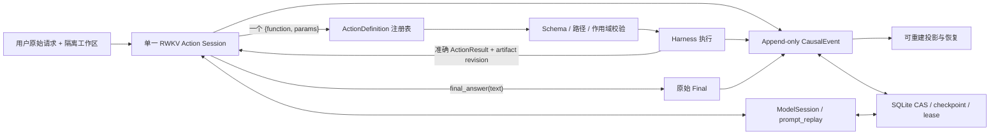

# RWKV-LH 研究与复现指南

> 这不是一篇只汇报最好分数的论文，而是一份 Research Notes + Engineering Guide +
> Reproduction Manual。目标是解释为什么这样设计、哪些路线已经失败、当前系统如何工作，
> 以及后来者如何复现而不重复踩坑。

## 当前状态

截至 2026 年 8 月 20 日，R119–R132 共 14 个计划轮次，已正式完成 R119–R129，
即 **11/14 轮**。当前最佳确认架构是 R126：正式运行 Strict `36/90`、FP `30`、
FN `0`；同源码确认运行 Strict `34/90`、FP `31`、FN `0`。

终局门槛为 Strict `>31`、FP `≤24`、FN `≤1`、`90/90` 有效，并由同配置重复确认。
当前只有 FP 未达标，所以项目仍是实验候选，不是已解决系统。

R130 正以单并发、逐题 worker 回收运行。进度快照（2026-08-20 16:41 CST）为
`40/90`，还剩 50 题；当前切片 Strict `14`、FP `12`、FN `0`、OTHER `14`。
这些数字只用于说明工程进度，运行结束前不进入架构排名。R130 完成后还有 R131 和 R132。

## 先看路线图

如果只想理解项目，请按以下顺序阅读：

1. **核心结论**：先理解我们最后保留了什么。
2. **研究路线图**：看架构如何从复杂系统收缩到单会话。
3. **最终架构**：看每个设计选择及其证据。
4. **What did not work**：直接查看失败目录，不要重复实验。
5. **工程心得**：了解这些实验真正改变了哪些判断。
6. **Benchmark**：理解分数到底测了什么。
7. **复现手册**：按固定步骤运行和判分。

实验历史不应被读成“R1 到 R132 的更新日志”。更有用的路径是：

```text
复杂 Task / Proof / Memory
        ↓ 失败：元判断阻止真实工作
局部 Task + 直接 Action
        ↓ 成功：R46 = 31 Strict
多阶段 selector / reviewer / 多角色状态
        ↓ 失败：正确动作在接口间丢失
原子因果 Task + 单 RWKV Action spine
        ↓ 成功：Basic30 由 8 提升到 20/21
单 RWKV Action Session + CausalEvent
        ↓ 成功：R119 = 30 Strict，FN = 0
固定状态邻接 + request-last
        ↓ 成功：R126 = 36 Strict，FP 下降 6
剩余问题：业务错误和结构回显导致 FP 仍为 30
```

## 核心结论

RWKV-LH 的工程结论可以压缩为一句话：

> **让 RWKV 直接行动；Harness 只保证接口、事实、执行和恢复，不代替模型推理。**

当前保留的设计只有七项：

1. 一个持续的 RWKV Action session。
2. 每回合一个直接工具调用或 `final_answer`。
3. 工具 schema、校验和 handler 来自同一个注册表。
4. 非法调用 fail-closed，并把已选工具的准确 schema 返回模型。
5. Observation 只追加，不重建一份新的“当前真相”。
6. CausalEvent 是唯一业务事实源，其他状态都是可重建投影。
7. 原始请求只在 bootstrap 出现一次，并放在闭合 JSON 的最后。

这套 Harness 能防止接口漂移、虚构工具执行、状态分叉和错误恢复，但不能修复模型的业务
逻辑错误。Agent completed 与 External acceptance 必须分开报告。

## 研究路线图

### 阶段 A：复杂控制没有带来可靠完成

R1–R23 使用 Task Graph、Goal coverage、proof、witness、obligation、provenance 和多种
memory 对象。R4–R23 的 Strict 全部为 0，External 一度达到 24。模型有时已经把工作区
做对，但 proof 和 completion 系统不允许结束。

**结论：** 系统不能把“模型再通过一层自我证明”当作可靠性来源。

### 阶段 B：局部 Task 和直接 Action 首次形成有效基线

R27–R46 逐步删除宽 Task schema 和多余证明边界。R46 使用局部 Task、一次完整 Action、
真实 Observation 和 decision-last commit，达到 Strict `31/90`、FP `24`、FN `1`。

**结论：** 收益来自缩小因果边界，而不是增加一个更聪明的控制器。

### 阶段 C：多阶段和多角色再次造成退化

R50 将工具名和参数拆成两次调用，Strict 从 31 降到 6。R53 增加同模型 reviewer，
Strict 为 23；它只减少 4 个 FP，却损失 8 个 Strict。R54–R77 继续增加 atomic judge、
evidence role、review pipeline 和 recovery 分支，小样本长期低于 R46。

**结论：** 同一个弱模型重复判断同一件事，不是交叉验证，而是重复制造失败机会。

### 阶段 D：统一接口仍不足以解决双重状态机

R78–R101 统一 G1i 调用、ModelSession、workset 和 rollover，但 Task DAG 与 Task 内循环
仍同时推进。R100 的四题 canary 达到 `4/4`，完整 R101 却只有 `12/90`。

R46 到 R101 期间，总输入 token 从 `3.50M` 增至 `13.03M`，平均每请求约从 2160 增至
6013；Strict 同时从 31 降至 12。不能把全部退化只归因于“上下文太长”，但可以确认复杂
状态、重复恢复和更长提示共同放大了 instruction drift。

**结论：** 小 canary 只能证明局部路径接通；更长上下文也不能替代清晰状态边界。

### 阶段 E：原子因果脊柱恢复基本能力

R116 将 Task 缩为原子因果推进，Basic30 Strict `8/30`。R117 改为单 RWKV Action
spine 后提升到 `20/30`；R118 引入 CausalEvent 权威状态后达到 `21/30`，Agent
completed `30/30`、FN 0。

**结论：** 模型应在真实动作结果后继续，而不是在执行前预猜 evidence contract。

### 阶段 F：单会话和状态邻接形成当前架构

R119 删除在线 Goal/Task/reviewer/completion gate，在完整 90 题达到 Strict 30、FP 36、
FN 0。R126 只改变 bootstrap 字段顺序：把 `immutable_request` 放在闭合 JSON 最后，
Strict 提升到 36，FP 降至 30，FN 保持 0。

**结论：** 对 RWKV，状态位置、闭合性和续写点属于架构，不是排版细节。

## 最终架构

### 在线链路



在线协议只有：

```text
immutable request
→ one RWKV Action session
→ one registered operation or final_answer
→ exact Observation
→ the same RWKV Action session
```

### 为什么只保留一个语义会话

两阶段 selector、reviewer 和多 lane 都要求模型重新表达已经做过的决定。R50、R53、
R80 和 R81 表明，每增加一个语义边界，就会新增格式错误、状态竞争或完成阻断。

一个会话并不意味着状态全部塞在一段自由文本中。业务事实仍结构化持久化；只是业务决定
不在多个模型角色之间传递。

### 为什么每回合只执行一个直接动作

模型必须一次提交 operation 和全部显式参数。Harness 不先问“用什么工具”，再问“参数
是什么”，也不让 reviewer 改选工具。R50/51 证明，弱模型的完整决定经常已经存在，拆开
后反而丢失。

一次动作完成后，准确 Observation 回到同一会话。模型再决定继续还是结束。Controller
不从用户请求中生成工具名、路径、值或预期答案。

### 为什么工具注册表必须是唯一权威

一个 `ActionDefinition` 同时生成：

- 模型看到的工具 schema；
- 参数和路径校验；
- handler 绑定；
- 默认值和错误文本。

调用依次通过呈现、单 JSON 解析、成员校验、注册表校验和参数校验。任一失败都在副作用
前 rollback。R128 前 65 题出现 154 次非法或错 schema 调用，42/65 题至少触发一次拒绝，
但虚构工具实际执行次数为 0；其中 29 题最终完成。

### 为什么 Observation 必须追加

R123 每回合重建近似相同 working set，在 temperature 0.05 下形成确定性固定点：已运行
29 题全部循环，随后终止。append transcript 每轮都有新的真实因果输入，避免模型不断
面对同一个重建状态。

追加不等于无限保留所有原始字节。超限时可以做确定性 rollover，但必须保留权威引用、
覆盖事实、最新 revision 和 archive digest；不能让模型摘要成为新的事实源。

### 为什么 CausalEvent 是唯一业务事实源

每个事件包含：

```text
schema_version / event_id / run_id / sequence / parent_id / cause_id /
subject_id / event_type / payload_schema / payload / digest / created_at
```

Action 由 `action_started` 和 `action_finished` 表示。模型决定、协议拒绝、artifact revision、
rollover 和 Final 进入同一链。`RunState.actions`、artifact heads、failure budget、UI 和
Final 状态只是 fold 后的投影，加载时重新构建并校验 digest。

该设计解决的是事实一致性，不是业务正确性。artifact revision 只说明“发生了什么”，不
说明“用户要求是否满足”。

### 为什么请求只出现一次并放在最后

R125 每回合重复注入请求，Strict 从 30 降到 12，FN 升至 19。R126 将请求放在 bootstrap
闭合 JSON 最后，在零 token 增量下增加 6 个 Strict。R127 把请求进一步移到 JSON 外，
虽然更靠近续写点，却产生开放尾部和 completion collapse。

所以规则不是简单的“越近越好”，而是：

> **权威请求靠近续写点，但必须位于稳定、闭合、低歧义的结构内。**

### 为什么 Controller 不判断业务答案

R53 的 reviewer、历史 proof gate 和 plan-time evidence contract 都尝试阻止错误完成，
但同时制造更多 FN。Controller 可以确定工具是否存在、参数是否合法、动作是否执行、文件
版本是否变化，却不能可靠判断自然语言目标是否满足。

Final 必须来自同一 RWKV session 的 `final_answer(text)`。Runtime 校验结构，不改写文本。

### 代码导航

| 模块 | 只负责什么 | 不负责什么 |
| --- | --- | --- |
| `rwkv_lh/model_io.py` | 单 JSON direct-call grammar、透明外壳归一化 | 选择工具、补语义参数 |
| `rwkv_lh/model_session.py` | transcript、checkpoint、commit/rollback、rollover | 判断任务是否正确 |
| `rwkv_lh/model.py` | 工具呈现、一次 Action 决策、schema feedback | 执行副作用、修改 Final |
| `rwkv_lh/harness.py` | ActionDefinition、sandbox、参数校验、执行 | 解析用户意图 |
| `rwkv_lh/controller.py` | Action→Observation→Final 循环、预算和恢复 | 生成业务答案、充当 reviewer |
| `rwkv_lh/schema.py` | CausalEvent 与投影 schema | 保存第二套业务真相 |
| `rwkv_lh/store.py` | SQLite CAS、事件追加、加载时重建 | 用 snapshot 覆盖事件事实 |
| `scripts/run_rwkv_e2e_benchmark.py` | 隔离运行、隐藏验收、结果落盘 | 把 acceptance 暴露给模型 |

### 恢复规则

Harness 在副作用前先提交 `action_started`：

- 幂等动作可按同一 action id 和显式参数恢复；
- 非幂等动作不自动重放，而是记录 interrupted，向模型暴露“副作用未知”；
- failure budget 从稳定 causal key 投影，不能通过新 Task id 重置；
- artifact mutation 产生新 revision，旧观察不会自动证明新 revision 正确；
- transport checkpoint 可以重建，但不拥有业务完成语义。

恢复目标是“不丢事实、不重复未知副作用”，不是让 Controller 猜测模型原本想做什么。

## What worked

| 方法 | 结果 | 为什么有效 |
| --- | --- | --- |
| Task-local 判断 | 早期 Basic10 达到 `8/10` | 当前 Task 与真实 Observation 邻近 |
| 局部 Task + 直接 Action | R46 Strict `31/90` | 减少计划和执行之间的语义接缝 |
| 单 RWKV Action spine | R116 `8/30` → R117 `20/30` | 不再让多个 lane 争夺下一步 |
| CausalEvent 权威状态 | R118 Basic `21/30`，FN 0 | 事实与投影不再分叉 |
| 单会话 append transcript | R119 Strict 30，FN 0 | 保持真实因果连续性 |
| 闭合 JSON 内 request-last | R119 30 → R126 36；FP 36 → 30 | 权威请求邻近续写点且结构闭合 |
| Fail-closed schema feedback | 154 次非法调用，0 次虚构执行 | 错误被拦截，但模型仍有机会自纠 |
| 逐题 worker 回收 | R130 内存恢复稳定 | 避免 WSL 跨题内存累积 |

成功不意味着所有模块都应继续扩展。当前最有效的改动通常更小，并且减少在线语义状态。

## What did not work

下表是失败架构目录。除“未正式验证”项外，结果都来自固定数据上的正式运行或预注册
canary。不要只复制方法名；应同时读取失败边界。

| 方法 | 结果 | 主要原因 | 后续规则 |
| --- | --- | --- | --- |
| Proof / witness / obligation | R4–R23 Strict 全为 0 | 正确工作区无法通过自证状态机 | 不恢复多套证明真相 |
| 两阶段 planner / selector | R46 31 → R50 6 | 工具名与参数之间丢失完整决定 | operation + params 一次生成 |
| 同模型 reviewer | R46 31 → R53 23 | 重复推理，没有新增事实 | 不增加串行 judge |
| 强制单层 frontier | R52 Strict 3 | 正确 DAG 被统一结构门阻断 | 不强制所有任务同构 |
| 多角色状态分解 | R54–R77 小样本长期低于 R46 | 角色间状态竞争、重复判断 | 一个模型语义会话 |
| 递归 multi-agent | **未做正式全量消融** | 当前多角色证据已显示高风险，但不能外推分数 | 基础单会话过门前不引入 |
| 长状态提示 / 双推进器 | R46 31 → R101 12；token 3.72× | Task DAG、Task 内 loop 和 recovery 互相放大 | 先缩状态边界，再谈长上下文 |
| Plan-time evidence contract | 多个正确 ActionResult 仍无法 ready | 执行前猜错 kind/subject 后不可修订 | evidence 从真实结果机械登记 |
| 微型 canary 驱动架构 | R100 `4/4`，R101 full90 `12/90` | 只接通四条已知路径 | 架构结论必须来自 full90 |
| 每回合重建 working set | R123 `0/29` 后终止 | 低温下输入近似不变，形成固定点 | 历史只能追加或确定性 fold |
| Step / progress scaffold | R119 30 → R120 22 | scaffold 成为回显和重复目标 | 不向每轮加入同质步骤模板 |
| Repetition guard | R121/122 约 27；token 降 43% | 只减少成本，没有修复语义 | 效率收益不能冒充质量收益 |
| 卡住后提高温度 | R124 Strict 27、FP 42 | 循环被打散后落到错误完成 | 不在采样层修业务错误 |
| 每回合重复请求 | R125 Strict 12、FN 19 | 同质尾部和第二完成决策 | 请求只在 bootstrap 出现 |
| 请求移到闭合 JSON 外 | R127 Strict 30、FN 4 | 邻近但开放，模型不结束 | request-last 必须保持闭合 |
| 可选 evidence reduce | R128 仅 `2/90` 采用，0 个有效改善 | 采用率低，envelope 成为新回显源 | 核心压缩不能依赖模型自选 |
| 丢弃旧事实的 recent-only 压缩 | 集合题重复读取并忘记覆盖进度 | 旧 Observation 消失，造成 fact loss | 保留覆盖 ledger 和原始引用 |
| 拆分同质 bootstrap 块 | R126 36 → R129 28 | 改变续写几何，制造竞争块 | 冻结 R126 bootstrap 形状 |
| 单次自产结果读回 | FP 长期集中在 Medium/Hard | `write → read self` 不是独立证明 | 外部验收与模型完成分开 |

### 关于 “multi-agent 下降” 的准确表述

项目确实验证了同模型 reviewer、多角色 pipeline、多 lane 和角色状态分解的退化；这些是
multi-agent 风格设计的直接风险证据。但当前没有一轮把“递归 subagent decomposition”作为
唯一变量跑完整 90 题，因此不能写成“multi-agent 已被定量证明下降”。正确结论是：

> 在单会话基础能力尚未过门前，不增加递归 Agent；如需验证，必须独立预注册并与单会话
> 基线比较 TP 保留、FP、FN、token 和恢复行为。

## 工程心得

### 1. Harness 的复杂度也是模型难度

新增一个 planner、reviewer 或 completion gate，看起来只是系统多一个模块，但对模型而言，
它意味着必须再正确理解一次状态、再序列化一次决定。模块边界不能只按软件工程美观设计，
还要按模型通过边界的成功率设计。

### 2. 不要把阻止完成当作质量提升

FP 下降可能只是 Agent 不再完成。R127 的 FP 从 30 降到 25，但 FN 升至 4，completed
population 下降；这不是可靠性提升。任何 gate 都必须同时报告 TP 保留、FP、FN 和 OTHER。

### 3. 不要用更长提示修状态设计

历史中 token 增长主要消耗在失败任务、重复恢复和状态重述，而不是成功任务。先解决谁拥有
事实、当前一步是什么、什么已经执行，再考虑扩大上下文。

### 4. 压缩必须区分存储压缩和语义压缩

SQLite 的 zlib/gzip 存储压缩可以无损完成；模型可见历史的语义压缩则可能丢覆盖事实。
安全做法是保留 event、digest、first/latest ref 和 member ledger，只压缩可恢复表示。
不要让模型生成的摘要成为唯一事实。

### 5. 对 RWKV，字段顺序是可测的架构变量

R126 没有增加信息或 token，只改变字段顺序就增加 6 个 Strict。以后冻结实验时必须冻结
prompt 字节布局、键序、闭合边界和 continuation anchor，不能只记录“包含哪些字段”。

### 6. 错误调用应该被纠正，不应该被猜测

模型会频繁使用错工具名、错 schema 或未知参数。Harness 应在执行前拒绝，并返回准确
schema；不能替模型猜字段、删除未知参数或改选工具。透明纠错保护接口，语义猜测会隐藏
真正错误。

### 7. 失败结果比局部最好分更可复用

R121 降低 43% token 但没有提升质量，R128 只有 2/90 采用，R129 没修复任何目标 case。
这些负结果限制了后续搜索空间，比“某个小 canary 通过”更能帮助后来者。

### 8. 基础设施失败与模型失败必须分开

WSL 内存崩溃、SSH 转发中断和 transport timeout 可以使一轮 INVALID；模型超时、协议拒绝、
错误答案和主动完成错误则属于有效结果。只有前者可以按预注册规则作废重跑。

## Benchmark：RWKV-E2E-90

### 它测什么

RWKV-E2E-90 测试 Harness 是否能让模型在隔离工作区中完成真实可观察任务，而不是只生成
格式正确的计划。每题只向模型提供用户请求、工作区和通用 Harness contract，不提供 Task
Graph、动作序列、repair path、参考答案或外部验收。

任务包含文件精确写入、JSON/CSV 转换、代码修复、命令执行、多文件聚合、故障恢复、幂等
API、产物版本和长程集合处理。

### 数据构成

| 分组 | 数量 | ID | 主要压力 |
| --- | ---: | --- | --- |
| Basic | 30 | `E2E-B01..B30` | 精确文件、简单转换、基础代码与命令 |
| Medium | 30 | `E2E-M01..M30` | 多源数据、结构变换、验证与恢复 |
| Hard | 18 | `E2E-H01..H18` | 多阶段、副作用、复杂约束 |
| Long-Horizon | 12 | `E2E-LH01..LH12` | 集合覆盖、长链、恢复与持久状态 |

正式三组计分为 Basic 30、Medium 30、Hard 30；Long-Horizon 12 计入 Hard。90 题共包含
171 个内联工作区文件，另有 9 题使用生成式工作区。

### 隐藏验收

验收包含 209 个检查、26 种 check kind，包括：

- 精确文件内容、包含/排除文本、文件集合和 SHA-256 manifest；
- JSON 值、精确键集合、聚合结果和优先级摘要；
- 命令退出码、分阶段命令结果和代码测试；
- artifact checkpoint、event 数量、scope violation；
- crash 后恢复、completed resume no-op、避免重复副作用；
- mock API 状态和 finalize 结果。

hidden acceptance 在独立 verifier 中运行，不进入 RWKV prompt。runner 会拒绝 visible task
中出现 `answer`、`expected`、`acceptance`、`task_graph`、`repair_path` 等字段。

### 隔离与有效性

- 每题使用独立 workspace 和独立 worker process。
- 正式运行要求 Bubblewrap；缺失时拒绝无隔离运行。
- hidden verifier 与模型工作区分离。
- `results.json` 每题完成后原子更新，部分基础设施中断可审计。
- `RUN_PROTOCOL.json`、runtime doctor、源码树 manifest 和逐题 audit 随运行保存。
- 当前正式并发为 1，并使用 `max_tasks_per_child=1` 防止 WSL 跨题内存累积。

### 指标怎么读

| 类别 | Agent completed | External accepted | 含义 |
| --- | --- | --- | --- |
| TP / Strict | 是 | 是 | 模型完成且工作区正确 |
| FP | 是 | 否 | 模型错误地宣称完成 |
| FN | 否 | 是 | 工作区已正确，但 Harness 阻止完成 |
| OTHER | 否 | 否 | 未完成且工作区错误 |

Strict 是主指标。还必须报告分组结果、byte precision、协议拒绝、模型请求、动作数、逐题
flip matrix 和首次偏离。单次完整运行存在约 ±3 Strict 波动，不能只看一个聚合数字。

终局门槛固定为：

```text
Strict > 31
FP <= 24
FN <= 1
90/90 valid
same-source confirmatory run also passes
```

### Benchmark 限制

原有 42 题的 acceptance 在本研究阶段前已经存在并被审计过，因此不能宣称全部 90 题都
是严格盲测。新增 48 题及参考结果在首次 RWKV-E2E-90 运行前冻结。数据规模仍然有限，
不能替代跨模型、跨 checkpoint 和更大外部盲测集。

## 复现手册

### 1. 环境

项目逻辑只在 WSL `UbuntuRecovered` 中运行。需要：

- Python 3.10+；
- `uv`；
- `bubblewrap`；
- `rtk`；
- OpenAI-compatible RWKV endpoint；
- 足够磁盘保存逐题 audit、SQLite 和 trace。

检查基础工具：

```bash
rtk --version
rtk which uv
rtk which bwrap
rtk git status --short --branch
```

安装冻结依赖：

```bash
rtk uv sync --frozen --dev
rtk cp .env.example .env.local
```

在 `.env.local` 中设置：

```text
RWKV_BASE_URL=http://127.0.0.1:29610/v1
RWKV_API_KEY=<local-key>
RWKV_MODEL=rwkv7-g1i-13.3b-20260805-ctx16384
RWKV_BACKEND_PROFILE=vllm-rwkv-rapid
RWKV_MAX_MODEL_LEN=16384
```

如果 endpoint 通过 SSH 转发，使用可自动重启的 user systemd unit。公开复现文档不固化
私人主机、用户和密钥；把以下占位符替换为自己的服务：

```bash
rtk systemd-run --user --unit=rwkv-forward --description="RWKV SSH forward" \
  --property=Restart=always --property=RestartSec=3s --collect -- \
  /usr/bin/ssh -NT -p <ssh-port> -o BatchMode=yes \
  -o ExitOnForwardFailure=yes -o ServerAliveInterval=15 \
  -o ServerAliveCountMax=3 -o TCPKeepAlive=yes \
  -L 127.0.0.1:29610:127.0.0.1:<remote-port> <user>@<host>
```

### 2. 先验证代码和数据，不要直接跑 90 题

```bash
rtk uv run pytest -q
rtk uv run python -m compileall rwkv_lh
rtk uv run rwkv-lh-e2e --suite all --validate-only
```

最后一条应返回 `tasks: 90` 和 `catalog_valid: true`。这些检查只证明代码、catalog 和
协议自洽，不证明模型质量。

### 3. 冻结运行身份

正式运行前记录：

```bash
rtk git rev-parse HEAD
rtk git status --short
rtk sha256sum data/datasets/rwkv_e2e_90_v1/manifest.json
```

必须固定模型、endpoint profile、temperature、top-p、top-k、penalty、max transition、
并发、上下文和源码 manifest。工作树有改动时，不能只记录 commit；必须保存 source tree
manifest 和 dirty diff。

**当前公开复现缺口：** R126–R130 的完整运行时代码和大量实验 artifact 仍主要存在于本地
冻结工作树/manifest，而不是一个完整公开 release commit。外部人员可以复现 runner 流程，
但要逐字节复现 R126 分数，还需要发布对应源码 checkpoint、数据摘要和实验目录。发布前不应
把 GitHub 文档本身当作充分复现包。

### 4. 先跑单题 smoke

```bash
rtk uv run rwkv-lh-e2e --suite all --case E2E-B01 \
  --max-transitions 200 --concurrency 1 \
  --output data/experiments/smoke-b01
```

确认输出目录包含 `RUN_PROTOCOL.json`、`runtime_doctor.json`、`results.json`、`REPORT.md`
和逐题 audit。不要用 smoke 分数宣布架构提升。

### 5. 跑固定 Full90

```bash
rtk uv run rwkv-lh-e2e --suite all \
  --max-transitions 200 --concurrency 1 \
  --output data/experiments/repro-full90
```

输出目录必须预先不存在。不要边运行边修改源码、数据、阈值或 `.env.local`。如果 WSL 资源
紧张，保持单并发和逐题 worker 回收；不要为了速度恢复高并发。

### 6. 汇总结果

```bash
rtk jq '{
  total:(.results|length),
  strict:([.results[]|select(.passed==true)]|length),
  completed:([.results[]|select(.agent_completed==true)]|length),
  fp:([.results[]|select(.agent_completed==true and .passed!=true)]|length),
  fn:([.results[]|select(.agent_completed!=true and .passed==true)]|length),
  other:([.results[]|select(.agent_completed!=true and .passed!=true)]|length)
}' data/experiments/repro-full90/results.json
```

只有 `total=90`、服务无残留 running case、manifest 校验通过时，才能形成正式聚合结果。
部分运行只能报告进度，不能与完整 90 题分数横比。

### 7. 做逐题因果分析

至少检查：

1. 基线 TP 保留多少；
2. 哪些 case 发生 FP→TP、TP→FP、TP→FN、OTHER→TP；
3. 改动变量是否在翻转 case 中真实触发；
4. 首次错误来自模型、协议、Harness 还是基础设施；
5. 是否只是减少 completed population；
6. 是否修改了未预注册的提示、阈值或 verifier。

没有 flip attribution 的原始分数变化，可能只是 ±3 波动。

### 8. 确认运行

候选过门后，用完全相同源码、数据、参数和并发再跑一次 Full90。两次结果都要报告，不能从
多次运行中选择最好样本。只有主运行和确认运行同时达到终局门槛，才能标记完成。

## 结果速查

| 轮次 | Strict | External | Agent | FP | FN | 结论 |
| --- | ---: | ---: | ---: | ---: | ---: | --- |
| R1 | 5 | 7 | 11 | — | — | 初始复杂协议 |
| R4–R23 | 0 | 最高 24 | 通常 0 | — | — | proof 阻止完成 |
| R46 | 31 | 32 | 55 | 24 | 1 | 局部 Task 基线 |
| R50 | 6 | 11 | 14 | 8 | 5 | 两阶段调用失败 |
| R53 | 23 | 24 | 43 | 20 | 1 | reviewer 净损失 8 Strict |
| R80-r2 | 0 | 10 | 1 | 1 | 10 | lane + selector 失败 |
| R101 | 12 | 21 | 32 | 20 | 9 | 长恢复链退化 |
| R119 | 30 | 30 | 66 | 36 | 0 | 单会话 Full90 基线 |
| **R126** | **36** | **36** | **66** | **30** | **0** | request-last，当前最佳 |
| R128 | 31 | 31 | 66 | 35 | 0 | reduce 无有效改善 |
| R129 | 28 | 28 | 59 | 31 | 0 | bootstrap 拆分失败 |

R126 分组为 Basic `23/30`、Medium `10/30`、Hard `2/18`、Long-Horizon `1/12`。
R119→R126 出现 FP→TP 5、OTHER→TP 2、TP→FP 1；byte precision 保持 `5/5`。

R46 的 FP 24 达到终局上限，但 Strict 只有 31；R126 Strict 更高，但 FP 多 6。因此 R126
不支配 R46，项目还没有同时跨过全部门槛。

## 当前限制与下一步

1. transport 仍是 `prompt_replay`，不是原生 RWKV recurrent tensor state。
2. 主要结果来自一个 G1i 13.3B checkpoint。
3. Hard 和 Long-Horizon 通过率仍低。
4. R126 仍有 30 个 FP，主要是结构回显、字段合并、数据逻辑和自然语言契约错误。
5. R130–R132 尚未全部结束。
6. 完整公开复现包尚未发布。

近期路线：

```text
完成 R130
→ 按预注册 gate 决定 KEEP / REVERT
→ 完成 R131 单变量筛选
→ R132 只组合已证明有效且兼容的变量
→ 同源码确认运行
→ 发布源码 checkpoint + dataset manifest + run artifacts
→ 再研究 native recurrent state
```

## 关键材料

- `docs/LONG_HORIZON_AGENT_DESIGN.zh-CN.md`
- `docs/TOOL_SELECTION_INTEGRITY_REPORT.zh-CN.md`
- `data/datasets/rwkv_e2e_90_v1/README.md`
- `data/datasets/rwkv_e2e_90_v1/manifest.json`
- `data/experiments/FULL_HISTORY_AUDIT_AND_V15_DECISION_20260815.md`
- `data/experiments/HISTORICAL_ARCHITECTURE_TRAJECTORY_AND_NEXT_STEP_20260815.md`
- `data/experiments/R119_R128_TEN_ROUND_HONEST_NEGATIVE_RESULT.md`
- `data/experiments/Round126_v19p1_full90/REPORT.md`
- `data/experiments/Round128_v19p3_full90/REPORT.md`
- `data/experiments/Round129_v19p2_full90/REPORT.md`
- `data/experiments/Round130_ORDER_SHUFFLED_SELF_CONSISTENCY_PROTOCOL.md`
- `data/experiments/Round132_TERMINAL_COMBINATION_RECORD_ATTEMPT_PROTOCOL.md`

## 最后一句

这项研究最重要的产物不是 Strict 36，而是一个更窄的设计空间：少做元判断、保留真实因果、
冻结续写几何、把接口可靠性与业务正确性分开。后来者如果从这里继续，应优先提出一个可证伪
的单变量问题，而不是再增加一个“看起来更聪明”的 Agent 层。
