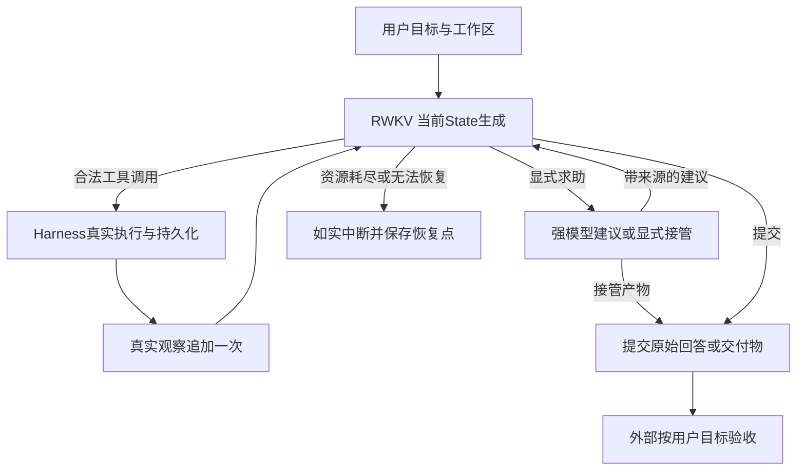

# RWKV 编程 Agent 与专属 Harness：第一版产品及架构设计

状态：产品目标与四方职责按 owner 已确认的定位及本轮明确指令登记；下述实现方案是第一版设计，不声称已经部署。当前仅交付设计、原始证据复核和最小验证方案，不大规模重构，不启动推理实验、训练、新数据集版本或 GitHub 更新。验证仍停留单文件读取与总结。

## 1. 产品目标和成功标准

产品是以 RWKV 为主要执行模型、强模型按需补足能力的编程 Agent。它交付满足用户目标的代码、文件、测试结果和说明，不以完成固定流程或增加角色调用数为产品目标。

比较对象必须做**相同项目、接受相同质量标准、使用可比工作区与工具环境**。质量达标之后，才比较总资源、每个合格项目成本、交付时间和多任务吞吐。以更多失败换得 tokens/s 上升，或把强模型成本漏记，不算收益。项目级效果尚无本轮新数据，不能用读取/摘要诊断代替项目验收。

RWKV 的 State 续接、独立任务调度是优化方向；当前部署的并发、成本优势需要实际测量。缓存容量、线程数、模型架构特点都不能直接推出端到端吞吐。第一版不预设工作分担百分比、不指定固定阶段/步骤数量，也不预设强模型一定更适合每个判断。

## 2. 已复核证据与结论边界

本轮逐文件核验 R4、R5、角色约定的封存清单，共 613/312/3 个文件；旧文件无变化。新复核记录位于 `data/experiments/RWKV_AGENT_HARNESS_DESIGN_V1_R1_20260912/RAW_EVIDENCE_REVIEW.json`，含来源 SHA、原始输出、工具全文、checkpoint 父子关系与精确 token 核验。

| 编号 | 证据 | 已确认的结论 | 不能推出的结论 |
|---|---|---|---|
| E1 | R4 新采原说明主组18/21，简短说明21/21；独立补充各3/3。抽查全部三个失败配对，原输出均含end_byte=-1，候选合法读取 | R4说明在固定读取集内达到登记门，保留当前工具合同 | 不能证明其他读取、复杂任务或全局稳定；也不能把R1历史失败全说成end_byte |
| E2 | R5八题16次真实generation完整输入重新按原始token和State增量重建；8次工具全文与exact_spans一致，下一调用直连观察child且注入一次 | 本固定组读取→总结闭环已工作；没有观察遗漏/重复、接错父State的证据 | 不是对所有恢复分支、内部数值张量或长上下文的全面证明 |
| E3 | 原评分把主旨与Python标准库、5秒超时、close等细节捆绑；任一缺失整组失败 | 旧0/8与“主要内容”目标粒度失配；提交final不等于声称隐藏验收通过 | 不能把0/8解释为RWKV不会总结，也不能把8次提交都叫虚假完成 |
| E4 | 库存文档首遍主要列接口，次遍明确事务、并发、持久化、验证边界；代码两遍没有强调db仅解析，次遍增加threading模块说法 | 有真实覆盖波动、重要遗漏和少量文件未直接支持的补充 | 不能因纠正评分问题就宣称模型输出全部无问题 |
| E5 | 验证脚本130 token；作答输入4890/4889 token；菜单19工具；8份总结输出129–696 token，均自然stop，上限1800 | 输入封装负担明显，当前摘要没有撞到输出上限 | “元数据/菜单导致遗漏”“State一定丢信息”“输出预算不足”均未获证实 |
| E6 | 旧dsh复查固定官方源码；旧R5两段12份父日志134次拒绝为85次格式/结构及49次未知参数 | 附加干预要与机械校验区分；现有代码有强制Final，但这些旧拒绝并非已证实的路径误杀 | 不能承诺删除补偿即可恢复项目能力；不能照搬dsh开放参数对象来重算旧结果 |

证据分三类处理：已确认的验收定义缺陷现在修订设计；已确认的强制完成代码行为列为定向清理对象；输入过重、上下文利用、并发收益与恢复风险必须先定位/回归。旧评分、无效夹具、失败候选和原轨迹全部保留，不套新规则重算为修复收益。

## 3. 职责、入口与目标身份

| 部分 | 负责 | 边界 |
|---|---|---|
| RWKV | 默认执行主体，自主选择工具与参数，完成读取、理解、修改、验证和根据真实反馈修复 | 不是填参数器，不要求独立承担所有复杂规划；不会因未走预想路径就被强制返工 |
| 强模型 | 按需理解复杂目标、分解结果导向子任务、诊断困难、综合结果、显式接管 | 不默认逐步审批，不成为所有并发工作单元的串行关卡 |
| Harness | 真实执行、观察、State、隔离、调度、预算、持久化及审计 | 不替模型选业务方案、补写参数、提炼答案或改写Final |
| 外部验收 | 针对用户目标检查最终回答/工作区快照/行为，确认重要遗漏与不实声明 | 不限定合法工具路径；隐藏参考实现、答案、私有验收内容不进入模型workspace或输入 |

入口首先保存原始用户目标、明确约束、初始工作区身份、允许副作用及资源预算。任务身份稳定，后续澄清/变更以追加版本记录，不覆盖原目标。这里的目标记录是工程状态，不由程序额外发明验收义务。

简单明确任务默认直接进入 RWKV。复杂度不是文件数、文本长度、固定关键词触发的任意分类器：用户明确请求任务级帮助、RWKV明确提出求助，或已有证据显示依赖/约束需要协调时，才引入强模型；首次运行不为了判断“简单”额外调用强模型。结果导向的子目标可以包含多步，依赖决定调度顺序，不按模板固定阶段数。

同一外部目标不能因预算不足、模型建议或内部计划失败而被静默降低。纯粹调整执行办法不改目标；修改交付范围或验收标准需要用户明确同意，登记变更后再继续。本轮已确认职责，不再把历史角色约定的“待确认”作为阻塞。

## 4. 唯一生产循环及模型输入

外部验收不自动回接补偿循环。工作期间模型自行运行公开测试并根据真实失败修复是正常执行；正式独立验收未通过后是否开启新尝试，必须使用预先登记的反馈与预算规则，不能泄露隐藏测试答案并无界重试。

第一版沿用唯一生产 `LongHorizonModel.create_literal_goal → _assignment → model_io.render_bootstrap` 和 `next_command`；Harness结果仍由 `controller._action_observation_event → observation_funnel → model.append_action_observation` 构造。不在诊断脚本或未来训练器另写协议；不长期保留第二个“简化Controller”。已有五角色协议存在，不意味着简单任务必须激活它们。若将来改变角色/协议，生产、trace重建、数据构建与验证同轮迁移，按规范拒绝旧版，不提前复制新协议分支。

### 每次调用需要什么

| 信息 | 模型可见部分 | Harness完整保留部分 |
|---|---|---|
| 目标 | 当前用户目标、约束；子任务所需上下文及结果要求 | 原目标、所有变更、授权与任务/依赖版本 |
| 工具 | 当前已开放工具的准确语义、参数类型/范围/默认值 | 同一注册表/schema的全文和源码身份 |
| 文件观察 | 路径/来源、真实内容、成功或错误、是否完整、必要续读位置 | 原始结果、文件快照、SHA、chunk/revision谱系、完整投影及其SHA |
| 修改前提 | 工具实际需要的base revision/digest等并发前提 | 版本比较、事务、写入集和完整diff；不能因“减元数据”删掉工具必需前提 |
| 历史与依赖 | 当前问题所需真实尝试、结果、未解决问题、相关依赖产物 | 全部事件与raw输入输出，可恢复准确前缀 |
| 预算和辅助 | 可采取行动所需的剩余预算/边界，明确标记的强模型建议或用户变更 | 累计计费、排队、重试、介入身份、原因、输入输出与预算消耗 |
| State/平台身份 | 通常不需反复展示服务build、所有SHA和cache标识 | 模型/tokenizer/协议/初始化State、父子关系、绑定digest、请求恢复与精确token |

这是信息职责目标，不是本轮已经删减的输入。审计元数据从提示中移走之前，要确认执行前提、来源引用、错误诊断、续读和恢复仍完整。即使模型只看到短来源ID，日志也必须能还原它当时对应的真实内容。不得以固定最近N条或摘要静默丢掉仍有任务价值的事实。

工具能力可以按产品阶段固定开放，但不是每一步替模型选择；精简菜单必须另轮登记，不能在本次全文直供对照中同时改19工具菜单与观察格式。初期保留R4说明和生产参数校验。

## 5. State延续、事务边界及恢复

正常路径是：合法生成候选在原父State上提交 → 工具动作及实际结果持久化 → 生产观察事件追加到提交后的State → 下一generation从观察child启动。动作ID、观察ID和State链有可复核关系。事件同ID同内容重复提交应无副作用，同ID不同内容拒绝；非法调用不执行，真实错误保留，模型自行选择下一步。

| 中断位置 | 必须恢复的事实 | 禁止的补偿 |
|---|---|---|
| generation/commit响应丢失 | 按原request_id及digest查询服务账本；已完成取回，确认未记录才按原请求重发 | 重新采样后假称同一次输出，或因传输重试重复计成果 |
| 调用已提交、工具未执行 | 从持久化动作身份恢复；核对是否真正执行过 | 因模型再次输出同调用就执行两遍副作用 |
| 工具可能执行、结果未落盘 | 用事务/幂等键及实际工作区证据判明；非幂等且状态未知时报告不确定并暂停 | 无条件重放外部副作用或猜测成功 |
| 结果落盘、观察未追加 | 由同一生产builder构造原观察，追加一次 | 丢结果、重做动作、注入两份结果 |
| 原生State暂不可取 | 优先用同身份export/import或原始可重建输入恢复，并核对模式 | 用新zero bootstrap当作原State数值续接 |
| 上下文超限 | 明确记录不足/中断；未来压缩必须保留来源和模式变化 | 隐式截断后仍声称完整原始State |

特别发现：`model.py:_rebuild_native_executor_cache`（1811起）目前通过 `_assignment(recent_limit=None)` 重新bootstrap事实上下文。这是**上下文重建路径**，不是逐token重放原始全部生成，也不能默认视作相同数值State。正常export/import、精确输入重放、语义上下文重建必须分别记模式。这个区别是代码事实；尚无本次摘要遗漏由该分支导致的证据。后续以cache失效故障注入核验，不能提前声称所有恢复分支都通过R5检查。

State只在同模型/tokenizer/协议/初始化兼容身份与正确任务范围内延续。独立任务不共享隐含任务State；不把不同worker的State拼接、平均。跨任务传显式产物与事实。公共前缀fork是后续可测优化，必须证明前缀身份一致，不按“相似任务”复用。强模型State永不与RWKV State互换。

### 长任务上下文边界

当前v1尚不解决长任务上下文管理；正确续接State不等于已证明长任务信息保持。达到实际上下文或资源边界时仍如实中断，不承诺无限保留历史。

后续另轮验证执行单元交接：由RWKV或按需强模型提出交接，Harness依据登记资源边界发出容量事件；交接必须包含原目标与当前范围、未完成事项、关键约束、真实尝试、产物版本和可回查来源。模型生成的交接摘要不是执行事实，必须保留原始证据以供核对。接收单元使用明确标记的新State及交接输入，不冒充旧State数值续接；验证目标/关键事实遗漏、来源可恢复性、继续执行质量和交接成本。未通过前，不自动压缩、静默截断或把全部历史无界重灌作为长期方案。

## 6. 强模型介入：建议、目标调整、接管

职责已确认，具体强模型、供应商、调用上限与预算尚待对应轮次冻结；当前不调用强模型。

| 类型 | 输入与产出 | 权限与归属 |
|---|---|---|
| 建议 | 原目标/当前子目标、真实尝试和错误、必要证据、剩余预算；输出诊断或方向 | 不代填工具参数/答案，建议不是执行证据；RWKV沿自己的State自主继续，记“建议后完成” |
| 目标/计划调整 | 显式提出依赖重排、替代办法或需要澄清的范围 | 办法可在原约束内调整；范围/质量门变化需用户确认，记录新目标版本，不能静默简化任务 |
| 接管 | 明确owner转换点，强模型通过同一Harness生成实际操作或最终产物 | 保留原RWKV产物与未完成部分；强模型写出的代码/答案记为接管，不称RWKV独立完成 |

触发依据是显式求助、具体失败无法处理、相互冲突的证据、已证实的复杂依赖等；不是另用一个模型逐次检查RWKV，也不是Harness用主观分数猜测“思考不足”。预算预留必须在整项预算内，求助不重置预算。预算耗尽不能再偷偷花六次调用强制Final。

### 实现前必须冻结的交接约定

以下是待实现接口要求，不表示已有求助协议。实现时接入唯一生产协议，不另建并行Controller：

- RWKV显式求助应说明当前目标、困难、已尝试事项、证据引用及所需帮助；Harness补充真实剩余预算和工作区版本，不替模型编造原因。
- RWKV没有求助时，Harness仅依据事前登记的客观事件处理，例如同类协议/工具错误累计或资源预警。事件阈值、是否转帮助或中断、帮助预算在实验前冻结；不推断“模型不会思考”，不自动改写业务动作，不逐步调用评审模型。
- 求助进入等待态前，当前动作必须落盘或明确标记结果未知。该任务暂停新写操作；等待建议期间RWKV不能继续修改同一工作区，其他隔离任务可继续。建议返回时核对目标和基线版本，过期建议不能当作当前事实。
- 接管要登记唯一执行者转换点，RWKV停止该任务的执行；强模型使用相同Harness、预算总账和权限边界。不得出现两个执行者同时写同一任务工作区。
- 接管可以结束任务，也可以交还。交还必须包含实际动作/结果、变更产物版本、未完成事项和建议来源；经唯一输入构造函数向RWKV传递，核对工作区版本与State边界。原State可用时明确追加交接；必须新建State时标记交接重建，不能伪装原State续接。具体接口及恢复行为须通过回归后才能启用。

每次介入记录：目标与版本、触发者/原因、任务/workspace/State边界、实际可见输入、强模型与采样身份、raw输出、token与费用、建议/调整/接管类别、后续消费者及效果。强模型改写最终答案，即使称为“润色”，也必须记录贡献。未来可观察建议是否被采用，但不能据仅一条成功轨迹断言建议有因果收益。

正式验收与执行辅助隔离；若外部验收使用模型，单独冻结评审模型/口径、隐藏执行臂标识并保留理由，尽量使用不同评审实例和只读证据。相同强模型自评不能冒充独立正确性证明。验收发现隐藏缺陷不自动变成训练/执行输入。

## 7. 任务隔离、并发与最终集成

先独立任务，后同项目子任务；不为并发切碎短文件。用户明确给出独立任务或模型提出依赖时，Harness可核对**已声明**依赖、读写作用域和资源冲突，但不靠文件名猜业务独立性。作用域未知、同文件写、共享数据库/服务/端口、依赖同一中间产物等，先串行或隔离资源；声明无冲突仍须运行后核对实际写集。

并发准入至少考虑写写、写读、读写交集及外部资源；纯读不同独立快照可以并行。依赖图ready队列由真实完成的依赖产物版本驱动，不固定阶段数。并发槽数是可测资源容量，和阶段/步骤数量无关；先低并发测质量、State隔离、峰值内存、排队和尾延迟，再逐级加压，不把8个cache槽当作并发上限或成绩。

每个worker拥有工作区基线版本、独立State/账本、预算和产出身份。并行写入提交候选diff及测试证据，不直接覆盖用户工作区。提交前在集成锁内比较基线/实际版本和真实读写集；无冲突可机械应用原diff，有冲突保存双方结果，重新读取/验证，由RWKV或按需强模型解决语义冲突，Harness不自行选业务内容。外部文件变更使基线过期同样需要处理。

同项目局部通过不等于项目交付：合并后必须在集成快照运行跨文件/接口/回归验证，最终外部验收读取不可变快照。失败要归因于局部实现、版本冲突、依赖声明或集成，再在总预算内修复；不能把多个worker的“completed”相加当成项目完成。必要时明确集成工作由哪个模型负责，不建立固定额外角色。

现有 `parallel_atoms.py` 已有隔离快照、作用域检查、线程池、锁和独占快照提交；`supervisor.py:957`已有重叠写根拒绝，应复用其工程能力。可是 `_commit_atom_workspace`（948起）按root复制、并非通用三方合并；上层合同假设和写根互斥不能证明任意外部变更、读写依赖及语义集成都安全。这里是推广能力的待验证缺口，不宣称旧12题已发生丢更新。本轮不启动并发。

## 8. 终止、成果归属和项目度量

将执行状态与验收状态分开：运行中、等待帮助、答案/产物已提交、资源中断、基础设施失败等是执行事实；未评、满足、部分满足、不满足等是外部质量判断。这是记录维度，不引入一个能改写答案的冲突状态机。

`final_answer`表示提交；没有达到隐藏评分不等于虚假完成。只有声称做了未做的事、测试未跑却说通过、结果与证据矛盾等才记不实声明。真实预算中断保留最后原始内容及未完成项，不强制生成“完成”回答，也不删除失败成本。

任务级分类：RWKV独立合格、强模型建议后合格、强模型接管合格、未完成/未达质量门。另记混合贡献轨迹；仅强模型看过但未改写也须记调用，不冒充零辅助。先报告项目与任务结果，再报告调用/token/协议错误。

| 指标 | 口径 |
|---|---|
| 质量 | 同一用户项目、同一外部验收；样本分母含失败/中断，重要遗漏和不实声明分别可复核 |
| 每个合格项目成本 | 整个登记批次全部尝试成本/合格项目数；包含失败、重试、RWKV GPU、强模型费用、Harness计算、必要存储与集成；0个合格时标不可计算，不给“低成本”结论 |
| 交付延迟 | 入队到同质量门通过，含排队、求助、恢复与集成；未完成保留耗时，不能当快速交付 |
| 吞吐 | 批次时间内通过同质量门的项目/任务数，报负载、并发、错误率和测量窗口 |
| 总/峰值资源 | GPU时间与峰值显存、CPU时间与峰值内存、I/O/存储；记录空闲摊销方式，缺失遥测明确NA |
| 诊断 | 生成/工具/辅助调用，原始输出token、完整输入token、实际增量prefill、State持有与恢复、协议错误、重读、超时 |

full-context输入token相加是可审计输入量，不等于实际重复prefill或GPU收费；同一GPU上的并发wall time不能按任务全额重复累计。资源以服务/设备实测总账为准，按预先确定方式分摊，不与强模型API费漏算或重复算。不同资源用量可呈现Pareto取舍，不能在质量下降时宣称时间/成本优势。

## 9. 第一优先：合理摘要口径与定位性对照

详见配套实验目录的 `MINIMAL_VALIDATION_PLAN.zh-CN.md`。本轮交付设计稿，不把它冒称为已经运行前冻结的REGISTRATION。

摘要评价分开记录主旨、重要行为/限制、事实忠实性。每个重要点单独判“覆盖/部分/遗漏”，次要实现细节单独记录；不再把多个事实捆成一组缺一全零。整体给满足/部分满足/不满足/无结果并解释实质影响，保留不同质量梯度。允许同义转述和不同组织方式，不逐字匹配参考答案，也不以调用次数扣任务质量。

仅使用原四文件，拟定“全文直供”与“生产工具读取”诊断对照。文件、任务要求、模型、采样、菜单、每次输出预算和新评分相同；观察获取方式、前序调用/State历史是被测差别。不能让直接组看到外部要点或参考总结，也不能伪造一次read_file事件给它。直接组仅用于定位，不是生产替代，也不能据其较少调用宣称真实项目更便宜。

由于两个组的输入内容位置、长度和State历史不能完全相同，该比较是**端到端信息获取路径对照**，不是单因素State消融。直供显著好于工具组只能支持进一步拆开菜单/元数据/上下文历史测试，不能直接证明State故障；两组都差仍可能受共同工具菜单和Agent指令封装影响，也需检查任务口径/摘要能力；两组均好则本组无需架构补偿。真实链路异常独立登记，不混进语义归因。

## 10. 代码保留、修改与删除建议及证据

| 改动 | 解决的问题/证据强度 | 上下游与最小验证 |
|---|---|---|
| 保留R4 read_file说明/schema/执行 | E1固定集已验证；不同新文案曾退化 | 读取参数合同、UTF-8/EOF/缺失文件原回归不退化；不自动修参数 |
| 保留model_session/native_state/store/真实Harness及token审计 | E2正常链路已核验 | 中断注入覆盖提交/执行/观察各边界，exactly-once与同请求恢复；不把异常重建等同原State |
| 修改评测报告：执行提交与结果合格分离、摘要要点原子化 | E3已确认定义缺陷 | 新评分新冻结新运行，旧0/8及失败样本不重算；行为测试与语义评审独立 |
| 逐项删除通用主循环中动作次数驱动的强制Final | controller.py:459/467/702/5386/5430及既有测试证明行为存在，未证明导致E4 | 先新增“预算到限不生成Final”“重复合法工作仍可继续”的失败回归，再替换旧期待；保留原观察/恢复/预算保护 |
| 移除任意最低动作门、根据工具数量推最低动作和固定只读重复截停 | atom_execution.py:89/835及controller.py:590/733；路径可能被过度约束 | 真正明确的用户过程约束仍验；合同/worker/恢复消费者一起处理，不删一处留双权威，资源上限仍保留 |
| 模型可见输入与审计元数据分离 | E5是负担事实，能力损失仅是假设 | 先P1定位；再每轮只缩一种输入，全文/错误/续读/写前提和token重建回归；不同时删菜单和改State |
| 标注或调整cache重建模式 | 源码确认bootstrap事实重建不等同原token续接 | exact import、精确重放、语义重建分别故障注入；未触发分支不能借R5通过率背书 |
| 保留并逐步解耦parallel_atoms隔离/事务能力 | 已有快照/作用域/锁；泛化读写与集成尚未验证 | 冲突、外部修改、依赖失效、提交故障与集成失败先红后绿；并发工程限制不变成业务阶段限制 |
| 复用强模型client/计费与trace，按需介入 | owner确认职责；建议有效性尚无本轮实验 | 原模型输出不改写、来源归属和预算贯穿回归；不直接重新接上旧Coordinator和全角色审核 |
| StateTune只保留离线可接入能力 | 用户要求未来闭环，无训练授权 | 生产builder重建、因果切点/纠正来源测试；不把直接全文诊断或接管产物自动送训练 |

所有生产改动一项一轮：保存失败案例→新增行为回归并观察失败→做最小修改→相关及要求的全量回归→冻结源码/预算/评分→真实同组验证→记录保留或不保留。不能只删旧测试或用本轮设计推断修复有效。对比两臂间不改生产文件。现有五个未提交文件按SHA保留；方案不要求现在全库迁移或删除旧协议模块。

## 11. StateTune离线通道

生产trace → 归因（模型/工具/运输/State/评分/环境/依赖）→ 经验证纠正 → owner获准数据构建 → StateTune → 固定回归与同质量任务验收。

每条候选保留生成时可见输入、精确原token与输出、真实工具结果、目标/工作区/协议/模型/tokenizer/初始化State身份、父子关系、错误发生时间、强模型介入及纠正验证。事件是追加事实，未来答案不能回填过去输入。

纠正若依赖后来读到的文件，必须移动到那个事实已可见的决策切点，或拒绝该候选；不能把工具/网络故障、错误评分标成模型应当知道的答案。强模型诊断/接管只是候选监督，先验证正确性、可由当时证据推出且目标RWKV输出范围相符；严禁把隐藏验收、参考实现泄漏给生产或训练。

未来训练重建使用当轮唯一生产输入builder及协议模块常量，并绑定准确版本；同一不变回归集保留zero对照。`goal_state_protocols/role_trace_dataset_v1.py`已有来源/协议准入，不能假设当前单文件直供/直接Actor诊断已经满足其架构准入，也不绕过它的校验。职责迁移如需调整抽取接口，生产、抽取、评测同轮迁移；不为接纳旧数据保留退役schema。本轮不创建datasets版本，不运行任何训练。

## 12. 本轮交付与下一动作

交付：本设计、重新核验的原始证据、配套最小验证计划及源码/文件SHA清单。角色已确认；本轮最新顺序覆盖旧“下一轮立即强模型建议”的建议。下一动作是完善并冻结合理摘要口径与直供/工具闭环对照，之后按定位结果决定最小改动；之后按各项前置证据推进搜索、修改、测试反馈与集成；出现有基线的可复现困难即可验证强模型协助，独立只读任务合格且State隔离可靠即可验证并发，无需等待多文件能力成熟。同项目并行修改仍以隔离、冲突及集成证据为前提。每次只新增一个明确待验证问题。

没有新Agent/项目验收数字、模型调用、训练或生产代码改动。已有同源码完整1514 passed、0 skipped作为工程基线，不冒充本轮新跑；本轮重新执行的是原始证据重建与封存完整性检查。后续代码修改必须重新履行仓库先失败后通过和全量回归。
