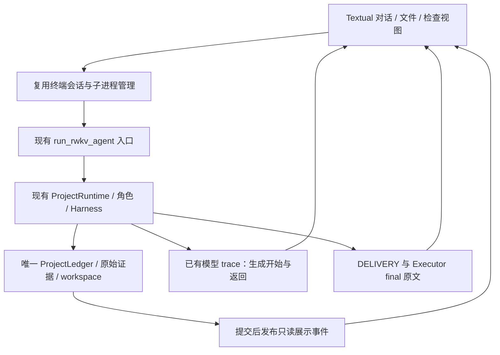

# Project 终端 TUI 实施方案

状态：待实施。当前授权范围是现状评估与方案，本次没有修改界面、Controller、角色协议、解码或训练配置。当前能力与实验结果统一从 [HANDOFF](HANDOFF.zh-CN.md) 进入。

## 产品定位与进入条件

可以开始构建可交互开发终端：用户提交需求，查看实际执行、已确认文件变更、检查结果和未完成原因，再对保留下来的项目继续提出要求。稳定自主完成整个项目仍未达到，不能作为首版界面的前提或承诺。

沙盒、启动器和交付记录已经提供底座；当前 `terminal.py` 仍是同步 `input/print` 界面。先复用一条 Project 执行链，补齐观察与会话生命周期，再做界面。TUI 不负责规划、选择工具、修改验收或补写模型总结。

首版验收分开两类：界面能准确展示和控制现有运行；Agent 能否实现全部需求。界面验收通过不更改 Strict、completed 或既有产物成绩。

## 当前可用边界

|能力|当前实现与证据|适用边界|
|---|---|---|
|命令执行|Harness 的 bubblewrap、工作区路径约束、显式 UTF-8 stdin/EOF、退出码及超时输出|普通命令隔离宿主网络；不能把它当成联网安装通道|
|检查命令|隔离、可丢弃的工作区视图；检查写入不保留到源工作区|`check_command` 与真实写入操作语义不同|
|项目运行|静态页和标准 Vite 独立副本，安装/构建/HTTP/日志/停止回执|启动器共享网络，可使用公开无认证代理；不是所有执行路径都断网|
|浏览器检查|`check_project` 可运行实际 Python/Playwright 检查，检查器读取只读项目副本|HTTP 200 仅证明服务就绪；没有行为检查时不能说功能通过|
|发布及完成|已确认工具回执、工作区身份和统一完成校验|文件存在、模型声明、工具成功、功能通过、项目完成逐层区分|
|追加需求|原目标和追加要求合并，上一轮产物复制为下一轮输入|新一轮运行，不等于延续旧 Native State|
|服务可用性|单独核对推理端点和模型身份|本次评估时本地 29810 无 TCP 监听；沙盒可用不代表推理服务在线|

启动器覆盖所选根目录 `index.html` 的静态项目，以及声明 Vite/build 脚本、产出 `dist/index.html` 的前端。后端、SSR、自定义构建目录尚无统一自动启动方案；普通沙盒可以执行适用命令，不代表这些项目已有完整生命周期管理。

本次运行 19 个现有测试模块，217 通过、无跳过，包含实际浏览器和进程测试，也包含注入角色返回的机制测试。Vite 生命周期回归使用本地依赖夹具，确实执行 npm/Node，但该夹具不是发行版 Vite；既有真实 npm/Vite/Chromium 验证见当前交接。没有重新运行真实模型项目。451 个 Python 源码/脚本/测试文件与此前 2996 通过的完整回归清单一致，完整回归按身份复用，不冒称本次全量重跑。

## “终结”需要拆开的四层

|层次|表示什么|当前主要缺口|
|---|---|---|
|单次生成结束|模型输出自然结束，未碰到单次输出上限|部分写文件和报告仍会复读或截断；完整 JSON 也可能非法|
|工作单元交回|Executor 的报告/yield 或 Decision 改选方向|重复读取、无产出交回、错误证据引用和拒绝后继续同一非法方向|
|本轮进程结束|完成、预算中断、阻塞、用户取消等|需要准确呈现停下原因和已确认产物；进程退出不等于需求完成|
|项目验收与交付|当前产物满足目标、检查与证据一致，明确交付 Executor 报告|实现缺陷、验证推进和最终覆盖都可能阻断；不是统一缺一个总结文件|

最新高预算阅读清单基线 Strict 0/1、completed 0/1、mutation 1，128 调用耗尽；125 次 Native 全部自然结束，122 次非法 `verify` 重复。这里主要是跨调用纠错与检查推进问题。另一臂首次 Decision 输入 33188 超过 25566，RWKV 尚未生成，是独立的传递容量缺陷。

部分成果必须保留事实：已有日志修复产物通过 10/11 个冻结浏览器分项，剩演示数据标注，另缺 README；这个例子接近交付。阅读清单则有新增入口、搜索、标签筛选、导出、事件绑定和持久化缺口，不能归为只差文档。通过分项不换算成项目完成百分比，未运行分项不算通过，初始已有功能不计为本轮新增成果。

## 首版界面

采用 Python Textual，作为可选 `terminal` extra；保留非交互命令和现有纯文本入口。实施时锁定并测试依赖版本，本轮不安装。Textual 提供后台 Worker 和 `run_test`/Pilot，可在不阻塞交互的情况下跟随子进程，并自动验证键盘、点击和窗口尺寸行为。依据：[Workers](https://textual.textualize.io/guide/workers/)、[Testing](https://textual.textualize.io/guide/testing/)；这些是框架能力，进程取消和账本恢复仍由本项目负责。

首版建议显式 `rwkv-lh --tui`；该参数尚未实现。非 TTY 输入继续走现有入口，不能强行进入全屏界面。

布局如下：

```text
项目路径  |  当前轮次  |  模型服务状态  |  调用/时间预算
----------------------------------------------------
对话与执行时间线             | 文件 / 差异 / 检查
用户原始目标与追加需求       | 已确认修改、对应回执
当前角色、模型请求           | 通过 / 失败 / 未运行
工具确认结果、模型报告       | 原始输入输出入口
本轮结束原因及剩余缺口       | 真实就绪的预览地址
----------------------------------------------------
多行输入与草稿  [发送] [停止本轮] [启动/停止预览]
```

中文、粘贴、多行编辑、窄屏切换为单栏是基本要求。运行中允许编辑草稿、查看证据和停止；草稿不自动插入正在生成的角色输入，结束后由用户发送新一轮。

顶层只显示工作中、已中断、受阻、已完成和有无可检查产物等事实；“部分成果”不新增一个与账本冲突的项目验收状态。调用/时间/输出上限分别呈现，token 来源区分实际回执、估算和未知，Planner 与 RWKV tokenizer 不混加。

## 单一执行链与展示事件



职责与计划文件：

|位置|计划变更|保持的职责边界|
|---|---|---|
|`rwkv_lh/terminal.py`|将执行生命周期从 print/input 分离为可复用接口，提供启动、观察、取消和会话保存|纯文本与 TUI 共用同一个会话/runner，不复制第二套执行器|
|`rwkv_lh/project_ledger.py`|在事务确认后提供展示投影发布点；不改变角色决策或完成语义|仍是唯一状态与证据权威，TUI 不直接写库|
|拟新增 `rwkv_lh/terminal_events.py`|账本事件和 model trace 的展示投影、序号、原文引用、尾读与校验|可重建的展示数据，不是新角色协议、训练来源或业务状态机|
|拟新增 `rwkv_lh/terminal_tui.py`|布局、键盘操作、时间线、文件差异、检查详情|不调用模型、不解释或执行模型工具 JSON|
|`scripts/run_rwkv_agent.py`、`pyproject.toml`、`uv.lock`|显式 TUI 入口及可选依赖|纯文本和自动化脚本行为保持兼容|

当前 `ProjectRuntime.run` 持有写租约，`ProjectLedger.read_snapshot` 会拒绝活动写者；不能用这个接口轮询运行中的数据库，也不能另开无锁 SQLite 读取绕过保护。运行端提交事务后输出带 run ID、账本 seq/digest、operation ID、事件种类和证据引用的展示记录。UI 只读展示文件和已发布原文引用。结束后在正式只读租约内核对完整账本与 `DELIVERY.json`。

展示输出必须在事务已提交后产生，观察器故障不能把已成功操作变成失败或触发重试。发生“提交成功、展示发布前进程退出”时，UI 保留未知/待核验提示；任务结束并取得只读租约后，可从账本补建展示索引。索引允许重建，原始回执不可改写。

事件按来源和序号去重，不按文本去重：同样的非法动作发生 122 次应真实计数，可折叠显示并打开全部原文。尾部半行等待补齐，不假定已完成；来源乱序、缺口或摘要不匹配明确标出。文件与日志大内容按需翻页，展示翻页不得改变模型输入、计划义务或原始审计数据。

显示阶段区分模型生成开始、模型请求、协议拒绝、操作待确认、确认成功/失败。写文件只有得到发布事务的真实回执才显示为已修改；模型请求中的工具名和路径不能当作执行结果。检查通过必须绑定检查版本及工作区身份；文件后续改变时显示“针对旧版本”，不保留过时的绿色通过提示。预览地址必须来自当前存活服务的就绪回执。

首版使用调用/事务级进度。当前 trace 没有逐 token 展示合同，不能把结束后返回的完整文本伪装成真实 token 流；新增 token 流需要另行验证 Native 接口和记录边界，不作为首版依赖。

## 会话、取消、部分交付

目前 `SESSION.json` 只在一轮返回后保存，构造函数不从它恢复；需在启动前原子登记运行意图，结束后原子写入回执索引。重开界面默认恢复历史和文件展示，不自动重新发起任务。

取消操作发送给当前 Agent 子进程组，执行有界等待和必要清理，保留真实退出码、日志与 pending。取消 Textual Worker 本身不等于取消进程。必须区分“停止本轮”与“停止预览”；现有 `/stop` 只关预览，不能在新界面中沿用歧义。退出时停止本界面拥有的运行和预览，不能按端口号杀其他服务。

已结束且回执完整、没有 pending 的轮次，可按现有语义复制产物开始用户的新请求。预算已耗尽时，这是一轮新预算的新任务，UI 要明确呈现；不假装原运行获得了追加预算。有 pending、未知结果或缺失回执时只允许检查，不自动重发或绕过阻塞。

后续若加入同一运行的 `resume_project`，必须复用原总预算和恢复校验，并证明角色 State 身份仍有效；Native 内存句柄在服务重启后不能靠聊天历史恢复。重新打开会话、从产物开始新回合、恢复同一 Agent 是三个不同操作。

每轮结束展示以下可复核内容：

1. 本轮结果和终止原因，调用/时间等实际用量。
2. 已确认文件变更及真实差异，文件改变不自动归纳为功能完成。
3. 公开检查的通过、失败、未运行与证据版本；独立开发基准结果不注入 Agent workspace。
4. 账本中的未完成义务、最后拒绝/错误、缺少的检查与当前可继续条件。
5. 若存在 `final`，原样显示 Executor 报告；不存在时只提供标明来源的事实面板，不调用额外模型补总结。

检查事实面板不替代最终报告。判断目标覆盖仍由 Decision 和既有完成门负责；UI 不补 README、不自动调用 finish、不把“停止运行”改成“项目完成”。

## 分阶段实施与测试门

每阶段先固定验收和失败反例，做最小实现，再通过相应回归；涉及生产变更后提交前运行完整 `tests/`，Torch、State 和浏览器不得跳过。测试、原文和 SHA 留在本地；每完成一轮按 `ROUND_01` 本地提交，owner push。

|顺序|交付|进入下一阶段的门|
|---|---|---|
|1. 执行观察与生命周期|复用 runner，会话意图落盘，提交后展示事件和停止接口|未确认操作不显示成功；重复/半行事件准确；UI观察故障不影响事务；退出、SIGINT/强制退出、缺回执、重启不重放；检查版本变化不冒充新结果|
|2. 最小 TUI|对话、多行输入、角色/预算、工具回执、差异、检查、Final原文、预览|Textual Pilot 验证中英文输入、发送防重、运行中交互、尺寸变化、滚动；真实子进程测试停止与清理；原 CLI 回归通过|
|3. 会话再打开与追加|恢复展示历史、审计完整性，从已确认产物开始下一轮|原目标/追加要求保留；源产物不被直接改写；服务离线有准确提示；pending 阻止新运行；重开不恢复失效 Native 句柄|
|4. 真实使用验收|在预先登记的既有开发任务上，由 TUI 发起一次受限的真实完整链路并留证|界面显示与原始账本/产物一致；Web 实跑 Playwright；报告 Strict/completed/mutation/终止原因和全部分项，不以界面通过代替 Agent 通过|

第 4 阶段应在运行前冻结任务 ID、源码、模型/State、采样、预算与评分。默认终端 64 调用/900 秒，若设高预算须单列登记；不自动扩展到全部 12/120 题，不读取最终 Holdout。当前只是实施方案，未启动这些任务。

## 与 TUI 并行推进的能力整改顺序

这里的“并行”指产品工作方向相互独立，不要求额外代理或并行模型调用。界面不必等待稳定自主完成才开始，核心能力也不能因界面可用而被标成已修复。

1. **先处理可确定的跨角色容量缺陷。** 在当前生产 builder 下复现完整 Planner 读取事实进入 Decision 超过 25566 的路径，检查所有首次交接和后续增量；先分析可逐字还原的重复展开与传输冗余，再对仍超限情形预登记无损分段物化的可行性实验。分段必须证明实际 token、父 State、frame、解码边界及完整证据一致，不替代模型调用，不把分段可输入冒称模型能利用任意长历史。不能静默删事实、截断计划、改成摘要模型或仅增大容量声明。这个工程问题独立于 RWKV 温度，也不调整 Planner 解码参数来制造改善。
2. **集中验证拒绝反馈到下一合法动作的能力。** 使用已有真实生产边界：未绑定检查却 verify、重复 request_info/yield、无效证据 ID。覆盖全部同类来源，并保留正常委派/读写/报告对照；先登记一个改动因素和晋级门，再做两臂。控制器不能代替 RWKV 强制改选 bind_checks。若进入 StateTune，沿用既有授权范围与角色数据准入；本评估不启动训练或新数据集。
3. **把代码修复和复验作为完整任务门。** 固定既有题面及浏览器/CLI 功能分项，观测“失败证据到修改到再次检查”，保留初始已有功能、失败、未运行与退化。先在相同任务/seed/预算下重复基线，再比较候选；不按运行结果改评分。角色自然结束或合法率提高仍不能直接晋级。
4. **最后处理证据齐全后的交付收尾。** 将确实只剩标注、说明或综合报告的轨迹与核心功能缺失的轨迹分开。只有需求和检查已覆盖的项目才验证最后验收与 Executor 报告；保留缺报告/失效证据的拒绝门，不用额外总结器制造 completed。

温度、惩罚和输出上限不随 TUI 改变。现有解码/额度实验没有给出统一可推广配置，后续能力实验须独立登记。内部 fully async 研究是否受幸存者偏差影响，当前没有原始筛选分母和训练链证据；它不是本项目根因结论。

## 本次评估材料

本地 `data/experiments/ROUND_01/G1K_TUI_READINESS_20261005/` 保留测试前 INTENT、测试原文与 JUnit、结果、评估报告及逐文件 SHA。当前没有 TUI 实现、模型生成、训练或新的 Agent 成绩。维护文档的实施状态由 [HANDOFF](HANDOFF.zh-CN.md) 统一说明。
